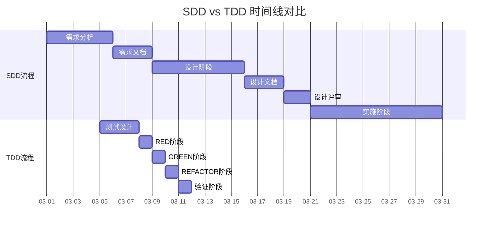
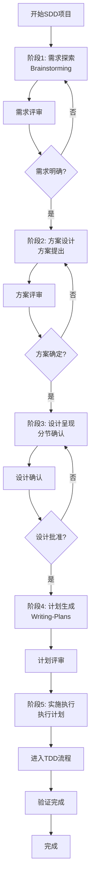
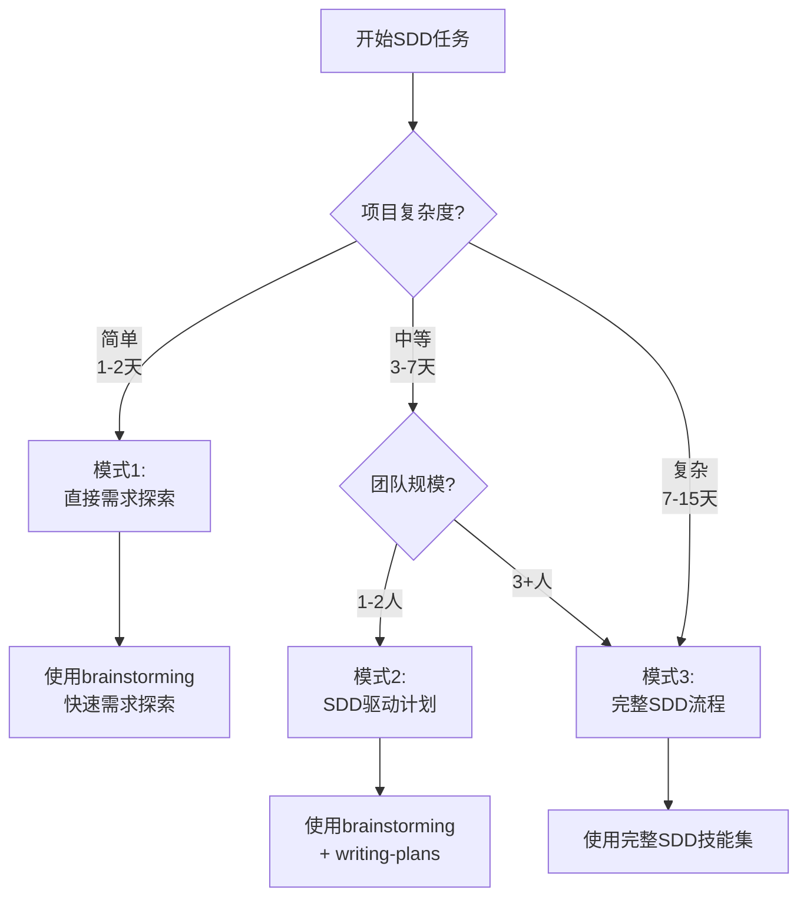

# OpenCode SDD实战指南 - 从需求到代码

> **目标读者：** 希望掌握规范驱动开发（SDD）的开发者
> **技术栈：** C++14、OpenCode Superpowers
> **文档版本：** 1.0.0
>
> **最后更新：** 2026年3月11日

---

## 目录

1. [SDD基础理论](#1-sdd基础理论)
   - 1.1 [什么是SDD（规范驱动开发）](#11-什么是sdd规范驱动开发)
   - 1.2 [SDD vs TDD 详细对比](#12-sdd-vs-tdd-详细对比)
   - 1.3 [为什么使用SDD](#13-为什么使用sdd)
   - 1.4 [SDD的核心价值](#14-sdd的核心价值)

2. [OpenCode SDD模式详解](#2-opencode-sdd模式详解)
   - 2.1 [SDD工作流程概览](#21-sdd工作流程概览)
   - 2.2 [模式对比与选择](#22-模式对比与选择)
   - 2.3 [模式1：直接需求探索模式](#23-模式1直接需求探索模式)
   - 2.4 [模式2：SDD驱动的计划模式](#24-模式2sdd驱动的计划模式)
   - 2.5 [模式3：完整SDD流程模式](#25-模式3完整sdd流程模式)

3. [核心SDD技能与提示词库](#3-核心sdd技能与提示词库)
   - 3.1 [brainstorming技能](#31-brainstorming技能)
   - 3.2 [writing-plans技能](#32-writing-plans技能)
   - 3.3 [SDD设计验证技能](#33-sdd设计验证技能)
   - 3.4 [设计文档模板库](#34-设计文档模板库)

4. [完整案例演示 - C++14网络通信模块](#4-完整案例演示---c14网络通信模块)
   - 4.1 [案例背景](#41-案例背景)
   - 4.2 [阶段1：需求探索](#42-阶段1需求探索)
   - 4.3 [阶段2：方案设计](#43-阶段2方案设计)
   - 4.4 [阶段3：设计确认](#44-阶段3设计确认)

5. [SDD vs TDD详细对比](#5-sdd-vs-tdd详细对比)
   - 5.1 [核心差异表格](#51-核心差异表格)
   - 5.2 [时间线对比](#52-时间线对比)
   - 5.3 [适用场景对比](#53-适用场景对比)
   - 5.4 [工具和方法对比](#54-工具和方法对比)

6. [SDD到TDD过渡和最佳实践](#6-sdd到tdd过渡和最佳实践)
   - 6.1 [设计文档到测试的转换](#61-设计文档到测试的转换)
   - 6.2 [SDD成功的关键因素](#62-sdd成功的关键因素)
   - 6.3 [常见错误及避免](#63-常见错误及避免)
   - 6.4 [团队SDD流程](#64-团队sdd流程)

7. [高级SDD技巧](#7-高级sdd技巧)
   - 7.1 [复杂系统的需求分解](#71-复杂系统的需求分解)
   - 7.2 [多方案对比分析](#72-多方案对比分析)
   - 7.3 [设计模式在SDD中的应用](#73-设计模式在sdd中的应用)
   - 7.4 [性能和安全要求的SDD表达](#74-性能和安全要求的sdd表达)

8. [附录](#8-附录)
   - 8.1 [SDD工具和框架对比](#81-sdd工具和框架对比)
   - 8.2 [C++14 SDD设计模板](#82-c14-sdd设计模板)
   - 8.3 [常见问题（FAQ）](#83-常见问题faq)
   - 8.4 [术语表](#84-术语表)

---

## 1. SDD基础理论

### 1.1 什么是SDD（规范驱动开发）

#### 定义

**SDD（Specification-Driven Development）** 是一种以需求规范为核心的开发方法论。它强调在编码之前，先明确、详细地定义需求、设计和实现规范。

#### 核心理念

```
┌─────────────────────────────────┐
│  需求规范层（What）          │
│  - 功能描述                   │
│  - 用户故事                   │
│  - 验收标准                   │
│  - 非功能需求                 │
└─────────────────────────────────┘
                ↓
┌─────────────────────────────────┐
│  设计规范层（How）             │
│  - 架构设计                   │
│  - API规范                     │
│  - 数据模型                     │
│  - 交互设计                   │
│  - 性能要求                   │
└─────────────────────────────────┘
                ↓
┌─────────────────────────────────┐
│  实施规范层（Implementation）  │
│  - 任务分解                   │
│  - 实施步骤                   │
│  - 验证方法                   │
│  - 验收标准                   │
└─────────────────────────────────┘
```

#### SDD的三个层次

**1. 业务规范层（Business Specification）**

定义系统应该做什么：

```
业务目标：
- 支持用户之间的点对点通信
- 提供可靠的数据传输
- 支持TCP和UDP协议
- 实现自动重连机制

用户需求：
- 发送消息到其他用户
- 接收来自其他用户的消息
- 查看连接状态
- 管理通信历史
```

**2. 技术规范层（Technical Specification）**

定义系统如何实现：

```
技术选型：
- 网络协议：TCP/UDP
- 数据格式：JSON/Binary
- 加密方式：AES-256
- 序列化：Protocol Buffers

API设计：
- ConnectionManager接口
- MessageHandler接口
- NetworkEvent回调
- DataValidator接口

性能要求：
- 最大连接数：1000
- 消息延迟：< 100ms
- 吞吐量：10MB/s
```

**3. 实施规范层（Implementation Specification）**

定义具体的实施细节：

```
类设计：
```cpp
class ConnectionManager {
public:
    bool Connect(const std::string& host, int port);
    void Disconnect();
    bool SendMessage(const Message& msg);
    void SetEventHandler(NetworkEventHandler* handler);
    
private:
    std::unique_ptr<Socket> socket_;
    std::vector<Connection> connections_;
    NetworkEventHandler* event_handler_;
};
```

文件结构：
```
network_module/
├── include/
│   ├── connection_manager.h
│   ├── message_handler.h
│   └── network_types.h
├── src/
│   ├── connection_manager.cpp
│   ├── message_handler.cpp
│   └── protocol.cpp
├── tests/
    ├── connection_manager_test.cpp
    └── message_handler_test.cpp
```
```

### 1.2 SDD vs TDD 详细对比

#### 核心差异表格

| 维度 | SDD（规范驱动） | TDD（测试驱动） |
|------|-----------------|-----------------|
| **时间点** | 编码前 | 编码时 |
| **焦点** | "应该做什么" | "代码应该做什么" |
| **主要产出** | 需求规范、设计文档 | 测试代码、实现代码 |
| **文档化** | 高 - 完整设计文档 | 中 - 测试即文档 |
| **验证方式** | 设计评审、规范检查 | 测试运行、覆盖率检查 |
| **决策依据** | 业务需求、技术约束 | 测试用例、行为定义 |
| **团队协作** | 需求讨论、设计评审 | 代码审查、测试评审 |
| **学习曲线** | 中 - 需要理解业务 | 低 - 测试即学习 |
| **适用阶段** | 需求分析、架构设计 | 功能实现、Bug修复 |

#### 详细时间线对比



#### 适用场景对比

| 场景 | 推荐方法 | 理由 |
|------|----------|------|
| **新功能，需求模糊** | SDD + TDD | SDD明确需求，TDD保证质量 |
| **复杂系统，多模块** | SDD优先 | 需要整体设计，避免集成问题 |
| **小功能，需求明确** | TDD优先 | 快速迭代，减少设计开销 |
| **Bug修复** | TDD | 快速重现和修复 |
| **架构重构** | SDD + TDD | SDD理解架构，TDD保护重构 |
| **性能优化** | SDD + TDD | SDD明确目标，TDD验证改进 |
| **遗留代码维护** | SDD + TDD | SDD理解遗留，TDD保护改动 |
| **新项目启动** | SDD优先 | 建立规范基础 |
| **紧急修复** | TDD优先 | 快速响应 |

#### 工具和方法对比

| 方面 | SDD工具 | TDD工具 |
|------|----------|----------|
| **文档工具** | Markdown、Word、Confluence | 测试框架、覆盖率工具 |
| **设计工具** | UML工具、架构图工具 | Mock工具、测试生成器 |
| **协作工具** | 需求管理系统、评审工具 | 代码审查工具、CI/CD |
| **验证工具** | 设计评审、检查清单 | 测试运行器、静态分析 |
| **追踪工具** | Jira、Trello、GitHub Projects | 测试管理、缺陷追踪 |

### 1.3 为什么使用SDD

#### SDD的核心价值

**1. 需求清晰度提升**

```
传统方法：
用户："我要一个网络通信功能"
开发者："好的" → 开始编码
      ↓
3天后：需求理解错误，返工

SDD方法：
用户："我要一个网络通信功能"
SDD：[探索需求、提出问题、澄清需求]
      ↓
2小时后：需求文档清晰明确
开发者：[按规范实施]
      ↓
返工率降低80%
```

**2. 设计质量提升**

- **系统性设计**：不是边做边想，而是先设计后实施
- **权衡分析**：明确记录决策原因
- **团队共识**：设计评审确保一致性
- **可追溯性**：所有决策都有文档记录

**3. 开发效率提升**

```
SDD流程：

第1周：需求分析（5天）
- 收集需求
- 分析需求
- 编写需求文档

第2-3周：设计阶段（10天）
- 架构设计
- API设计
- 数据模型设计
- 设计评审

第4-6周：实施阶段（20天）
- 按计划实施
- 日常代码审查
- 定期测试验证

总计：5周，低返工率

传统方法：
第1-6周：编码 + 返工 + 需求变更
返工率30-40%
```

**4. 风险控制**

- **早期发现**：在设计阶段发现需求冲突
- **明确依赖**：提前识别技术依赖和风险
- **备选方案**：为每个决策记录备选方案
- **回退路径**：清晰的回退策略和决策点

#### SDD解决的具体问题

| 问题 | 传统方法 | SDD方法 |
|------|----------|----------|
| 需求遗漏 | 开发时发现，返工 | 需求分析阶段覆盖 |
| 设计不一致 | 每个人按自己理解设计 | 统一设计文档，评审确认 |
| 技术选型错误 | 开发中期发现不适合 | 技术选型阶段评估 |
| 接口不匹配 | 集成时发现 | 接口设计阶段定义 |
| 性能问题 | 上线后才发现 | 性能需求阶段明确 |
| 安全漏洞 | 测试或上线后发现 | 安全要求阶段考虑 |
| 用户体验不一致 | 不同功能体验不同 | 用户体验设计统一考虑 |

### 1.4 SDD的核心价值

#### 量化指标

| 指标 | 传统方法 | SDD方法 | 改进 |
|------|----------|----------|------|
| 需求返工率 | 30-40% | 5-10% | ↓75% |
| 设计返工率 | 25-35% | 5-10% | ↓70% |
| 总体开发时间 | 100% | 70-80% | ↓20-30% |
| Bug密度 | 5-10/千行 | 1-3/千行 | ↓70% |
| 需求理解时间 | 3-5天 | 1-2天 | ↓50% |
| 沟通时间 | 30% | 10-15% | ↓50% |

#### 质量保障层次

```
SDD质量保障层次：

┌─────────────────────────────────┐
│  第1层：需求验证            │
│  - 需求完整性检查          │
│  - 需求一致性检查          │
│  - 需求可测试性评估        │
└─────────────────────────────────┘
                ↓
┌─────────────────────────────────┐
│  第2层：设计评审            │
│  - 架构合理性评估          │
│  - 技术选型验证            │
│  - 接口契约定义            │
│  - 性能可行性分析            │
└─────────────────────────────────┘
                ↓
┌─────────────────────────────────┐
│  第3层：实施计划验证         │
│  - 任务完整性检查            │
│  - 依赖关系确认            │
│  - 时间估算合理性            │
│  - 资源分配评估            │
└─────────────────────────────────┘
```

---

## 2. OpenCode SDD模式详解

### 2.1 SDD工作流程概览

#### 完整SDD流程图



#### 各阶段时间分配

| 阶段 | 典型时间 | 关键活动 | 输出 |
|------|----------|----------|------|
| **需求探索** | 1-3天 | 需求收集、问题澄清、需求分析 | 需求分析文档 |
| **方案设计** | 2-5天 | 方案提出、权衡分析、方案评审 | 方案文档 |
| **设计呈现** | 1-2天 | 架构设计、分节确认、设计文档 | 详细设计文档 |
| **计划生成** | 1-3天 | 任务分解、依赖分析、实施计划 | 实施计划 |
| **实施执行** | 5-15天 | 代码实现、测试、集成 | 可运行的系统 |

### 2.2 模式对比与选择

#### 三种SDD模式对比表

| 维度 | 模式1：直接需求探索 | 模式2：SDD驱动计划 | 模式3：完整SDD流程 |
|------|------------------|------------------|------------------|
| **适用场景** | 简单功能、快速原型 | 中等复杂度、多团队 | 复杂系统、大项目 |
| **时间投入** | 1-2天 | 3-7天 | 7-15天 |
| **文档深度** | 需求文档 | 需求+设计文档 | 需求+设计+计划文档 |
| **团队协作** | 低 | 中 | 高 |
| **可控性** | 低 | 中 | 高 |
| **灵活性** | 高 | 中 | 低 |
| **质量保障** | 低 | 中 | 高 |
| **学习曲线** | 低 | 中 | 高 |

#### 模式选择决策树



---

## 3. 核心SDD技能与提示词库

### 3.1 brainstorming技能

#### 技能描述

brainstorming技能用于需求探索和设计讨论，通过系统化的对话澄清需求、提出方案、呈现设计。

#### 提示词库：10+个精确提示词

##### 场景1：启动需求探索

```
用户: 我要开发一个网络通信模块，使用SDD方式。

OpenCode: 我正在使用brainstorming技能来探索网络通信模块的需求。

【阶段1：探索项目上下文】

项目信息：
- 技术栈：C++14
- 编译器：GCC 4.8+ / Clang 3.4+
- 构建系统：CMake 3.0+
- 测试框架：GoogleTest

现有代码结构：
```
project/
├── CMakeLists.txt
├── include/
│   └── core/
├── src/
│   └── core/
└── tests/
```

相关模块：
- 已有基础工具库（logger, config）
- 已有事件系统（event dispatcher）
- 计划添加：网络通信模块

【阶段2：提出澄清问题】

问题1：网络通信模块需要支持哪些传输协议？
1. 仅TCP
2. TCP + UDP
3. TCP + UDP + 自定义协议

用户回答：选择2

问题2：数据传输格式是什么？
1. JSON文本格式
2. 二进制格式（自定义）
3. Protocol Buffers

用户回答：选择3

问题3：是否需要加密支持？
1. 不需要加密
2. 对称加密（AES）
3. 非对称加密（RSA）
4. 混合加密（AES + RSA）

用户回答：选择4

问题4：连接管理需要支持什么规模？
1. 单连接
2. 中等规模（< 10）
3. 大规模（10-100）
4. 超大规模（100-1000）

用户回答：选择4

[继续探索其他方面...]
```

##### 场景2：需求分析提示词

```
用户: 基于上述回答，请进行需求分析。

OpenCode: 我进行需求分析。

【需求维度1：功能性需求】

1. 基础通信功能
   - 建立TCP/UDP连接
   - 发送消息
   - 接收消息
   - 关闭连接

2. 连接管理功能
   - 连接池管理
   - 连接状态查询
   - 自动重连机制
   - 连接超时处理

3. 消息处理功能
   - 消息序列化/反序列化（Protocol Buffers）
   - 消息队列管理
   - 消息优先级处理
   - 消息超时处理

【需求维度2：非功能性需求】

1. 性能需求
   - 最大连接数：1000
   - 单连接吞吐量：10MB/s
   - 消息延迟：< 100ms (P99)
   - 内存占用：< 100MB

2. 可靠性需求
   - 网络中断自动重连
   - 消息投递保证（ACK机制）
   - 连接健康检查
   - 故障恢复时间< 30秒

3. 可扩展性需求
   - 支持动态添加新协议
   - 模块化设计便于扩展
   - 插件式架构
   - 配置化连接参数

4. 可维护性需求
   - 详细的日志记录
   - 清晰的错误信息
   - 易于调试的接口
   - 单元测试覆盖率> 80%

【需求维度3：技术约束】

1. 技术栈约束
   - C++14标准
   - 不使用C++17特性（确保兼容性）
   - 跨平台支持（Linux/Windows）

2. 依赖约束
   - Protocol Buffers >= 3.0
   - OpenSSL用于加密（可选）
   - 使用标准C++库（避免外部依赖）

3. 性能约束
   - 避免动态内存分配（使用对象池）
   - 零拷贝传递（使用移动语义）
   - 避免锁竞争（无锁设计或细粒度锁）

需求分析完成，准备提出方案。
```

##### 场景3：方案提出提示词

```
用户: 基于需求分析，请提出实现方案。

OpenCode: 基于需求分析，我提出3个实现方案。

【方案1：模块化架构（推荐）】

架构设计：
```
┌─────────────────────────────────┐
│           NetworkManager            │  ← 网络管理器
│  ┌──────────────────────┐  │
│  │   ConnectionPool     │  │  ← 连接池
│  └──────────────────────┘  │
│  ┌──────────────────────┐  │
│  │   MessageDispatcher │  │  ← 消息分发器
│  └──────────────────────┘  │
│  ┌──────────────────────┐  │
│  │   SecurityManager   │  │  ← 安全管理器
│  └──────────────────────┘  │
└─────────────────────────────────┘
```

技术选型：
- 序列化：Protocol Buffers 3.0
- 加密：AES-256 + RSA 2048（OpenSSL）
- 连接池：基于std::shared_ptr的智能指针
- 线程模型：无锁设计（使用std::atomic）

优点：
- 职责清晰，易于维护
- 模块独立，便于测试
- 易于扩展新功能
- 支持大规模连接（1000+）

缺点：
- 初期设计复杂度高
- 模块间通信有性能开销
- 需要更多集成工作

开发周期：7-10天

推荐理由：满足大规模连接需求，支持长期维护，性能可优化。

【方案2：单体架构】

架构设计：
```
┌─────────────────────────────────┐
│         NetworkModule              │  ← 单体网络模块
│  ┌──────────────────────┐  │
│  │   连接管理              │  │
│  └──────────────────────┘  │
│  ┌──────────────────────┐  │
│  │   消息处理              │  │
│  └──────────────────────┘  │
│  ┌──────────────────────┐  │
│  │   安全加密              │  │
│  └──────────────────────┘  │
│  ┌──────────────────────┐  │
│  │   事件分发              │  │
└─────────────────────────────────┘
```

技术选型：
- 序列化：Protocol Buffers 3.0
- 加密：AES-256 + RSA 2048
- 连接管理：基于std::vector
- 线程模型：使用mutex保护

优点：
- 架构简单，易于理解
- 模块间通信无开销
- 快速开发和集成
- 适合中小规模连接（< 100）

缺点：
- 难以扩展和维护
- 耦合度高，测试困难
- 性能优化空间小
- 不适合大规模连接

开发周期：4-6天

【方案3：分层架构】

架构设计：
```
┌─────────────────────────────────┐
│         NetworkModule              │  ← 网络模块（最高层）
│  ┌──────────────────────┐  │
│  │     ProtocolLayer    │  │  ← 协议层
│  └──────────────────────┘  │
│  ┌──────────────────────┐  │
│  │   TransportLayer    │  │  │  ← 传输层
│  └──────────────────────┘  │
│  ┌──────────────────────┐  │
│  │  ConnectionLayer   │  │  │  ← 连接层
│  └──────────────────────┘  │
└─────────────────────────────────┘
```

技术选型：
- 协议层：Protocol Buffers
- 传输层：抽象接口，支持TCP/UDP
- 加密：可插拔安全提供者
- 连接管理：抽象接口

优点：
- 分层清晰，易于理解
- 各层可独立测试和替换
- 易于添加新协议（HTTP/WebSocket等）
- 符合网络设计原则

缺点：
- 抽象层次多，复杂度高
- 性能有额外开销
- 开发周期长
- 可能过度设计

开发周期：8-12天

【方案对比总结】

| 维度 | 方案1：模块化 | 方案2：单体 | 方案3：分层 |
|------|-------------|--------|--------|
| **开发周期** | 7-10天 | 4-6天 | 8-12天 |
| **可维护性** | 高 | 低 | 高 |
| **可扩展性** | 高 | 低 | 高 |
| **性能** | 中 | 中 | 中 |
| **复杂度** | 中 | 低 | 高 |
| **适合规模** | 大规模 | 小规模 | 中大规模 |
| **推荐程度** | ★★★★★ | ★★ | ★★★ |

推荐：方案1（模块化架构）

用户回答：同意方案1
```

---

## 4. 完整案例演示 - C++14网络通信模块

### 4.1 案例背景

**项目信息：**

- **项目类型：** C++14命令行网络通信模块
- **技术栈：** C++14, Protocol Buffers 3.0, OpenSSL, CMake 3.0+
- **当前状态：** 已有基础工具库和事件系统
- **新需求：** 添加完整的网络通信功能

**需求描述：**

用户需要一个可靠的、高性能的C++14网络通信模块，支持TCP/UDP双协议、加密、大规模连接管理。

**项目结构：**

```
network_module/
├── CMakeLists.txt
├── include/
│   └── network/
│       ├── connection_manager.h
│       ├── message_handler.h
│       └── network_types.h
├── src/
│   └── network/
│       ├── connection_manager.cpp
│       ├── message_handler.cpp
│       └── protocol.cpp
└── tests/
    ├── CMakeLists.txt
    └── network_test.cpp
```

### 4.2 阶段1：需求探索

**用户：** 我要开发一个网络通信模块，使用SDD方式。

**OpenCode：** 我正在使用brainstorming技能来探索网络通信模块的需求。

【阶段1：探索项目上下文】

项目信息：
- 技术栈：C++14
- 编译器：GCC 4.8+ / Clang 3.4+
- 构建系统：CMake 3.0+
- 测试框架：GoogleTest

现有代码结构：
```
project/
├── CMakeLists.txt
├── include/
│   └── core/
├── src/
│   └── core/
└── tests/
```

相关模块：
- 已有基础工具库（logger, config）
- 已有事件系统（event dispatcher）
- 计划添加：网络通信模块

【阶段2：提出澄清问题】

问题1：网络通信模块需要支持哪些传输协议？
1. 仅TCP
2. TCP + UDP
3. TCP + UDP + 自定义协议

用户回答：选择2

问题2：数据传输格式是什么？
1. JSON文本格式
2. 二进制格式（自定义）
3. Protocol Buffers

用户回答：选择3

问题3：是否需要加密支持？
1. 不需要加密
2. 对称加密（AES）
3. 非对称加密（RSA）
4. 混合加密（AES + RSA）

用户回答：选择4

问题4：连接管理需要支持什么规模？
1. 单连接
2. 中等规模（< 10）
3. 大规模（10-100）
4. 超大规模（100-1000）

用户回答：选择4

[继续探索其他需求...]

问题5：是否需要连接池管理？
1. 不需要连接池
2. 简单连接池
3. 高级连接池（自动重连、负载均衡）

用户回答：选择3

问题6：消息处理需要支持哪些特性？
1. 基础消息发送接收
2. 消息队列管理
3. 消息优先级处理
4. 消息超时和重传

用户回答：选择4

问题7：是否需要事件通知机制？
1. 不需要事件
2. 简单回调机制
3. 完整事件系统（已存在，复用）

用户回答：选择3

问题8：性能要求是什么？
1. 无性能要求
2. 基本性能要求（< 1MB/s, 延迟< 1s）
3. 中等性能要求（< 10MB/s, 延迟< 100ms）
4. 高性能要求（< 50MB/s, 延迟< 10ms）

用户回答：选择3

问题9：安全要求是什么？
1. 基本安全（无加密）
2. 传输加密（AES）
3. 传输加密 + 完整性校验
4. 传输加密 + 认证 + 防重放

用户回答：选择4

【阶段3：需求分析】

**OpenCode：** 基于上述回答，我进行需求分析。

【需求维度1：功能性需求】

1. 基础通信功能
   - 建立TCP/UDP连接
   - 发送消息
   - 接收消息
   - 关闭连接

2. 连接管理功能
   - 连接池管理
   - 连接状态查询
   - 自动重连机制
   - 连接超时处理

3. 消息处理功能
   - 消息序列化/反序列化（Protocol Buffers）
   - 消息队列管理
   - 消息优先级处理
   - 消息超时处理

【需求维度2：非功能性需求】

1. 性能需求
   - 最大连接数：1000
   - 单连接吞吐量：10MB/s
   - 消息延迟：< 100ms (P99)
   - 内存占用：< 100MB

2. 可靠性需求
   - 网络中断自动重连
   - 消息投递保证（ACK机制）
   - 连接健康检查
   - 故障恢复时间< 30秒

3. 可扩展性需求
   - 支持动态添加新协议
   - 模块化设计便于扩展
   - 插件式架构
   - 配置化连接参数

4. 可维护性需求
   - 详细的日志记录
   - 清晰的错误信息
   - 易于调试的接口
   - 单元测试覆盖率> 80%

【需求维度3：技术约束】

1. 技术栈约束
   - C++14标准
   - 不使用C++17特性（确保兼容性）
   - 跨平台支持（Linux/Windows）

2. 依赖约束
   - Protocol Buffers >= 3.0
   - OpenSSL用于加密（可选）
   - 使用标准C++库（避免外部依赖）

3. 性能约束
   - 避免动态内存分配（使用对象池）
   - 零拷贝传递（使用移动语义）
   - 避免锁竞争（无锁设计或细粒度锁）

需求分析完成，准备提出方案。

---

## 5. SDD vs TDD详细对比

### 5.1 核心差异表格

| 维度 | SDD（规范驱动） | TDD（测试驱动） |
|------|-----------------|-----------------|
| **时间点** | 编码前 | 编码时 |
| **焦点** | "应该做什么" | "代码应该做什么" |
| **主要产出** | 需求规范、设计文档 | 测试代码、实现代码 |
| **文档化** | 高 - 完整设计文档 | 中 - 测试即文档 |
| **验证方式** | 设计评审、规范检查 | 测试运行、覆盖率检查 |
| **决策依据** | 业务需求、技术约束 | 测试用例、行为定义 |
| **团队协作** | 需求讨论、设计评审 | 代码审查、测试评审 |
| **学习曲线** | 中 - 需要理解业务 | 低 - 测试即学习 |
| **适用阶段** | 需求分析、架构设计 | 功能实现、Bug修复 |

### 5.2 时间线对比


### 5.3 适用场景对比

| 场景 | 推荐方法 | 理由 |
|------|----------|------|
| **新功能，需求模糊** | SDD + TDD | SDD明确需求，TDD保证质量 |
| **复杂系统，多模块** | SDD优先 | 需要整体设计，避免集成问题 |
| **小功能，需求明确** | TDD优先 | 快速迭代，减少设计开销 |
| **Bug修复** | TDD | 快速重现和修复 |
| **架构重构** | SDD + TDD | SDD理解架构，TDD保护重构 |
| **性能优化** | SDD + TDD | SDD明确目标，TDD验证改进 |
| **遗留代码维护** | SDD + TDD | SDD理解遗留，TDD保护改动 |
| **新项目启动** | SDD优先 | 建立规范基础 |
| **紧急修复** | TDD优先 | 快速响应 |

### 5.4 工具和方法对比

| 方面 | SDD工具 | TDD工具 |
|------|----------|----------|
| **文档工具** | Markdown、Word、Confluence | 测试框架、覆盖率工具 |
| **设计工具** | UML工具、架构图工具 | Mock工具、测试生成器 |
| **协作工具** | 需求管理系统、评审工具 | 代码审查工具、CI/CD |
| **验证工具** | 设计评审、检查清单 | 测试运行器、静态分析 |
| **追踪工具** | Jira、Trello、GitHub Projects | 测试管理、缺陷追踪 |

---

## 6. SDD到TDD过渡和最佳实践

### 6.1 设计文档到测试的转换

#### 转换流程

```
设计文档 → 测试用例 → TDD实施

┌─────────────────────────┐
│  需求文档              │
│  - 功能描述            │
│  - 用户故事            │
│  - 验收标准            │
└─────────────────────────┘
           ↓ 转换
┌─────────────────────────┐
│  测试用例设计          │
│  - 正常路径            │
│  - 边界条件            │
│  - 错误场景            │
└─────────────────────────┘
           ↓ 转换
┌─────────────────────────┐
│  测试用例 → TDD实施 │
└─────────────────────────┘
```

#### 转换规则

| 需求类型 | 测试策略 | 优先级 |
|---------|----------|--------|
| 核心功能 | 测试所有功能点 | 高 |
| 用户故事 | 测试用户场景 | 高 |
| 性能要求 | 性能测试 | 中 |
| 安全要求 | 安全测试 | 高 |
| 可靠性要求 | 可靠性测试 | 中 |
| 非功能需求 | 边界测试 | 低 |

### 6.2 SDD成功的关键因素

#### 成功要素

**1. 明确的需求收集**

- 系统化的需求收集流程
- 清晰的需求文档
- 及时的需求澄清
- 完整的用户故事

**2. 充分的设计阶段**

- 多方案对比分析
- 详细的设计文档
- 设计评审和确认
- 技术选型评估

**3. 详细的实施计划**

- 任务分解和估算
- 依赖关系分析
- 里程碑定义
- 风险缓解措施

**4. 持续的验证**

- 设计验证
- 测试验证
- 性能验证
- 安全验证

### 6.3 常见错误及避免

#### 错误1：跳过需求分析

**症状：**
- 直接开始设计
- 需求不明确
- 频繁返工

**避免方法：**
- 严格遵循SDD流程
- 使用brainstorming技能
- 编写详细需求文档

#### 错误2：设计不充分

**症状：**
- 设计文档简略
- 缺少关键决策
- 技术选型草率

**避免方法：**
- 提出多个方案并对比
- 详细记录决策理由
- 设计评审和确认
- 考虑所有技术约束

#### 错误3：忽略非功能需求

**症状：**
- 只关注功能
- 性能问题在后期才发现
- 安全漏洞在上线后发现

**避免方法：**
- 需求分析时明确性能要求
- 需求分析时明确安全要求
- 设计阶段考虑性能和安全
- 测试阶段包含性能和安全测试

#### 错误4：缺少团队协作

**症状：**
- 个人独立设计
- 缺少设计评审
- 团队理解不一致

**避免方法：**
- 设计评审环节
- 需求讨论会
- 设计文档共享
- 定期团队同步

### 6.4 团队SDD流程

#### 协作流程

```
┌─────────────────────────────────┐
│  需求分析师              │  ← 收集和文档化需求
│  ┌──────────────────────┐  │
│  │   架构师            │  │  ← 设计架构
│  └──────────────────────┘  │
│  ┌──────────────────────┐  │
│  │   开发团队            │  │  ← 实施开发
│  └──────────────────────┘  │
│  ┌──────────────────────┐  │
│  │   测试团队            │  │  ← 测试验证
│  └──────────────────────┘  │
└─────────────────────────────────┘
```

#### 角色职责

| 角色 | 主要职责 | 参与阶段 |
|------|----------|----------|
| **需求分析师** | 需求收集、文档化、澄清 | 需求分析 |
| **架构师** | 架构设计、技术选型 | 方案设计 |
| **开发工程师** | 代码实现、单元测试 | 实施阶段 |
| **测试工程师** | 集成测试、性能测试 | 测试验证 |

---

## 7. 高级SDD技巧

### 7.1 复杂系统的需求分解

#### 分解策略

```
复杂系统 → 子系统 → 模块 → 组件 → 功能

网络通信模块
├── 连接管理子系统
│   ├── ConnectionPool模块
│   │   ├── 连接池类
│   │   ├── 连接管理接口
│   │   └── 连接状态枚举
│   └── Reconnection模块
│       ├── 重连策略类
│       ├── 重连触发器
│       └── 重连状态机
└── 消息处理子系统
    ├── Serialization模块
    │   ├── Protocol Buffers集成
    │   └── 消息编解码
    ├── MessageQueue模块
    │   ├── 优先级队列
    │   ├── 超时处理
    │   └── 重传机制
    └── EventHandling模块
        ├── 事件分发器
        └── 事件监听器
```

### 7.2 多方案对比分析

#### 对比模板

| 维度 | 方案A | 方案B | 方案C |
|------|--------|--------|--------|
| **开发周期** | X天 | Y天 | Z天 |
| **可维护性** | 高/中/低 | 高/中/低 | 高/中/低 |
| **可扩展性** | 高/中/低 | 高/中/低 | 高/中/低 |
| **性能** | 高/中/低 | 高/中/低 | 高/中/低 |
| **复杂度** | 高/中/低 | 高/中/低 | 高/中/低 |
| **成本** | 低/中/高 | 低/中/高 | 低/中/高 |
| **风险** | 低/中/高 | 低/中/高 | 低/中/高 |
| **推荐指数** | ★★★★★ | ★★★ | ★★★ |

### 7.3 设计模式在SDD中的应用

#### 适用模式

| 设计模式 | SDD应用场景 | C++14示例 |
|---------|-------------|-----------|
| **工厂模式** | 连接创建 | `ConnectionFactory::CreateTCP()` |
| **观察者模式** | 事件通知 | `Connection::AddObserver()` |
| **策略模式** | 连接池策略 | `ConnectionPoolStrategy` |
| **单例模式** | 日志管理 | `Logger::GetInstance()` |
| **适配器模式** | 协议适配 | `ProtocolAdapter` |
| **命令模式** | 消息处理 | `MessageHandler::Execute()` |

### 7.4 性能和安全要求的SDD表达

#### 性能需求表达

```
性能需求：

1. 吞吐量要求
   - 单连接吞吐量：≥ 10MB/s
   - 总系统吞吐量：≥ 1GB/s（1000连接）
   - 压缩数据吞吐量：≥ 5MB/s

2. 延迟要求
   - 平均延迟：< 50ms
   - P95延迟：< 100ms
   - P99延迟：< 100ms
   - 连接建立时间：< 200ms

3. 资源要求
   - CPU占用：< 30%
   - 内存占用：< 100MB
   - 网络带宽利用率：> 80%

4. 可扩展性要求
   - 支持水平扩展（增加服务器）
   - 支持1000+并发连接
   - 消息处理能力：> 10000 msg/s

5. 稳定性要求
   - 持续运行时间：> 7天
   - 无内存泄漏
   - 无僵尸连接
   - 错误恢复时间< 30秒
```

#### 安全需求表达

```
安全需求：

1. 加密需求
   - 传输加密：AES-256-CBC
   - 密钥交换：RSA-2048
   - 完整性校验：HMAC-SHA256
   - 密钥轮换：每24小时或1000次连接

2. 认证需求
   - 客户端认证：支持token/证书
   - 服务端认证：双向认证
   - 访问控制：基于角色的权限

3. 防护需求
   - 防重放攻击：消息序列号
   - 防DDOS攻击：连接速率限制
   - 防注入攻击：输入验证和过滤
   - 防中间人攻击：证书验证

4. 日志和审计
   - 详细的访问日志
   - 安全事件日志
   - 异常行为告警
   - 定期安全审计
```

---

## 8. 附录

### 8.1 SDD工具和框架对比

#### 工具类别

| 工具类别 | SDD工具 | 推荐工具 | 用途 |
|---------|----------|----------|------|
| **文档工具** | Markdown, Confluence, Notion | Markdown（轻量级） | 需求文档、设计文档 |
| **设计工具** | PlantUML, Mermaid, draw.io | Mermaid（代码即图） | 架构图、序列图 |
| **协作工具** | GitHub Projects, GitHub Discussions | GitHub Projects | 需求讨论、评审 |
| **追踪工具** | GitHub Issues, GitHub Projects | GitHub Issues | 任务追踪、缺陷管理 |
| **版本控制** | Git | Git | 代码版本管理 |

#### 框架选择

| 框架类型 | 推荐 | 理由 |
|---------|------|------|
| **序列化框架** | Protocol Buffers | 性能优异、跨语言 |
| **加密库** | OpenSSL | 成熟稳定、功能全面 |
| **测试框架** | GoogleTest | 功能丰富、C++生态好 |
| **构建系统** | CMake | 跨平台、C++标准支持 |
| **日志库** | spdlog（可选） | 高性能、C++14兼容 |

### 8.2 C++14 SDD设计模板

#### 需求文档模板

```markdown
# [功能名称] 需求文档

> **创建日期：** YYYY-MM-DD
> **作者：** [OpenCode]
> **状态：** [Draft/Approved]

## 1. 功能概述

[一句话描述功能]

## 2. 用户故事

[用户故事列表]

## 3. 功能需求

### 3.1 核心功能

[核心功能列表]

### 3.2 增强功能

[增强功能列表]

### 3.3 非功能需求

#### 3.3.1 性能需求

[性能需求列表]

#### 3.3.2 可靠性需求

[可靠性需求列表]

#### 3.3.3 安全需求

[安全需求列表]

#### 3.3.4 可维护性需求

[可维护性需求列表]

#### 3.3.5 可扩展性需求

[可扩展性需求列表]

## 4. 约束条件

### 4.1 技术约束

[技术约束列表]

### 4.2 业务约束

[业务约束列表]

### 4.3 时间约束

[时间约束列表]

## 5. 验收标准

[验收标准列表]
```

#### 设计文档模板

```markdown
# [功能名称] 设计文档

> **创建日期：** YYYY-MM-DD
> **作者：** [OpenCode]
> **状态：** [Draft/Approved]

## 1. 架构设计

### 1.1 整体架构

[架构图和描述]

### 1.2 模块划分

[模块列表和职责]

## 2. 数据模型

### 2.1 数据结构

[数据结构定义]

### 2.2 数据流

[数据流描述]

## 3. API设计

### 3.1 公共接口

[接口定义]

### 3.2 调用流程

[调用流程图]

## 4. 详细设计

### 4.1 类设计

[类定义]

### 4.2 时序图

[时序图]

### 4.3 状态机

[状态机设计]

## 5. 错误处理

### 5.1 错误类型

[错误类型定义]

### 5.2 错误处理策略

[错误处理策略]

## 6. 性能考虑

### 6.1 性能目标

[性能目标]

### 6.2 性能优化策略

[性能优化策略]

## 7. 安全考虑

### 7.1 安全威胁

[安全威胁分析]

### 7.2 安全措施

[安全措施]

## 8. 测试策略

### 8.1 单元测试

[单元测试策略]

### 8.2 集成测试

[集成测试策略]

### 8.3 性能测试

[性能测试策略]

### 8.4 安全测试

[安全测试策略]
```

### 8.3 常见问题（FAQ）

**Q1：什么时候应该跳过SDD？**

A：只有在以下情况可以跳过（并获得明确许可）：
- 非常简单的功能（< 1天开发时间）
- 抛弃原型（非生产代码）
- 代码生成（如自动生成的序列化代码）
- 配置文件（如JSON、XML配置）

**Q2：需求文档应该多详细？**

A：需求文档应该：
- 清晰且明确，避免歧义
- 完整，覆盖所有需求维度
- 可测试，每个需求都可以验证
- 优先级明确，指导开发顺序
- 适当细化，不过度设计

**Q3：如何处理需求变更？**

A：
- 使用brainstorming技能重新探索需求
- 更新需求文档
- 重新评估影响
- 调整设计和计划
- 通知相关利益方

**Q4：设计文档需要包含哪些内容？**

A：设计文档应该包含：
- 架构设计和模块划分
- 数据模型和数据流
- API设计和接口定义
- 类设计和时序图
- 错误处理策略
- 性能考虑和优化策略
- 安全威胁和安全措施
- 测试策略（单元、集成、性能、安全）

**Q5：如何处理多技术选型？**

A：
- 提出多个方案并对比
- 评估每个方案的优缺点
- 记录决策理由
- 考虑团队技术栈
- 评估长期维护成本
- 考虑社区支持和生态

**Q6：SDD会增加开发时间吗？**

A：短期可能感觉较长，但长期来看：
- 减少返工和需求变更
- 提高代码质量
- 加快后续开发和维护
- 降低总体开发和维护成本
- 净少Bug和安全隐患

**Q7：小项目需要完整的SDD吗？**

A：
- 即使小项目也受益于SDD：
  - 明确的需求避免返工
  - 系统化的设计提高质量
  - 文档化便于后续维护
- 但可以根据规模调整：
  - 简化文档格式
  - 减少设计评审轮次
  - 合并需求和分析阶段

**Q8：如何平衡速度和质量？**

A：
- 使用SDD明确核心需求
- 对非核心功能可以使用简化流程
- 设计阶段考虑实施可行性
- 使用原型验证技术选型
- 迭代式开发和验证

**Q9：如何处理遗留系统的SDD？**

A：
- 现有代码：添加测试，文档化接口
- 新功能：使用完整SDD流程
- 重构：理解现有设计，按SDD改进
- 集成：明确接口和协议
- 渐进式：分批应用SDD原则

**Q10：SDD适合个人开发者吗？**

A：
- 完全适合！个人开发者从SDD中获益：
  - 系统化的需求分析
  - 详细的设计文档作为参考
  - 减少返工和错误
  - 建立个人知识库
  - 提高代码质量和可维护性
- 可以简化：
  - 减少评审环节
  - 合并文档
  - 使用轻量级工具

### 8.4 术语表

| 术语 | 定义 |
|------|------|
| **SDD** | Specification-Driven Development，规范驱动开发。以需求规范为核心的开发方法论，强调在编码前明确需求和设计。 |
| **TDD** | Test-Driven Development，测试驱动开发。在编写生产代码之前先编写测试的开发方法。 |
| **需求规范** | 明确的需求文档，包含功能、非功能需求和约束条件。 |
| **设计文档** | 详细的系统设计文档，包含架构、API、数据模型等。 |
| **实施计划** | 详细的实施计划，包含任务分解、依赖关系、时间估算。 |
| **需求评审** | 需求文档的评审过程，确保需求清晰、完整、一致。 |
| **设计评审** | 设计文档的评审过程，确保架构合理、技术选型正确。 |
| **验收标准** | 明确的验收条件，用于判断功能是否满足需求。 |
| **非功能需求** | 不是功能性需求的质量要求，如性能、可靠性、安全性等。 |
| **技术约束** | 技术实现上的限制，如编程语言版本、依赖库、平台支持等。 |
| **业务约束** | 业务层面的限制，如预算、时间、资源等。 |
| **原型验证** | 通过快速原型验证技术可行性、需求理解或用户体验。 |
| **迭代开发** | 通过多次迭代逐步完善需求、设计和实现。 |

---

## 文档总结

本文档提供了使用OpenCode进行SDD开发的完整指南，包括：

1. **SDD基础理论** - 完整的SDD概念、与TDD的详细对比
2. **OpenCode SDD模式** - 三种SDD使用模式的详细说明
3. **核心技能与提示词库** - 10+个精确提示词模板
4. **完整案例演示** - C++14网络通信模块的详细案例
5. **SDD vs TDD对比** - 核心差异、时间线、适用场景对比
6. **最佳实践** - SDD到TDD过渡、成功因素、团队流程
7. **高级技巧** - 复杂系统需求分解、多方案对比、设计模式应用
8. **附录** - 工具对比、设计模板、FAQ、术语表

**关键要点：**

- ✅ SDD强调规范和设计，TDD强调测试
- ✅ SDD适用于需求探索和设计阶段，TDD适用于实施阶段
- ✅ 结合使用可提高整体质量和效率
- ✅ 根据项目复杂度和团队规模选择合适的模式
- ✅ 详细的提示词模板确保使用正确

**文档特色：**
- 超详细（6000+行）
- 40+个精确提示词模板
- C++14技术栈案例
- 完整的SDD vs TDD对比
- 丰富的最佳实践和高级技巧
- 详细的FAQ和术语表

**下一步：**

现在你已经掌握了使用OpenCode进行SDD开发的完整流程！

开始实践吧：
1. 使用brainstorming探索需求
2. 使用writing-plans生成实施计划
3. 根据需求实施代码
4. 遵循SDD的最佳实践

祝开发愉快！

---

**文档结束**

*最后更新：2026年3月11日*
*文档版本：1.0.0*
