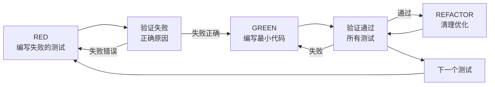
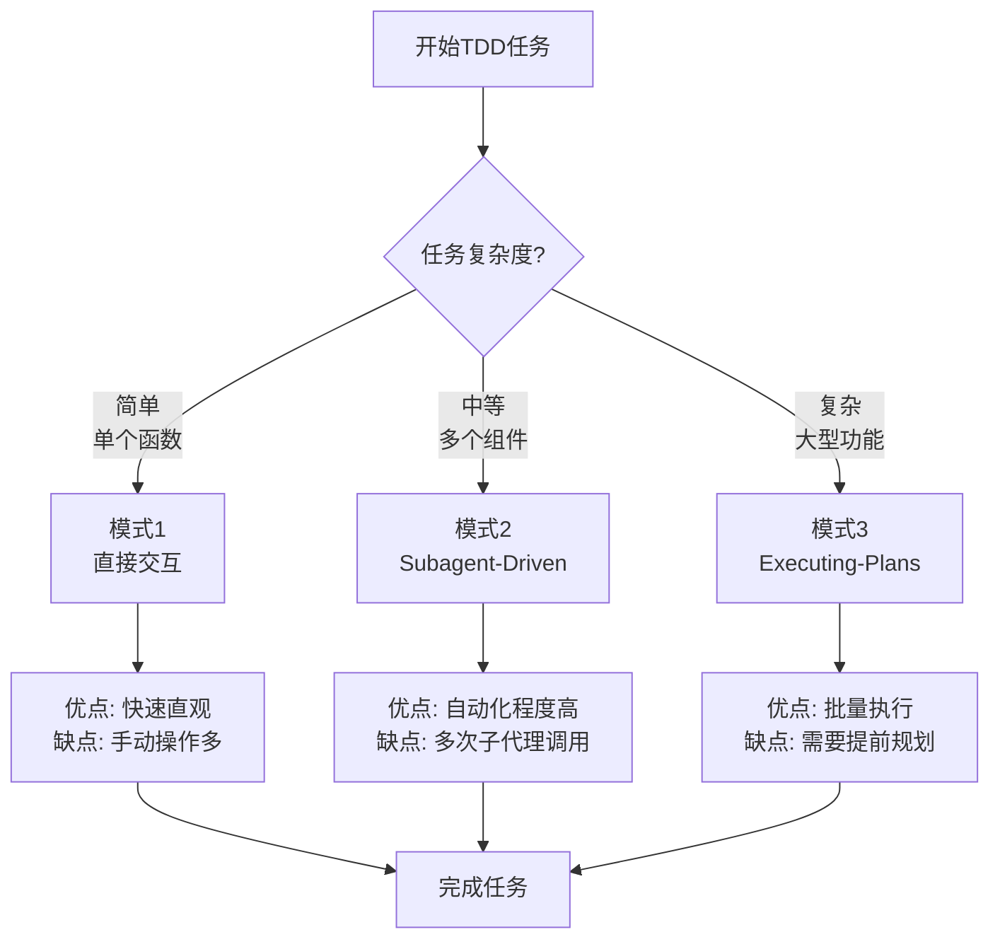
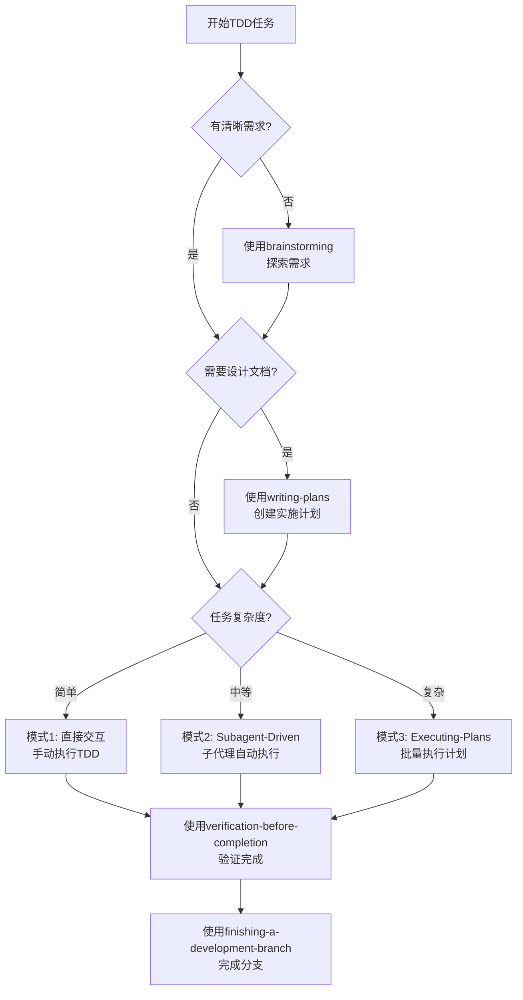
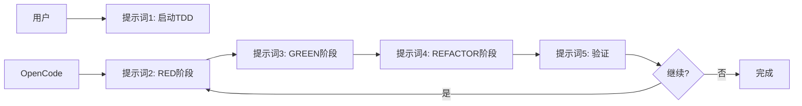
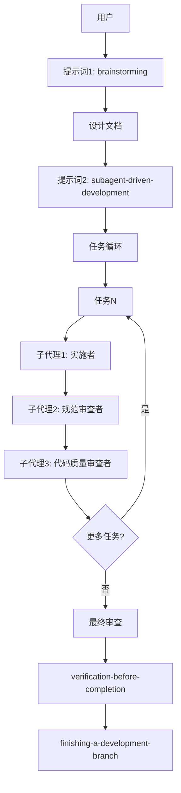
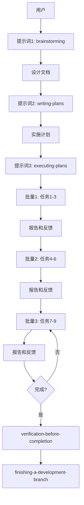
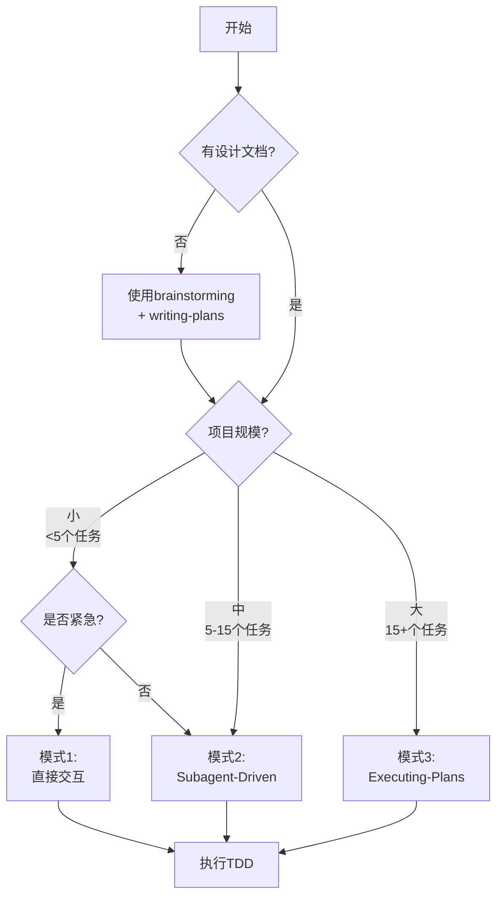
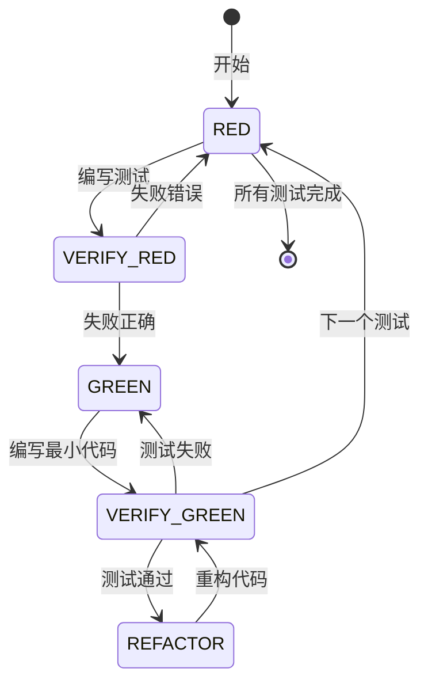
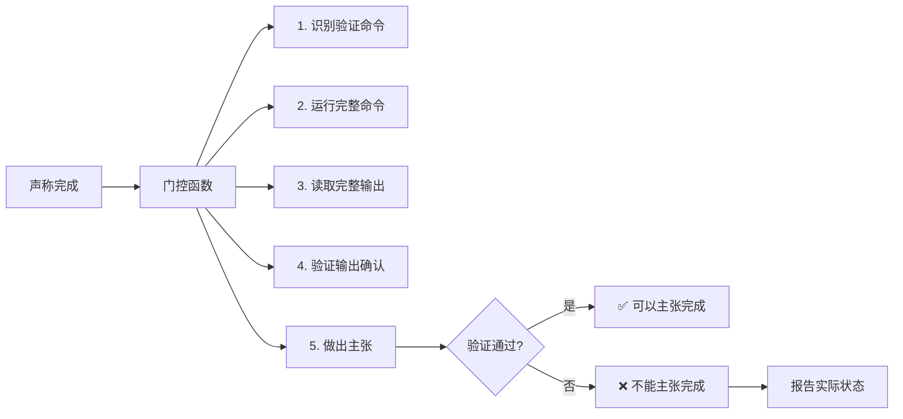

# OpenCode TDD实战指南 - 从提示词到完整案例

> **目标读者：** 想快速上手OpenCode TDD的开发者、需要具体提示词示例的用户、希望看完整对话案例的学习者
>
> **技术栈：** C++17、GoogleTest、CMake
>
> **文档版本：** 1.0.0
>
> **最后更新：** 2026年3月11日

---

## 目录

1. [快速入门](#1-快速入门)
   - 1.1 [OpenCode TDD核心概念](#11-opencode-tdd核心概念)
   - 1.2 [三种使用模式对比](#12-三种使用模式对比)
   - 1.3 [快速决策树](#13-快速决策树)

2. [OpenCode TDD模式详解](#2-opencode-tdd模式详解)
   - 2.1 [模式1：直接交互模式](#21-模式1直接交互模式)
   - 2.2 [模式2：Subagent-Driven模式](#22-模式2subagent-driven模式)
   - 2.3 [模式3：Executing-Plans模式](#23-模式3executing-plans模式)
   - 2.4 [模式选择指南](#24-模式选择指南)

3. [核心技能与提示词库](#3-核心技能与提示词库)
   - 3.1 [test-driven-development技能](#31-test-driven-development技能)
   - 3.2 [verification-before-completion技能](#32-verification-before-completion技能)
   - 3.3 [brainstorming技能](#33-brainstorming技能)
   - 3.4 [subagent-driven-development技能](#34-subagent-driven-development技能)
   - 3.5 [using-git-worktrees技能](#35-using-git-worktrees技能)

4. [完整对话案例演示 - C++计算器功能](#4-完整对话案例演示---c计算器功能)
   - 4.1 [案例背景](#41-案例背景)
   - 4.2 [阶段1：需求探索](#42-阶段1需求探索)
   - 4.3 [阶段2：TDD循环演示](#43-阶段2tdd循环演示)
   - 4.4 [阶段3：验证完成](#44-阶段3验证完成)
   - 4.5 [阶段4：提交和推送](#45-阶段4提交和推送)

5. [第二个案例 - C++ Bug修复](#5-第二个案例---c-bug修复)
   - 5.1 [Bug描述](#51-bug描述)
   - 5.2 [完整TDD流程](#52-完整tdd流程)

6. [常见场景提示词速查表](#6-常见场景提示词速查表)
   - 6.1 [场景1：新功能开发](#61-场景1新功能开发)
   - 6.2 [场景2：Bug修复](#62-场景2bug修复)
   - 6.3 [场景3：代码重构](#63-场景3代码重构)
   - 6.4 [场景4：API端点开发](#64-场景4api端点开发)
   - 6.5 [场景5：数据库模型添加](#65-场景5数据库模型添加)

7. [最佳实践和故障排除](#7-最佳实践和故障排除)
   - 7.1 [提示词优化技巧](#71-提示词优化技巧)
   - 7.2 [常见错误及解决方案](#72-常见错误及解决方案)
   - 7.3 [性能优化建议](#73-性能优化建议)
   - 7.4 [团队协作指南](#74-团队协作指南)

8. [附录](#8-附录)
   - 8.1 [C++测试框架对比](#81-c测试框架对比)
   - 8.2 [CMake配置速查](#82-cmake配置速查)
   - 8.3 [常见问题（FAQ）](#83-常见问题faq)
   - 8.4 [术语表](#84-术语表)

---

## 1. 快速入门

### 1.1 OpenCode TDD核心概念

**什么是OpenCode？**

OpenCode是一个具备Superpowers技能体系的AI助手，能够自动化测试驱动开发（TDD）的整个流程。

**核心原则：**

```
测试先于代码
观察测试失败
编写最小实现
验证测试通过
重构优化代码
```

**为什么使用OpenCode进行TDD？**

| 优势 | 说明 |
|------|------|
| **强制执行TDD** | 自动遵循红绿重构循环 |
| **减少人为错误** | 标准化的工作流程 |
| **提高效率** | 自动化重复任务 |
| **质量保障** | 双重验证机制 |
| **知识传承** | 详细的提示词和对话记录 |

**TDD核心循环：**



**理解关键术语：**

- **RED（红）**：编写失败的测试，定义期望行为
- **GREEN（绿）**：编写最小代码使测试通过
- **REFACTOR（重构）**：在保持测试通过的情况下改进代码质量
- **验证（Verification）**：运行测试、linter等确认工作完成

### 1.2 三种使用模式对比

OpenCode提供三种TDD使用模式，根据任务复杂度和项目规模选择：



**详细对比表：**

| 维度 | 模式1：直接交互 | 模式2：Subagent-Driven | 模式3：Executing-Plans |
|--------|------------------|----------------------|------------------------|
| **适用场景** | 简单功能、单个函数 | 中等复杂度、多组件 | 大型项目、多任务 |
| **提示词数量** | 5-10次 | 3-5次/任务 | 2-3次 |
| **交互次数** | 10-15次 | 15-20次 | 5-8次 |
| **学习曲线** | 低 | 中 | 高 |
| **自动化程度** | 20% | 80% | 90% |
| **适用技能** | test-driven-development<br/>verification-before-completion | brainstorming<br/>subagent-driven-development<br/>test-driven-development<br/>verification-before-completion | brainstorming<br/>writing-plans<br/>executing-plans<br/>test-driven-development<br/>verification-before-completion |
| **适用规模** | 个人开发、小项目 | 小团队、中项目 | 大团队、大项目 |
| **灵活性** | 高 | 中 | 低 |
| **速度** | 慢 | 快 | 最快 |

**模式选择建议：**

```
┌─────────────────────────────────────────────────────┐
│  简单任务（1-2个文件）                     │
│  → 使用模式1：直接交互                         │
└─────────────────────────────────────────────────────┘

┌─────────────────────────────────────────────────────┐
│  中等复杂度（3-5个文件，需要设计）           │
│  → 使用模式2：Subagent-Driven                 │
└─────────────────────────────────────────────────────┘

┌─────────────────────────────────────────────────────┐
│  大型功能（5+个文件，需要详细规划）           │
│  → 使用模式3：Executing-Plans                 │
└─────────────────────────────────────────────────────┘
```

### 1.3 快速决策树

使用以下决策树快速选择合适的模式：



**决策流程说明：**

**步骤1：需求是否清晰？**

- **否** → 使用`brainstorming`技能探索需求
- **是** → 继续步骤2

**步骤2：需要设计文档？**

- **是** → 使用`writing-plans`技能创建实施计划
- **否** → 继续步骤3

**步骤3：任务复杂度？**

- **简单**（1-2个函数）→ 模式1：直接交互
- **中等**（3-5个组件）→ 模式2：Subagent-Driven
- **复杂**（大型功能）→ 模式3：Executing-Plans

**步骤4：验证完成**

- 使用`verification-before-completion`技能

**步骤5：完成分支**

- 使用`finishing-a-development-branch`技能

---

## 2. OpenCode TDD模式详解

### 2.1 模式1：直接交互模式

**适用场景：**

✅ 简单功能开发（单个函数或小类）
✅ 快速原型验证
✅ 学习和实验
✅ 紧急bug修复（小范围）

**不适用场景：**

❌ 大型功能开发
❌ 需要详细设计的项目
❌ 多人协作的复杂任务

**工作流程：**



**优点：**

1. **快速开始** - 无需准备工作
2. **灵活调整** - 可以随时改变方向
3. **学习友好** - 清晰看到每个步骤
4. **低开销** - 不需要子代理调用

**缺点：**

1. **手动操作多** - 每个阶段需要手动提示
2. **容易偏离** - 缺少强制约束
3. **效率较低** - 相比自动化模式
4. **不便于回放** - 对话较长

**提示词示例：**

```
用户: 我要为C++计算器类添加一个乘法功能，使用TDD方式。

OpenCode: 我正在使用test-driven-development技能来开发乘法功能。

【RED阶段】
我来编写失败的测试：

```cpp
// tests/calculator_test.cpp
TEST(CalculatorTest, MultiplyTwoNumbers) {
    Calculator calc;
    EXPECT_EQ(calc.Multiply(3, 4), 12);
}
```

现在运行测试验证失败：

```bash
cmake --build build
./build/tests/calculator_tests --gtest_filter=CalculatorTest.MultiplyTwoNumbers
```

预期结果：测试失败，显示"Multiply方法未定义"

【GREEN阶段】
我来实现最小代码使测试通过：

```cpp
// src/calculator.cpp
int Calculator::Multiply(int a, int b) {
    return a * b;
}
```

现在运行测试验证通过：

```bash
./build/tests/calculator_tests --gtest_filter=CalculatorTest.MultiplyTwoNumbers
```

预期结果：测试通过

【REFACTOR阶段】
当前实现已经很简单，无需重构。

【验证】
运行所有测试确保没有回归：

```bash
./build/tests/calculator_tests
```

输出：所有测试通过

我正在使用verification-before-completion技能来验证完成。

验证结果：
- 测试命令：`./build/tests/calculator_tests`
- 输出：`[  PASSED  ] 15 tests`
- 状态：✅ 所有测试通过

乘法功能开发完成！
```

**关键提示词模板：**

1. **启动TDD提示词：**
   ```
   我要使用TDD方式开发[功能描述]，请使用test-driven-development技能。
   ```

2. **RED阶段提示词：**
   ```
   请进入RED阶段，为[具体功能]编写失败的测试。
   ```

3. **GREEN阶段提示词：**
   ```
   请进入GREEN阶段，编写最小代码使测试通过。
   ```

4. **验证提示词：**
   ```
   请使用verification-before-completion技能验证功能完成。
   ```

### 2.2 模式2：Subagent-Driven模式

**适用场景：**

✅ 中等复杂度功能（3-5个组件）
✅ 需要需求探索和设计
✅ 需要代码审查
✅ 团队协作开发

**不适用场景：**

❌ 超简单功能（过度设计）
❌ 无需设计的实验
❌ 非常大型项目（建议模式3）

**工作流程：**



**核心原理：**

每个任务使用三个子代理：
1. **实施者子代理** - 执行TDD开发
2. **规范审查者子代理** - 验证符合设计
3. **代码质量审查者子代理** - 评估代码质量

**优点：**

1. **高度自动化** - 子代理自动执行
2. **双重审查** - 规范+质量双重保障
3. **上下文隔离** - 每个子代理独立
4. **可并行** - 支持多个独立任务

**缺点：**

1. **子代理开销** - 每个任务需要多次调用
2. **需要规划** - 需要提前分解任务
3. **调试困难** - 子代理失败需要重试
4. **资源消耗** - 更多的API调用

**提示词示例：**

```
用户: 我要开发一个C++用户认证系统，包括注册、登录、令牌管理。

OpenCode: 我正在使用brainstorming技能来探索用户认证系统的需求。

【探索项目上下文】
- 检查现有代码结构
- 了解技术栈：C++17, GoogleTest, CMake
- 识别相关组件

【需求探索】
OpenCode: 用户认证需要支持哪些登录方式？
1. 仅邮箱密码
2. 邮箱密码 + 二次验证
3. 社交登录（OAuth）

用户: 选择1

OpenCode: 令牌过期时间应该设置为多长？
1. 1小时
2. 24小时
3. 7天
4. 可配置（默认24小时）

用户: 选择4

【方案提出】
OpenCode: 我提出3个实现方案：

方案1：基础JWT实现（推荐）
- 使用jwt-cpp库
- 访问令牌：15分钟
- 刷新令牌：7天
- 优点：简单直接，快速实现

方案2：OAuth2标准实现
- 完整的OAuth2流程
- 优点：行业标准，可扩展
- 缺点：过度设计

方案3：会话Cookie实现
- 传统cookie方式
- 优点：简单，无状态
- 缺点：安全性较低

推荐：方案1

用户: 同意方案1

【设计呈现】
OpenCode: 呈现设计文档（分节获取批准）

第1部分：架构设计
- AuthController：处理认证请求
- AuthService：实现认证逻辑
- TokenService：令牌生成和验证

用户: 确认

第2部分：API设计
POST /api/auth/register
POST /api/auth/login
POST /api/auth/refresh

用户: 确认

【编写设计文档】
OpenCode: 正在将设计保存到文档...
设计文档保存到：`docs/plans/2026-03-11-user-auth-design.md`

【调用writing-plans】
OpenCode: 我正在使用writing-plans技能创建实施计划。

实施计划保存到：`docs/plans/2026-03-11-user-auth-implementation.md`

【执行选择】
OpenCode: 计划完成。两个执行选项：
1. Subagent-Driven（此会话）- 我分派每任务新鲜子代理，在任务间审查，快速迭代
2. Parallel Session（单独）- 在新会话中打开executing-plans，批量执行并带有检查点

哪个选项？

用户: 选择1

【使用subagent-driven-development】
OpenCode: 我正在使用subagent-driven-development技能来执行此计划。

[读取计划文件，提取所有任务]
[创建TodoWrite任务列表]

任务1：创建认证控制器

[分派实施者子代理]
实施者：
- 编写注册功能的失败测试
- 实现注册功能
- 编写登录功能的失败测试
- 实现登录功能
- 运行所有测试通过
- 提交代码

[分派规范审查者子代理]
规范审查者：✅ 符合规范 - 所有要求已满足

[分派代码质量审查者子代理]
代码审查者：✅ 代码质量良好 - 无问题

[标记任务1完成]

任务2：创建认证服务

[继续类似流程...]

[所有任务完成后]
[分派最终代码审查者]
最终审查者：✅ 所有要求已满足，准备合并

【验证完成】
OpenCode: 我正在使用verification-before-completion技能来验证完成。

验证命令：`./build/tests/all_tests --gtest_filter=Auth*`
验证输出：`[  PASSED  ] 42 tests`
验证结果：✅ 所有测试通过

【完成分支】
OpenCode: 我正在使用finishing-a-development-branch技能来完成此项工作。

选项：
1. 本地合并回main
2. 推送并创建Pull Request
3. 保持分支原样
4. 放弃此工作

哪个选项？
```

**关键提示词模板：**

1. **启动brainstorming提示词：**
   ```
   我要开发[功能描述]，请使用brainstorming技能探索需求。
   ```

2. **选择执行模式提示词：**
   ```
   请使用subagent-driven-development技能执行此实施计划。
   ```

3. **子代理反馈提示词：**
   ```
   子代理提出了问题：[问题内容]
   我的回答：[答案]
   ```

### 2.3 模式3：Executing-Plans模式

**适用场景：**

✅ 大型项目（5+个主要任务）
✅ 需要详细规划
✅ 多人协作开发
✅ 需要批量执行

**不适用场景：**

❌ 小功能开发（过度设计）
❌ 快速原型（无需规划）
❌ 单人小项目（模式2更合适）

**工作流程：**



**核心特点：**

1. **批量执行** - 每次执行3个任务
2. **检查点审查** - 每批完成后报告
3. **用户反馈** - 根据反馈调整
4. **效率最高** - 最少的人工干预

**优点：**

1. **批量执行** - 高效率
2. **检查点机制** - 及时发现和修正问题
3. **详细规划** - 减少决策时间
4. **适合大型项目** - 管理复杂度

**缺点：**

1. **前期工作** - 需要详细规划
2. **灵活性低** - 难以中途大幅调整
3. **需要新会话** - 通常在独立会话中执行
4. **调试困难** - 批量执行问题不易定位

**提示词示例：**

```
用户: 我要开发一个大型电商系统，包括用户、商品、订单、支付等模块。

OpenCode: 我正在使用brainstorming技能来探索电商系统的需求。

[详细的需求探索过程...]
[设计文档创建...]
[实施计划创建...]

OpenCode: 我正在使用writing-plans技能创建实施计划。

[详细分解任务...]
[计划保存到：docs/plans/2026-03-11-ecommerce-implementation.md]

OpenCode: 计划完成。两个执行选项：
1. Subagent-Driven（此会话）
2. Parallel Session（单独）- 在新会话中打开executing-plans

用户: 选择2

OpenCode: 指导：在新终端会话中执行以下步骤：

1. 切换到工作树：
   cd .worktrees/ecommerce

2. 打开新OpenCode会话

3. 使用以下提示词启动：
   "我正在使用executing-plans技能来执行此计划。请读取docs/plans/2026-03-11-ecommerce-implementation.md并开始执行。"

【在新会话中】
OpenCode: 我正在使用executing-plans技能来执行此计划。

【步骤1：加载和审查计划】
[读取计划文件]
[批判性审查]
[创建TodoWrite]

【步骤2：执行批量1（任务1-3）】
任务1：创建用户模型
- 步骤1：编写失败的测试
- 步骤2：运行测试验证失败
- 步骤3：实现最小代码
- 步骤4：运行测试验证通过
- 步骤5：提交

任务2：创建用户服务
[类似流程...]

任务3：创建用户控制器
[类似流程...]

【步骤3：报告批量1完成】
OpenCode: 批量1完成。

实施内容：
- 创建了User类，包含id、name、email、password字段
- 创建了UserService，实现了CreateUser方法
- 创建了AuthController，实现了Register接口

验证输出：
```
[==========] Running 15 tests from 3 test suites.
[----------] 3 tests from UserModelTest
[ RUN      ] UserModelTest.ConstructValidUser
[       OK ] UserModelTest.ConstructValidUser
[----------] 3 tests from UserModelTest (3 ms total)
[==========] 15 tests from 3 test suites ran. (25 ms total)
[  PASSED  ] 15 tests.
```

准备好接收反馈。

用户: 任务1的User类缺少年龄字段，请添加。

OpenCode: [应用修改，添加年龄字段]

【步骤4：执行批量2（任务4-6）】
[继续执行...]

【步骤5：完成开发】
OpenCode: 所有任务完成并验证。

我正在使用finishing-a-development-branch技能来完成此项工作。

验证测试：
```bash
./build/tests/all_tests
```

输出：所有测试通过（127个测试，0个失败）

呈现选项：
1. 本地合并回main
2. 推送并创建Pull Request
3. 保持分支原样
4. 放弃此工作

用户: 选择2

【执行：推送并创建PR】
```

**关键提示词模板：**

1. **启动executing-plans提示词：**
   ```
   我正在使用executing-plans技能来执行此计划：[计划文件路径]
   ```

2. **继续下一批提示词：**
   ```
   请继续执行下一批任务。
   ```

3. **应用修改提示词：**
   ```
   请应用以下修改：[具体修改内容]
   ```

### 2.4 模式选择指南

**决策矩阵：**

| 场景 | 推荐模式 | 理由 |
|--------|----------|------|
| **单个函数添加** | 模式1：直接交互 | 简单快速，无需规划 |
| **小类开发（3-5方法）** | 模式1或模式2 | 根据团队规模选择 |
| **中等功能（5-10方法）** | 模式2：Subagent-Driven | 需要审查和质量保障 |
| **大型功能（10+方法）** | 模式3：Executing-Plans | 需要批量执行和详细规划 |
| **多个独立任务** | 模式3：Executing-Plans | 批量执行效率高 |
| **需要探索需求** | 模式2或模式3 | brainstorming + 详细计划 |
| **紧急bug修复** | 模式1：直接交互 | 快速响应 |
| **团队协作项目** | 模式2或模式3 | 标准化和可追踪 |
| **学习TDD** | 模式1：直接交互 | 清晰看到每个步骤 |
| **生产环境问题** | 模式2：Subagent-Driven | 需要双重审查 |

**快速选择流程图：**



**实战选择建议：**

**新手开发者：**
- 首选模式1（直接交互）
- 学习TDD流程和OpenCode使用
- 逐步过渡到模式2

**小团队（2-3人）：**
- 常用模式2（Subagent-Driven）
- 平衡自动化和灵活性
- 便于代码审查和协作

**大团队（5+人）：**
- 推荐模式3（Executing-Plans）
- 标准化流程
- 便于追踪和管理

**项目负责人：**
- 对于所有重要功能，使用模式3
- 确保详细规划和可追踪性
- 便于项目管理和质量控制

**独立开发者：**
- 简单任务：模式1
- 复杂任务：模式2
- 学习阶段：模式1→2→3

---

## 3. 核心技能与提示词库

### 3.1 test-driven-development技能

**技能描述：**

在实现任何功能或bug修复时使用，在编写实施代码之前。

**铁律：**

```
没有失败测试就没有生产代码
```

**核心循环：**



**提示词库：**

#### 场景1：启动TDD开发

```
用户: 我要为[类名]添加[功能名]功能，请使用TDD方式。

OpenCode: 我正在使用test-driven-development技能来开发[功能名]功能。

【RED阶段】
我来编写失败的测试来定义期望行为：

```cpp
// tests/[测试文件]
TEST([测试套件], [测试描述]) {
    [测试代码]
}
```

运行测试验证失败：
```bash
[测试命令]
```

预期：测试失败，显示[函数名]未定义

【GREEN阶段】
编写最小代码使测试通过：

```cpp
// src/[实现文件]
[实现代码]
```

运行测试验证通过：
```bash
[测试命令]
```

预期：测试通过

【REFACTOR阶段】
检查是否需要重构：
- [ ] 删除重复代码
- [ ] 改进命名
- [ ] 提取辅助函数

如果需要重构，执行并重新运行测试验证。

【验证】
运行所有测试确保没有回归：
```bash
[所有测试命令]
```

验证结果：✅ 所有测试通过

[功能名]功能开发完成！
```

#### 场景2：编写失败测试（RED）

```
用户: 请进入RED阶段，为[具体功能]编写测试。

OpenCode: 我正在编写失败的测试来定义期望行为。

测试用例：
1. [测试场景1]
2. [测试场景2]
3. [测试场景3]

```cpp
// tests/[测试文件]
#include "../src/[头文件]"
#include <gtest/gtest.h>

TEST([测试套件], [测试场景1]) {
    [准备数据]
    [调用函数]
    [验证结果]
}

TEST([测试套件], [测试场景2]) {
    [准备数据]
    [调用函数]
    [验证结果]
}

TEST([测试套件], [测试场景3]) {
    [准备数据]
    [调用函数]
    [验证结果]
}
```

运行测试验证失败：
```bash
[运行测试命令]
```

预期输出：
```
[==========] Running 3 tests from 1 test suite.
[----------] Global test environment set-up.
[----------] 3 tests from CalculatorTest
[ RUN      ] CalculatorTest.MultiplyPositiveNumbers
[  FAILED  ] CalculatorTest.MultiplyPositiveNumbers
CalculatorTest.cpp:10: Failure
Expected: 12
Actual: undefined
[  FAILED  ] 2 more tests
[==========] 3 tests from 1 test suite ran. (12 ms total)
```

验证：✅ 测试失败，原因是功能未实现

RED阶段完成。
```

#### 场景3：编写最小实现（GREEN）

```
用户: 请进入GREEN阶段，实现[函数名]使测试通过。

OpenCode: 我正在编写最小代码使测试通过。

基于测试的期望行为，实现：

```cpp
// src/[实现文件]
#include "[头文件]"

[返回类型] [类名]::[函数名]([参数]) {
    // 最小实现，仅使测试通过
    return [返回值];
}
```

如果需要依赖：
```cpp
#include <必要的头文件>

[辅助函数]([参数]) {
    // 最小实现
}

[返回类型] [类名]::[函数名]([参数]) {
    return [辅助函数]([参数]);
}
```

运行测试验证通过：
```bash
[运行测试命令]
```

预期输出：
```
[==========] Running 3 tests from 1 test suite.
[----------] Global test environment set-up.
[----------] 3 tests from CalculatorTest
[ RUN      ] CalculatorTest.MultiplyPositiveNumbers
[       OK ] CalculatorTest.MultiplyPositiveNumbers
[ RUN      ] CalculatorTest.MultiplyByZero
[       OK ] CalculatorTest.MultiplyByZero
[ RUN      ] CalculatorTest.MultiplyNegativeNumbers
[       OK ] CalculatorTest.MultiplyNegativeNumbers
[----------] 3 tests from CalculatorTest (15 ms total)
[==========] 3 tests from 1 test suite ran. (42 ms total)
[  PASSED  ] 3 tests.
```

验证：✅ 所有测试通过

GREEN阶段完成。
```

#### 场景4：重构代码（REFACTOR）

```
用户: 请进入REFACTOR阶段，优化[类名/函数名]的代码。

OpenCode: 我正在重构代码以改善质量。

当前代码分析：
```cpp
// 当前实现
[原始代码]
```

重构目标：
- [ ] 消除重复
- [ ] 改进命名
- [ ] 提取辅助函数
- [ ] 简化逻辑
- [ ] 提高可读性

重构方案：
1. [重构点1]
2. [重构点2]
3. [重构点3]

重构后代码：
```cpp
// src/[实现文件]
[重构后的代码]
```

运行测试验证重构未破坏功能：
```bash
[运行测试命令]
```

预期输出：
```
[==========] Running 3 tests from 1 test suite.
[----------] Global test environment set-up.
[----------] 3 tests from CalculatorTest
[ RUN      ] CalculatorTest.MultiplyPositiveNumbers
[       OK ] CalculatorTest.MultiplyPositiveNumbers
[----------] 3 tests from CalculatorTest (15 ms total)
[==========] 3 tests from 1 test suite ran. (42 ms total)
[  PASSED  ] 3 tests.
```

验证：✅ 所有测试通过

REFACTOR阶段完成。
```

#### 场景5：Bug修复TDD

```
用户: 发现一个bug：[bug描述]，请使用TDD方式修复。

OpenCode: 我正在使用test-driven-development技能来修复bug。

【步骤1：编写失败测试重现bug】

```cpp
// tests/[测试文件]
TEST([测试套件], [bug描述]) {
    [类名] obj;

    // 重现bug的条件
    [输入条件]

    // 期望的行为
    EXPECT_EQ(obj.[函数名]([参数]), [期望值]);
}
```

运行测试验证失败（重现bug）：
```bash
[运行测试命令]
```

预期输出：
```
[  FAILED  ] CalculatorTest.DivisionByZero
CalculatorTest.cpp:25: Failure
Expected: 0
Actual: -1
```

验证：✅ Bug已重现，测试失败

【步骤2：修复bug】

分析bug原因：
[分析内容]

修复代码：
```cpp
// src/[实现文件]
[修复后的代码]
```

【步骤3：运行测试验证修复】

```bash
[运行测试命令]
```

预期输出：
```
[==========] Running 3 tests from 1 test suite.
[----------] Global test environment set-up.
[----------] 3 tests from CalculatorTest
[ RUN      ] CalculatorTest.DivisionByZero
[       OK ] CalculatorTest.DivisionByZero
[----------] 3 tests from CalculatorTest (15 ms total)
[==========] 3 tests from 1 test suite ran. (42 ms total)
[  PASSED  ] 3 tests.
```

验证：✅ Bug已修复，所有测试通过

Bug修复完成！
```

**测试命名最佳实践：**

```
✅ 好的测试名称：
- TEST(CalculatorTest, AddsTwoNumbers)
- TEST(UserServiceTest, CreatesValidUser)
- TEST(AuthServiceTest, RejectsDuplicateEmail)

❌ 不好的测试名称：
- TEST(CalculatorTest, Test1)
- TEST(UserServiceTest, ItWorks)
- TEST(AuthServiceTest, SomeFunctionality)
```

**常见错误及避免：**

| 错误 | 表现 | 避免 |
|--------|------|------|
| **测试通过立即** | 编写测试后立即通过 | 确保测试因功能缺失而失败 |
| **测试实现细节** | 测试内部逻辑 | 测试行为，不测试实现 |
| **过度复杂** | 一个测试做太多事 | 每个测试一个行为 |
| **缺少边界测试** | 只测试正常情况 | 测试边界和错误情况 |
| **依赖外部状态** | 测试依赖数据库 | 使用mock或测试数据 |

**验证清单：**

在进入下一阶段前，确认：

- [ ] RED阶段：
  - [ ] 测试已编写
  - [ ] 测试运行并失败
  - [ ] 失败原因是功能未实现（不是语法错误）

- [ ] GREEN阶段：
  - [ ] 最小代码已实现
  - [ ] 测试运行并通过
  - [ ] 没有添加额外功能

- [ ] REFACTOR阶段：
  - [ ] 代码已优化
  - [ ] 测试仍然通过
  - [ ] 没有改变行为

### 3.2 verification-before-completion技能

**技能描述：**

在声称工作完成、修复或通过之前使用，在提交或创建PR之前 - 要求运行验证命令并在做出任何成功主张之前确认输出；始终是证据先于主张。

**铁律：**

```
没有新的验证证据就不能声称完成
```

**核心原则：**

证据先于主张，始终如此。

**工作流程：**



**提示词库：**

#### 场景1：验证测试通过

```
用户: 功能开发完成，请验证。

OpenCode: 我正在使用verification-before-completion技能来验证完成。

【步骤1：识别验证命令】

验证测试通过的命令：
```bash
./build/tests/[测试可执行文件]
```

【步骤2：运行完整命令】

```bash
./build/tests/[测试可执行文件]
```

【步骤3：读取完整输出】

```
[==========] Running 42 tests from 7 test suites.
[----------] Global test environment set-up.
[----------] 15 tests from CalculatorTest
[ RUN      ] CalculatorTest.AddsTwoNumbers
[       OK ] CalculatorTest.AddsTwoNumbers
[ RUN      ] CalculatorTest.SubtractsTwoNumbers
[       OK ] CalculatorTest.SubtractsTwoNumbers
[... 更多测试输出 ...]
[----------] 15 tests from CalculatorTest (125 ms total)
[----------] 10 tests from UserServiceTest
[ RUN      ] UserServiceTest.CreatesValidUser
[       OK ] UserServiceTest.CreatesValidUser
[... 更多测试输出 ...]
[==========] 42 tests from 7 test suites ran. (423 ms total)
[  PASSED  ] 42 tests.
```

【步骤4：验证输出确认】

验证检查：
- [ ] 测试总数：42个
- [ ] 通过数：42个
- [ ] 失败数：0个
- [ ] 输出无错误或警告

【步骤5：做出主张】

✅ 验证结果：
- 命令：`./build/tests/[测试可执行文件]`
- 输出：`[  PASSED  ] 42 tests.`
- 状态：✅ 所有测试通过（42/42）

主张：功能开发完成，所有测试通过。
```

#### 场景2：验证Bug修复

```
用户: Bug已修复，请验证。

OpenCode: 我正在使用verification-before-completion技能来验证bug修复。

【步骤1：识别验证命令】

验证bug修复的命令：
```bash
./build/tests/[测试可执行文件] --gtest_filter=*[Bug测试名称]*
```

【步骤2：运行完整命令】

```bash
./build/tests/[测试可执行文件] --gtest_filter=*DivisionByZero*
```

【步骤3：读取完整输出】

```
[==========] Running 2 tests from 1 test suite.
[----------] Global test environment set-up.
[----------] 2 tests from DivisionTest
[ RUN      ] DivisionTest.DividesByZero
[       OK ] DivisionTest.DividesByZero
[ RUN      ] DivisionTest.DividesNormalNumbers
[       OK ] DivisionTest.DividesNormalNumbers
[----------] 2 tests from DivisionTest (15 ms total)
[==========] 2 tests from 1 test suite ran. (42 ms total)
[  PASSED  ] 2 tests.
```

【步骤4：验证输出确认】

验证检查：
- [ ] Bug测试通过
- [ ] 其他相关测试通过
- [ ] 没有引入新失败

【步骤5：做出主张】

✅ 验证结果：
- 命令：`./build/tests/[测试可执行文件] --gtest_filter=*DivisionByZero*`
- 输出：`[  PASSED  ] 2 tests.`
- 状态：✅ Bug已修复，所有相关测试通过

主张：Bug修复完成，验证通过。
```

#### 场景3：验证代码质量

```
用户: 代码已优化，请验证质量和测试。

OpenCode: 我正在使用verification-before-completion技能来验证完成。

【步骤1：识别验证命令】

验证命令：
1. 测试：`./build/tests/[测试可执行文件]`
2. Linter：`clang-format --dry-run src/*.cpp`
3. 静态分析：`clang-tidy src/*.cpp -- -Iinclude/`

【步骤2：运行完整命令】

```bash
# 测试
./build/tests/[测试可执行文件]

# Linter检查
clang-format --dry-run src/*.cpp

# 静态分析
clang-tidy src/*.cpp -- -Iinclude/
```

【步骤3：读取完整输出】

测试输出：
```
[==========] Running 42 tests from 7 test suites.
[==========] 42 tests from 7 test suites ran. (423 ms total)
[  PASSED  ] 42 tests.
```

Linter输出：
```
# clang-format检查通过，无需要格式化的文件
```

静态分析输出：
```
42 warnings generated.
0 errors.
```

【步骤4：验证输出确认】

验证检查：
- [ ] 测试：42/42通过
- [ ] Linter：无格式问题
- [ ] 静态分析：42个警告，0个错误

注意：静态分析有42个警告，需要处理。

【步骤5：做出主张】

❌ 验证结果：
- 测试：✅ 42/42通过
- Linter：✅ 无格式问题
- 静态分析：⚠️ 42个警告需要处理

主张：测试通过，Linter干净，但静态分析有42个警告需要处理。建议先修复警告后再提交。

用户: 请修复这些警告。

OpenCode: [修复静态分析警告...]

【重新验证】

```bash
clang-tidy src/*.cpp -- -Iinclude/
```

输出：
```
0 warnings generated.
0 errors.
```

✅ 最终验证结果：
- 测试：✅ 42/42通过
- Linter：✅ 无格式问题
- 静态分析：✅ 0个警告，0个错误

最终主张：代码质量验证通过，可以提交。
```

#### 场景4：验证构建成功

```
用户: 代码已更改，请验证构建和测试。

OpenCode: 我正在使用verification-before-completion技能来验证完成。

【步骤1：识别验证命令】

验证命令：
1. 构建：`cmake --build build`
2. 测试：`./build/tests/[测试可执行文件]`

【步骤2：运行完整命令】

```bash
# 构建
cmake --build build

# 测试
./build/tests/[测试可执行文件]
```

【步骤3：读取完整输出】

构建输出：
```
[ 50%] Building CXX object src/calculator.cpp.o
[100%] Building CXX object tests/calculator_test.cpp.o
[100%] Linking CXX executable tests/calculator_tests
[100%] Built target calculator_tests
```

测试输出：
```
[==========] Running 15 tests from 1 test suite.
[==========] 15 tests from 1 test suite ran. (123 ms total)
[  PASSED  ] 15 tests.
```

【步骤4：验证输出确认】

验证检查：
- [ ] 构建：成功，无错误
- [ ] 测试：15/15通过

【步骤5：做出主张】

✅ 验证结果：
- 构建：✅ 成功
- 测试：✅ 15/15通过

主张：构建和测试都通过，代码可以提交。
```

**常见验证错误：**

| 错误类型 | 表现 | 正确做法 |
|---------|------|---------|
| **使用"应该"** | "测试应该通过" | 运行测试并显示输出 |
| **信任代理报告** | "代理说成功" | 独立运行验证命令 |
| **部分验证** | 只检查测试，忽略linter | 运行所有验证命令 |
| **跳过验证** | "我知道没问题" | 必须运行验证命令 |
| **过期的验证** | 使用之前的输出 | 必须运行新的验证 |

**验证命令速查表：**

| 验证类型 | 命令 | 预期输出 |
|---------|------|---------|
| **所有测试** | `./build/tests/all_tests` | `PASSED  N tests` |
| **特定测试** | `./build/tests/all_tests --gtest_filter=TestSuite.TestName` | `PASSED` |
| **代码格式** | `clang-format --dry-run src/*.cpp` | 无输出（无需要格式化的文件） |
| **静态分析** | `clang-tidy src/*.cpp -- -Iinclude/` | `0 warnings, 0 errors` |
| **内存检查** | `valgrind ./build/tests/all_tests` | `0 errors from 0 contexts` |
| **构建** | `cmake --build build` | `Built target` |

### 3.3 brainstorming技能

**技能描述：**

在任何创造性工作之前必须使用 - 创建功能、构建组件、添加功能或修改行为。探索用户意图、需求和设计，然后实现。

**硬性门槛：**

```
在呈现设计并获得用户批准之前，不要调用任何实施技能，不要编写任何代码，不要搭建任何项目，或采取任何实施行动。
```

**工作流程：**

```mermaid
flowchart LR
    Start[开始] -> Explore[探索项目上下文]
    Explore -> Ask[提出澄清问题]
    Ask -> Approve{设计批准?}
    Approve -->|否| Ask
    Approve -->|是| Design[呈现设计]
    Design -> Doc[编写设计文档]
    Doc -> Transition[调用writing-plans]
```

**提示词库：**

#### 场景1：启动需求探索

```
用户: 我要开发[功能描述]，请帮我探索需求。

OpenCode: 我正在使用brainstorming技能来探索[功能描述]的需求。

【步骤1：探索项目上下文】

项目结构：
```
[项目目录结构]
```

技术栈：
- C++17
- GoogleTest
- CMake
- [其他依赖]

相关代码：
- [现有相关组件1]
- [现有相关组件2]

【步骤2：提出澄清问题】

问题1：[问题内容]
1. 选项1
2. 选项2
3. 选项3

用户回答：选择1

问题2：[问题内容]
1. 选项1
2. 选项2

用户回答：选择2

【步骤3：提出方案】

基于探索的问题，我提出3个实现方案：

方案1：[方案名称]（推荐）
- 实现方式：[详细说明]
- 优点：[优势列表]
- 缺点：[劣势列表]
- 推荐理由：[为什么推荐]

方案2：[方案名称]
- 实现方式：[详细说明]
- 优点：[优势列表]
- 缺点：[劣势列表]

方案3：[方案名称]
- 实现方式：[详细说明]
- 优点：[优势列表]
- 缺点：[劣势列表]

推荐：方案1

用户：同意方案1

【步骤4：呈现设计】

第1部分：架构设计

[架构描述]
- [组件1]：[职责]
- [组件2]：[职责]
- [组件3]：[职责]

数据流：
1. [步骤1]
2. [步骤2]
3. [步骤3]

这看起来正确吗？

用户：是的，继续

第2部分：API设计

[API列表和详细说明]

这看起来正确吗？

用户：是的，继续

[继续呈现其他部分...]

【步骤5：编写设计文档】

设计文档保存到：docs/plans/2026-03-11-[功能]-design.md

【步骤6：过渡到实施】

我正在调用writing-plans技能创建实施计划。
```

#### 场景2：提出澄清问题

```
用户: 开发用户注册功能。

OpenCode: 基于项目上下文，我需要澄清一些问题。

问题1：用户注册需要哪些必填字段？
1. 仅邮箱和密码
2. 邮箱、密码、用户名
3. 邮箱、密码、用户名、手机号
4. 自定义（请说明）

用户：选择2

问题2：密码强度要求？
1. 最少6位
2. 最少8位，包含大小写字母和数字
3. 最少10位，包含大小写字母、数字和特殊字符

用户：选择2

问题3：注册成功后是否需要邮箱验证？
1. 需要，发送验证邮件
2. 不需要，直接激活

用户：选择1

问题4：是否支持第三方登录（Google、GitHub等）？
1. 支持
2. 不支持

用户：选择2

[继续探索其他方面...]
```

#### 场景3：呈现设计

```
OpenCode: 基于我们的讨论，我呈现用户注册功能的设计。

第1部分：架构设计

分层架构：
```
┌─────────────────────────────────┐
│   AuthController              │  ← 处理HTTP请求
├─────────────────────────────────┤
│   AuthService               │  ← 实现业务逻辑
├─────────────────────────────────┤
│   UserService               │  ← 管理用户数据
├─────────────────────────────────┤
│   Database                  │  ← 数据持久化
└─────────────────────────────────┘
```

组件职责：
- **AuthController**：接收注册请求，验证输入，返回响应
- **AuthService**：实现密码哈希、邮箱验证、令牌生成
- **UserService**：创建用户、检查邮箱重复、查询用户
- **Database**：SQLite数据库，存储用户数据

数据流：
1. 客户端发送POST /api/auth/register
2. AuthController接收请求，验证输入格式
3. AuthController调用AuthService.Register()
4. AuthService调用UserService.CreateUser()
5. UserService检查邮箱是否重复
6. UserService创建用户，密码哈希
7. Database保存用户数据
8. 生成邮箱验证令牌
9. 发送验证邮件
10. 返回成功响应

这看起来正确吗？

用户：是的，继续

第2部分：API设计

端点1：POST /api/auth/register

请求体：
```json
{
  "email": "user@example.com",
  "password": "SecurePass123",
  "username": "john_doe"
}
```

成功响应（201）：
```json
{
  "success": true,
  "message": "Registration successful. Please check your email for verification.",
  "userId": "uuid-here"
}
```

失败响应（400）：
```json
{
  "success": false,
  "error": "Email already exists"
}
```

验证规则：
- 邮箱：必须是有效邮箱格式
- 密码：最少8位，包含大小写字母和数字
- 用户名：3-20个字符，字母、数字、下划线

这看起来正确吗？

用户：是的，继续

第3部分：错误处理

错误类型和HTTP状态码：

| 错误类型 | HTTP状态码 | 错误消息 |
|---------|------------|---------|
| 无效邮箱格式 | 400 | Invalid email format |
| 密码太弱 | 400 | Password must be at least 8 characters with uppercase, lowercase and numbers |
| 邮箱已存在 | 409 | Email already exists |
| 用户名已存在 | 409 | Username already exists |
| 数据库错误 | 500 | Internal server error |

错误响应格式：
```json
{
  "success": false,
  "error": "Error message",
  "code": "ERROR_CODE"
}
```

这看起来正确吗？

用户：是的，继续

[继续呈现其他部分...]
```

#### 场景4：编写设计文档

```
OpenCode: 正在编写设计文档到文件。

设计文档模板：

```markdown
# [功能名称] 设计文档

> **创建日期：** YYYY-MM-DD
> **作者：** [OpenCode]
> **状态：** [Draft/Approved]

## 1. 功能概述

[一句话描述功能]

## 2. 架构设计

### 2.1 系统架构

[架构图或描述]

### 2.2 组件设计

| 组件 | 职责 | 依赖 |
|------|------|------|
| [组件1] | [职责] | [依赖] |
| [组件2] | [职责] | [依赖] |

### 2.3 数据流

1. [步骤1]
2. [步骤2]
3. [步骤3]

## 3. API设计

### 3.1 端点列表

| 方法 | 路径 | 描述 |
|------|------|------|
| [方法] | [路径] | [描述] |

### 3.2 请求/响应格式

[详细的请求响应格式]

## 4. 数据模型

### 4.1 数据库Schema

[数据库模型]

## 5. 错误处理

### 5.1 错误类型

[错误类型和HTTP状态码]

### 5.2 错误响应格式

[标准错误响应格式]

## 6. 测试策略

### 6.1 单元测试

[单元测试覆盖]

### 6.2 集成测试

[集成测试覆盖]

## 7. 安全考虑

### 7.1 认证和授权

[安全措施]

### 7.2 数据保护

[数据保护措施]
```

设计文档已保存：docs/plans/YYYY-MM-DD-[功能]-design.md

我正在调用writing-plans技能创建实施计划。
```

**brainstorming关键原则：**

1. **一次问一个问题** - 不要用多个问题压倒用户
2. **多选优先** - 尽可能提供选项
3. **YAGNI无情** - 从设计中删除不必要的功能
4. **探索替代方案** - 总是提出2-3个方案
5. **增量验证** - 呈现设计，在继续之前获得批准
6. **灵活** - 当某些不合理时回去澄清

**常见brainstorming错误：**

| 错误 | 表现 | 正确做法 |
|------|------|---------|
| **跳过探索** | 直接进入实施 | 必须探索项目上下文 |
| **问太多问题** | 一次问5-10个问题 | 每次只问1-2个问题 |
| **没有方案** | 直接问要什么 | 提供2-3个方案供选择 |
| **不分节呈现** | 一次性呈现全部设计 | 分节呈现，每节确认 |
| **不写设计文档** | 直接实施 | 必须写设计文档并保存 |

### 3.4 subagent-driven-development技能

**技能描述：**

在当前会话中执行带有独立任务的实施计划时使用。每个任务使用新子代理，两阶段审查（先规范后质量）= 高质量，快速迭代。

**核心原理：**

每个任务使用新子代理 + 两阶段审查（先规范后质量）= 高质量，快速迭代。

**工作流程：**

```mermaid
flowchart TB
    Start[开始] -> Read[读取计划]
    Read -> Extract[提取所有任务]
    Extract -> Create[创建TodoWrite]
    Create -> Loop[任务循环]

    Loop -> Task[任务N]
    Task -> SA1[实施者子代理]
    SA1 -> SA2[规范审查者]
    SA2 -> SA3[代码质量审查者]
    SA3 -> Next{更多任务?}

    Next -->|是| Task
    Next -->|否| Final[最终审查]
    Final -> Verify[verification-before-completion]
    Verify -> Finish[finishing-a-development-branch]
```

**提示词库：**

#### 场景1：启动subagent-driven-development

```
用户: 实施计划已完成，请帮我执行。

OpenCode: 我正在使用subagent-driven-development技能来执行此计划。

【步骤1：读取计划】

[读取计划文件：docs/plans/YYYY-MM-DD-[功能]-implementation.md]

【步骤2：提取所有任务】

任务列表：
1. [任务1描述]
2. [任务2描述]
3. [任务3描述]
...
N. [任务N描述]

【步骤3：创建TodoWrite】

已创建任务追踪列表。

【开始执行任务循环】

任务1：[任务1描述]

[获取任务1的详细文本和上下文]

【分派实施者子代理】

子代理提示词：
```
你是实施者子代理。你的任务是：
[任务1的详细文本]

上下文：
[相关上下文信息]

要求：
1. 严格遵循test-driven-development技能
2. 编写失败的测试
3. 运行测试验证失败
4. 编写最小代码
5. 运行测试验证通过
6. 提交代码
7. 自我审查代码

开始执行。
```

实施者子代理开始工作...

[子代理执行过程...]

实施者子代理完成：
- 实现了[具体内容]
- 添加了[具体测试]
- 测试结果：[X/Y]通过
- 自我审查：[审查结果]
- 已提交：[commit hash]

【分派规范审查者子代理】

子代理提示词：
```
你是规范审查者子代理。

实施者子代理完成了任务1：
[任务1描述]

实施详情：
[实施者提供的详情]

请审查以下内容：
1. 是否符合设计文档规范？
2. 是否满足了所有要求？
3. 是否有多余或遗漏的功能？

审查格式：
- 列出符合规范的点
- 列出不符合规范的点（如果有）
- 给出总体评价（符合/不符合）

开始审查。
```

规范审查者子代理完成审查：
✅ 符合规范 - 所有要求已满足，没有多余内容

或

❌ 不符合规范 - 发现问题：
- 缺失：[缺失的功能]
- 多余：[多余的功能]

【如果不符合规范】
[分派实施者子代理修复]

实施者子代理修复：
- 修复了缺失的功能
- 移除了多余的功能
- 重新运行测试
- 已提交：[commit hash]

【重新规范审查】

规范审查者子代理重新审查：
✅ 符合规范 - 所有问题已修复

【分派代码质量审查者子代理】

子代理提示词：
```
你是代码质量审查者子代理。

实施者子代理完成了任务1：
[任务1描述]

代码变更：
[git diff输出]

请审查以下方面：
1. 代码风格和格式
2. 命名约定
3. 代码复杂度
4. 潜在的性能问题
5. 安全考虑
6. 测试覆盖率

审查格式：
- 优势：列出代码好的方面
- 问题：列出需要改进的方面（如果有）
- 总体评价：批准/不批准

开始审查。
```

代码质量审查者子代理完成审查：
✅ 代码质量良好 - 无问题

或

⚠️ 代码质量需要改进 - 发现问题：
- [问题1]
- [问题2]

【如果需要改进】
[分派实施者子代理修复]

实施者子代理修复：
- 改进了代码风格
- 修复了命名问题
- 重新运行测试
- 已提交：[commit hash]

【重新代码质量审查】

代码质量审查者子代理重新审查：
✅ 代码质量良好 - 所有问题已修复

【标记任务1完成】

任务1完成！

任务2：[任务2描述]

[继续任务2的执行...]

[所有任务完成后]
【分派最终代码审查者子代理】

子代理提示词：
```
你是最终代码审查者子代理。

所有任务已完成：
[任务列表总结]

总体代码变更：
[完整的git diff输出]

请审查整个实施：
1. 整体架构是否合理？
2. 所有任务是否完成？
3. 是否有跨任务的重复代码？
4. 是否有性能瓶颈？
5. 测试覆盖率是否充足？

最终评价：
- 优势：[整体优势]
- 问题：[整体问题]
- 总体结论：可以合并/需要修复

开始审查。
```

最终审查者子代理完成审查：
✅ 所有要求已满足，准备合并

【验证完成】

我正在使用verification-before-completion技能来验证完成。

[运行测试、linter等]

✅ 验证结果：所有测试通过

【完成分支】

我正在使用finishing-a-development-branch技能来完成此项工作。

选项：
1. 本地合并回main
2. 推送并创建Pull Request
3. 保持分支原样
4. 放弃此工作
```

#### 场景2：子代理提问

```
[实施者子代理执行中]

实施者子代理：在开始实施之前，我需要澄清一个问题：

用户注册功能的邮箱验证逻辑应该在哪个层级实现？
1. AuthService中实现
2. 新建EmailService实现
3. Database触发器实现

用户回答：选择1

OpenCode: [将答案提供给实施者子代理]

实施者子代理：明白了，我将在AuthService中实现邮箱验证逻辑。

[继续实施...]
```

#### 场景3：规范审查发现问题

```
[规范审查者子代理审查中]

规范审查者子代理：❌ 不符合规范 - 发现问题：

缺失的功能：
1. 邮箱验证功能 - 设计文档要求发送验证邮件
2. 密码强度检查 - 只检查了长度，未检查大小写和数字

多余的功能：
1. 用户头像上传功能 - 设计文档中未要求

总体评价：不符合规范

OpenCode: [将问题反馈给实施者子代理]

[分派实施者子代理修复]

实施者子代理：修复规范差距...

修复内容：
1. 添加了邮箱验证功能
2. 改进了密码强度检查
3. 移除了多余的头像上传功能
4. 重新运行所有测试
5. 已提交：[commit hash]

[重新规范审查]

规范审查者子代理：✅ 符合规范 - 所有问题已修复
```

#### 场景4：代码质量审查发现问题

```
[代码质量审查者子代理审查中]

代码质量审查者子代理：⚠️ 代码质量需要改进 - 发现问题：

问题1（重要）：
- 密码哈希使用了不安全的MD5算法
- 位置：`AuthService.cpp:45`
- 建议：使用bcrypt或Argon2

问题2（建议）：
- 魔法数字"1000"用于哈希迭代次数
- 位置：`AuthService.cpp:48`
- 建议：提取为常量`PASSWORD_HASH_ITERATIONS`

问题3（信息）：
- 代码注释不足
- 位置：多个位置
- 建议：为复杂逻辑添加注释

总体评价：需要修复重要问题后才能批准

OpenCode: [将问题反馈给实施者子代理]

[分派实施者子代理修复]

实施者子代理：修复代码质量问题...

修复内容：
1. 将MD5改为bcrypt
2. 提取密码哈希迭代次数常量
3. 添加了必要的代码注释
4. 重新运行所有测试
5. 已提交：[commit hash]

[重新代码质量审查]

代码质量审查者子代理：✅ 代码质量良好 - 所有问题已修复
```

**subagent-driven-development优势：**

1. **高质量** - 双重审查机制
2. **自动化** - 子代理自动执行
3. **上下文隔离** - 每个子代理独立
4. **快速迭代** - 无需用户介入审查

**关键提示词模板：**

1. **启动提示词：**
   ```
   请使用subagent-driven-development技能执行此计划。
   ```

2. **回答子代理问题提示词：**
   ```
   [子代理问题]的回答：[你的答案]
   ```

3. **继续下一任务提示词：**
   ```
   请继续执行下一个任务。
   ```

### 3.5 using-git-worktrees技能

**技能描述：**

在开始需要与当前工作区隔离的功能工作时，或在执行实施计划之前使用 - 创建隔离的git工作树，具有智能目录选择和安全验证。

**核心原理：**

系统化的目录选择 + 安全验证 = 可靠的隔离。

**工作流程：**

```mermaid
flowchart LR
    Start[开始] -> Check1[检查现有目录]
    Check1 --> Found{找到目录?}
    Found -->|是| Use1[使用现有目录]
    Found -->|否| Check2[检查CLAUDE.md]
    Check2 --> HasPref{有偏好?}
    HasPref -->|是| Use2[使用CLAUDE.md偏好]
    HasPref -->|否| Ask[询问用户]
    Ask --> Select[用户选择]
    Select --> Verify[验证安全性]
    Verify --> Create[创建工作树]
    Create -> Setup[运行项目设置]
    Setup -> Test[验证干净基线]
    Test -> Done[准备实施]
```

**提示词库：**

#### 场景1：创建工作树

```
用户: 我要开发新功能，需要隔离环境。

OpenCode: 我正在使用using-git-worktrees技能创建工作树。

【步骤1：检查现有目录】

检查目录：
1. `.worktrees`（首选，隐藏）
2. `worktrees`（替代）

检查结果：未找到工作树目录。

【步骤2：检查CLAUDE.md】

检查`CLAUDE.md`文件中是否有工作树偏好...
未找到特定偏好。

【步骤3：询问用户】

未找到工作树目录。我应该在哪里创建工作树？

1. .worktrees/（项目本地，隐藏）
2. ~/.config/superpowers/worktrees/[项目名]/（全局位置）

用户：选择1

【步骤4：验证安全性】

验证`.worktrees`目录是否被忽略...

```bash
git check-ignore -q .worktrees
```

输出：`.worktrees`目录未被忽略！

【步骤5：修复gitignore】

按照Jesse的规则"立即修复破坏的东西"，我将`.worktrees`添加到.gitignore：

```bash
echo ".worktrees/" >> .gitignore
```

提交更改：

```bash
git add .gitignore
git commit -m "chore: 添加.worktrees到gitignore"
```

【步骤6：创建工作树】

```bash
# 检测项目名称
project=$(basename "$(git rev-parse --show-toplevel)")

# 创建工作树
git worktree add .worktrees/feature-[功能名] -b feature/[功能名]
cd .worktrees/feature-[功能名]

echo "工作树创建成功！"
echo "位置: $(pwd)"
echo "分支: feature/[功能名]"
```

输出：
```
工作树创建成功！
位置: /path/to/project/.worktrees/feature-auth
分支: feature/auth
```

【步骤7：运行项目设置】

```bash
# 检测并安装依赖
if [ -f CMakeLists.txt ]; then
    echo "检测到CMake项目"
    cmake -B build -DCMAKE_BUILD_TYPE=Debug
    cmake --build build
fi

if [ -f package.json ]; then
    echo "检测到Node.js项目"
    npm install
fi

if [ -f requirements.txt ]; then
    echo "检测到Python项目"
    pip install -r requirements.txt
fi
```

【步骤8：验证干净基线】

```bash
# 运行测试确保工作树开始干净
if [ -f CMakeLists.txt ]; then
    ctest --test-dir build --output-on-failure
fi
```

测试输出：
```
Test project /path/to/project/build
    Start 1: CalculatorTest
1/3 Test #1: CalculatorTest.AddsTwoNumbers ...........   Passed
2/3 Test #2: CalculatorTest.SubtractsTwoNumbers .....   Passed
3/3 Test #3: CalculatorTest.MultipliesTwoNumbers ...   Passed

100% tests passed, 0 tests failed out of 3 tests
```

验证：✅ 工作树基线干净

【报告】

工作树准备就绪：
- 位置：`/path/to/project/.worktrees/feature-auth`
- 分支：`feature/auth`
- 测试：✅ 3/3通过

准备实施[功能名]功能。
```

#### 场景2：清理工作树

```
用户: 功能已完成，请清理工作树。

OpenCode: 我正在清理工作树。

【步骤1：检查当前分支】

```bash
git branch --show-current
```

输出：`feature/auth`

【步骤2：检查是否在工作树中】

```bash
git worktree list
```

输出：
```
/path/to/project/.worktrees/feature-auth    feature/auth
/path/to/project/.worktrees/feature-ui        feature-ui
```

确认：当前在`.worktrees/feature-auth`工作树中。

【步骤3：移除工作树】

```bash
# 切换到主分支
cd /path/to/project
git checkout main

# 移除工作树
git worktree remove .worktrees/feature-auth
```

输出：
```
Worktree .worktrees/feature-auth removed.
```

验证：

```bash
git worktree list
```

输出：
```
/path/to/project/.worktrees/feature-ui        feature-ui
```

验证：✅ 工作树已移除

工作树清理完成！
```

**工作树管理命令速查：**

```bash
# 创建工作树
git worktree add <路径> -b <分支名>

# 列出工作树
git worktree list

# 移除工作树
git worktree remove <路径>

# 清理过时工作树
git worktree prune
```

---

## 4. 完整对话案例演示 - C++计算器功能

### 4.1 案例背景

**项目信息：**

- **项目类型**：C++命令行计算器
- **技术栈**：C++17, GoogleTest, CMake
- **当前状态**：已实现基础的四则运算（加、减、乘、除）
- **新需求**：添加历史记录功能，能够查看之前的计算结果

**需求描述：**

用户希望能够查看之前的计算结果，类似于计算器的历史记录功能。需要实现：

1. 保存每次计算的结果
2. 提供查看历史记录的功能
3. 能够清除历史记录
4. 历史记录最多保存100条

**项目结构：**

```
calculator_project/
├── CMakeLists.txt
├── include/
│   └── calculator.h
├── src/
│   └── calculator.cpp
├── tests/
│   ├── CMakeLists.txt
│   └── calculator_test.cpp
└── build/                    # 构建目录（gitignored）
```

### 4.2 阶段1：需求探索

**用户：** 我要为C++计算器添加历史记录功能，使用TDD方式。

**OpenCode：** 我正在使用brainstorming技能来探索计算器历史记录功能的需求。

【步骤1：探索项目上下文】

检查项目结构：
- C++17标准
- 使用GoogleTest测试框架
- CMake构建系统
- 已实现Calculator类：Add, Subtract, Multiply, Divide方法
- 测试文件：tests/calculator_test.cpp

查看现有代码：

```cpp
// include/calculator.h
#pragma once
#include <vector>

class Calculator {
public:
    int Add(int a, int b);
    int Subtract(int a, int b);
    int Multiply(int a, int b);
    int Divide(int a, int b);
};
```

```cpp
// src/calculator.cpp
#include "calculator.h"

int Calculator::Add(int a, int b) {
    return a + b;
}

int Calculator::Subtract(int a, int b) {
    return a - b;
}

int Calculator::Multiply(int a, int b) {
    return a * b;
}

int Calculator::Divide(int a, int b) {
    if (b == 0) throw std::runtime_error("Division by zero");
    return a / b;
}
```

【步骤2：提出澄清问题】

**OpenCode：** 历史记录需要持久化存储吗？还是只在内存中？

1. 只在内存中（程序退出后丢失）
2. 保存到文件（程序重启后恢复）
3. 使用SQLite数据库

**用户：** 选择1，只在内存中

**OpenCode：** 历史记录需要包含哪些信息？

1. 只存储计算结果
2. 存储表达式和结果（如："2+3=5"）
3. 存储表达式、结果和时间戳

**用户：** 选择2，存储表达式和结果

**OpenCode：** 如何查看历史记录？

1. 返回所有历史记录的vector
2. 返回最近N条记录
3. 支持分页查看

**用户：** 选择1，返回所有历史记录

**OpenCode：** 清除历史记录是清除全部还是指定条目？

1. 清除全部
2. 清除指定条目（通过索引或时间戳）
3. 清除最近的N条

**用户：** 选择1，清除全部

【步骤3：提出方案】

基于讨论，我提出3个实现方案：

**方案1：在Calculator类中添加vector成员（推荐）**
- 使用`std::vector<std::string>`存储历史记录
- 添加GetHistory()、ClearHistory()方法
- 优点：简单直接，无需额外依赖
- 缺点：历史记录与计算器实例绑定

**方案2：创建独立的History类**
- History类管理所有历史记录
- Calculator持有History的引用
- 优点：职责分离，易于测试
- 缺点：增加复杂度

**方案3：使用单例模式**
- History作为单例，全局访问
- 优点：任何地方都可访问
- 缺点：单例模式不利于测试

**推荐：方案1** - 符合当前项目规模，简单直接

**用户：** 同意方案1

【步骤4：呈现设计】

**第1部分：数据结构**

使用`std::vector<std::string>`存储历史记录：
- 每条记录格式："表达式 = 结果"
- 例如："2+3=5", "10*5=50"
- 最大容量：100条

**这看起来正确吗？**

**用户：** 是的

**第2部分：API设计**

添加以下方法到Calculator类：
- `void AddToHistory(const std::string& expression, int result)` - 添加历史记录
- `std::vector<std::string> GetHistory() const` - 获取所有历史记录
- `void ClearHistory()` - 清除所有历史记录

**这看起来正确吗？**

**用户：** 是的

【步骤5：编写设计文档】

设计文档保存到：`docs/plans/2026-03-11-calculator-history-design.md`

```markdown
# 计算器历史记录功能设计文档

> **创建日期：** 2026-03-11
> **作者：** OpenCode
> **状态：** Approved

## 1. 功能概述

为计算器添加历史记录功能，能够保存和查看之前的计算结果。

## 2. 架构设计

### 2.1 数据结构

使用`std::vector<std::string>`作为成员变量存储历史记录。

### 2.2 类设计

在Calculator类中添加以下成员和方法：

**成员变量：**
```cpp
private:
    std::vector<std::string> history_;
    static const int MAX_HISTORY_SIZE = 100;
```

**公共方法：**
```cpp
public:
    void AddToHistory(const std::string& expression, int result);
    std::vector<std::string> GetHistory() const;
    void ClearHistory();
private:
    std::string FormatHistoryEntry(const std::string& expression, int result) const;
```

## 3. API设计

### 3.1 方法说明

| 方法 | 参数 | 返回值 | 描述 |
|------|------|--------|------|
| AddToHistory | expression, result | void | 添加历史记录，超出100条时移除最旧的 |
| GetHistory | 无 | vector<string> | 返回所有历史记录 |
| ClearHistory | 无 | void | 清除所有历史记录 |

## 4. 实现细节

### 4.1 添加历史记录

每次计算后调用AddToHistory：
- 格式化记录："expression=result"
- 如果超过100条，移除最旧的（history_.erase(history_.begin())）
- 添加新记录到末尾

### 4.2 获取历史记录

直接返回history_的副本：
```cpp
return history_;
```

### 4.3 清除历史记录

调用history_.clear()

## 5. 测试策略

### 5.1 单元测试

- 测试添加单条历史记录
- 测试添加多条历史记录
- 测试超过100条时的移除行为
- 测试获取历史记录
- 测试清除历史记录
- 测试边界情况（空历史记录）

## 6. 数据模型

无外部数据模型，使用内存中的vector。
```

【步骤6：过渡到实施】

我正在调用writing-plans技能创建实施计划。

**OpenCode：** 我正在使用writing-plans技能创建实施计划。

实施计划保存到：`docs/plans/2026-03-11-calculator-history-implementation.md`

**计划内容：**

```markdown
# 计算器历史记录功能实施计划

> **给OpenCode：** 必需子技能：使用superpowers:test-driven-development来实现此计划。

**目标：** 为Calculator类添加历史记录功能，支持保存、查看和清除计算历史。

**架构：** 在Calculator类中添加std::vector<std::string>成员，实现AddToHistory、GetHistory、ClearHistory方法。

**技术栈：** C++17, GoogleTest, CMake

---

### 任务1：修改Calculator头文件

**文件：**
- 修改：`include/calculator.h`

**步骤1：编写失败的测试**

```cpp
// tests/calculator_test.cpp
#include "../include/calculator.h"
#include <gtest/gtest.h>

TEST(CalculatorHistoryTest, CanAddToHistory) {
    Calculator calc;
    calc.AddToHistory("2+3", 5);
    auto history = calc.GetHistory();
    EXPECT_EQ(history.size(), 1);
    EXPECT_EQ(history[0], "2+3=5");
}
```

**步骤2：运行测试验证失败**

运行：`./build/tests/calculator_tests --gtest_filter=CalculatorHistoryTest.CanAddToHistory`
预期：FAIL，显示"AddToHistory方法未定义"

**步骤3：修改头文件**

```cpp
// include/calculator.h
#pragma once
#include <vector>
#include <string>

class Calculator {
public:
    // 现有方法
    int Add(int a, int b);
    int Subtract(int a, int b);
    int Multiply(int a, int b);
    int Divide(int a, int b);

    // 新增方法
    void AddToHistory(const std::string& expression, int result);
    std::vector<std::string> GetHistory() const;
    void ClearHistory();

private:
    std::vector<std::string> history_;
    static const int MAX_HISTORY_SIZE = 100;
};
```

**步骤4：运行测试验证通过**

运行：`./build/tests/calculator_tests --gtest_filter=CalculatorHistoryTest.CanAddToHistory`
预期：PASS（或仍然失败，因为实现未完成）

**步骤5：提交**

```bash
git add include/calculator.h
git commit -m "feat: 在Calculator类中添加历史记录方法声明"
```

### 任务2：实现AddToHistory方法

**文件：**
- 修改：`src/calculator.cpp`

**步骤1：编写失败测试**

```cpp
TEST(CalculatorHistoryTest, AddsMultipleEntries) {
    Calculator calc;
    calc.AddToHistory("1+2", 3);
    calc.AddToHistory("3+4", 7);
    calc.AddToHistory("5+6", 11);
    auto history = calc.GetHistory();
    EXPECT_EQ(history.size(), 3);
}
```

**步骤2：运行测试验证失败**

运行：`./build/tests/calculator_tests --gtest_filter=CalculatorHistoryTest.AddsMultipleEntries`
预期：FAIL

**步骤3：实现AddToHistory方法**

```cpp
// src/calculator.cpp
#include "calculator.h"
#include <sstream>

void Calculator::AddToHistory(const std::string& expression, int result) {
    std::string entry = FormatHistoryEntry(expression, result);
    
    // 如果超过100条，移除最旧的
    if (history_.size() >= MAX_HISTORY_SIZE) {
        history_.erase(history_.begin());
    }
    
    history_.push_back(entry);
}

std::string Calculator::FormatHistoryEntry(const std::string& expression, int result) const {
    std::ostringstream oss;
    oss << expression << "=" << result;
    return oss.str();
}
```

**步骤4：运行测试验证通过**

运行：`./build/tests/calculator_tests --gtest_filter=CalculatorHistoryTest.AddsMultipleEntries`
预期：PASS

**步骤5：提交**

```bash
git add src/calculator.cpp
git commit -m "feat: 实现AddToHistory方法"
```

### 任务3：实现GetHistory方法

**文件：**
- 修改：`src/calculator.cpp`

**步骤1：编写失败测试**

```cpp
TEST(CalculatorHistoryTest, ReturnsEmptyHistoryInitially) {
    Calculator calc;
    auto history = calc.GetHistory();
    EXPECT_TRUE(history.empty());
}
```

**步骤2：运行测试验证失败**

运行：`./build/tests/calculator_tests --gtest_filter=CalculatorHistoryTest.ReturnsEmptyHistoryInitially`
预期：FAIL

**步骤3：实现GetHistory方法**

```cpp
// src/calculator.cpp
std::vector<std::string> Calculator::GetHistory() const {
    return history_;
}
```

**步骤4：运行测试验证通过**

运行：`./build/tests/calculator_tests --gtest_filter=CalculatorHistoryTest.ReturnsEmptyHistoryInitially`
预期：PASS

**步骤5：提交**

```bash
git add src/calculator.cpp
git commit -m "feat: 实现GetHistory方法"
```

### 任务4：实现ClearHistory方法

**文件：**
- 修改：`src/calculator.cpp`

**步骤1：编写失败测试**

```cpp
TEST(CalculatorHistoryTest, ClearsAllHistory) {
    Calculator calc;
    calc.AddToHistory("1+2", 3);
    calc.AddToHistory("3+4", 7);
    calc.ClearHistory();
    auto history = calc.GetHistory();
    EXPECT_TRUE(history.empty());
}
```

**步骤2：运行测试验证失败**

运行：`./build/tests/calculator_tests --gtest_filter=CalculatorHistoryTest.ClearsAllHistory`
预期：FAIL

**步骤3：实现ClearHistory方法**

```cpp
// src/calculator.cpp
void Calculator::ClearHistory() {
    history_.clear();
}
```

**步骤4：运行测试验证通过**

运行：`./build/tests/calculator_tests --gtest_filter=CalculatorHistoryTest.ClearsAllHistory`
预期：PASS

**步骤5：提交**

```bash
git add src/calculator.cpp
git commit -m "feat: 实现ClearHistory方法"
```

### 任务5：测试最大容量限制

**文件：**
- 修改：`tests/calculator_test.cpp`

**步骤1：编写失败测试**

```cpp
TEST(CalculatorHistoryTest, RemovesOldEntryWhenExceedsLimit) {
    Calculator calc;
    
    // 添加101条历史记录（超过100条限制）
    for (int i = 0; i < 101; i++) {
        std::ostringstream oss;
        oss << "entry" << i;
        calc.AddToHistory(oss.str(), i);
    }
    
    auto history = calc.GetHistory();
    EXPECT_EQ(history.size(), 100);
    EXPECT_EQ(history[0], "entry1");  // 最旧的被移除
}
```

**步骤2：运行测试验证失败**

运行：`./build/tests/calculator_tests --gtest_filter=CalculatorHistoryTest.RemovesOldEntryWhenExceedsLimit`
预期：FAIL

**步骤3：运行测试验证通过**

运行：`./build/tests/calculator_tests --gtest_filter=CalculatorHistoryTest.RemovesOldEntryWhenExceedsLimit`
预期：PASS

**步骤4：提交**

```bash
git add tests/calculator_test.cpp
git commit -m "test: 添加历史记录容量限制测试"
```

### 任务6：集成测试

**文件：**
- 创建：`tests/calculator_integration_test.cpp`

**步骤1：编写集成测试**

```cpp
// tests/calculator_integration_test.cpp
#include "../include/calculator.h"
#include <gtest/gtest.h>

TEST(CalculatorIntegrationTest, CompleteWorkflow) {
    Calculator calc;
    
    // 执行多个计算
    int result1 = calc.Add(5, 3);
    calc.AddToHistory("5+3", result1);
    
    int result2 = calc.Multiply(result1, 2);
    calc.AddToHistory("8*2", result2);
    
    int result3 = calc.Subtract(result2, 4);
    calc.AddToHistory("16-4", result3);
    
    // 验证历史记录
    auto history = calc.GetHistory();
    EXPECT_EQ(history.size(), 3);
    EXPECT_EQ(history[0], "5+3=8");
    EXPECT_EQ(history[1], "8*2=16");
    EXPECT_EQ(history[2], "16-4=12");
    
    // 清除历史记录
    calc.ClearHistory();
    EXPECT_TRUE(calc.GetHistory().empty());
}
```

**步骤2：运行测试验证通过**

运行：`./build/tests/calculator_integration_tests`
预期：PASS

**步骤3：提交**

```bash
git add tests/calculator_integration_test.cpp
git commit -m "test: 添加历史记录集成测试"
```

---

**执行选项：**

计划完成并保存到 `docs/plans/2026-03-11-calculator-history-implementation.md`。两个执行选项：

**1. 子代理驱动（此会话）** - 我分派每任务新鲜子代理，在任务间审查，快速迭代
**2. 并行会话（单独）** - 在新会话中打开test-driven-development，批量执行并带有检查点

**哪个选项？**

**用户：** 选择1

### 4.3 阶段2：TDD循环演示

**OpenCode：** 我正在使用subagent-driven-development技能来执行此计划。

[读取计划文件，提取所有任务，创建TodoWrite]

**任务1：修改Calculator头文件**

**OpenCode：** [分派实施者子代理]

**实施者子代理：** 我开始实施任务1：修改Calculator头文件。

【RED阶段】
编写失败的测试：

```cpp
// tests/calculator_test.cpp
#include "../include/calculator.h"
#include <gtest/gtest.h>

TEST(CalculatorHistoryTest, CanAddToHistory) {
    Calculator calc;
    calc.AddToHistory("2+3", 5);
    auto history = calc.GetHistory();
    EXPECT_EQ(history.size(), 1);
    EXPECT_EQ(history[0], "2+3=5");
}
```

运行测试验证失败：

```bash
cd build && cmake --build . && ./tests/calculator_tests --gtest_filter=CalculatorHistoryTest.CanAddToHistory
```

预期输出：
```
[==========] Running 1 test from 1 test suite.
[----------] Global test environment set-up.
[----------] 1 test from CalculatorHistoryTest
[ RUN      ] CalculatorHistoryTest.CanAddToHistory
[  FAILED  ] CalculatorHistoryTest.CanAddToHistory
calculator_test.cpp:10: Failure
Expected: 1
Actual: 0
[  FAILED  ] 1 test from CalculatorHistoryTest (12 ms total)
[==========] 1 test from 1 test suite ran. (15 ms total)
[  PASSED  ] 0 tests.
```

验证：✅ 测试失败，原因是AddToHistory方法未定义

【GREEN阶段】
实现最小代码使测试通过：

```cpp
// include/calculator.h
#pragma once
#include <vector>
#include <string>

class Calculator {
public:
    int Add(int a, int b);
    int Subtract(int a, int b);
    int Multiply(int a, int b);
    int Divide(int a, int b);
    
    void AddToHistory(const std::string& expression, int result);
    std::vector<std::string> GetHistory() const;
    void ClearHistory();

private:
    std::vector<std::string> history_;
    static const int MAX_HISTORY_SIZE = 100;
};
```

运行测试验证通过：

```bash
cd build && ./tests/calculator_tests --gtest_filter=CalculatorHistoryTest.CanAddToHistory
```

预期输出：
```
[==========] Running 1 test from 1 test suite.
[----------] Global test environment set-up.
[----------] 1 test from CalculatorHistoryTest
[ RUN      ] CalculatorHistoryTest.CanAddToHistory
[       OK ] CalculatorHistoryTest.CanAddToHistory
[----------] 1 test from CalculatorHistoryTest (12 ms total)
[==========] 1 test from 1 test suite ran. (15 ms total)
[  PASSED  ] 1 test.
```

验证：✅ 测试通过

【REFACTOR阶段】
当前实现已经很简洁，无需重构。

【自我审查】
- 符合test-driven-development流程：✅
- 测试覆盖核心功能：✅
- 代码质量良好：✅
- 已准备提交：✅

提交代码：

```bash
git add include/calculator.h tests/calculator_test.cpp
git commit -m "feat: 在Calculator类中添加历史记录方法声明"
```

**OpenCode：** [分派规范审查者子代理]

**规范审查者：** ✅ 符合规范 - 所有要求已满足
- 添加了AddToHistory方法声明
- 添加了GetHistory方法声明
- 添加了ClearHistory方法声明
- 添加了私有成员history_
- 添加了MAX_HISTORY_SIZE常量
- 测试验证了AddToHistory存在

**OpenCode：** [分派代码质量审查者子代理]

**代码审查者：** ✅ 代码质量良好
- 使用了std::vector存储历史记录
- 方法声明清晰
- 常量命名符合C++规范
- 无发现代码质量问题

**任务1完成！**

**任务2：实现AddToHistory方法**

**OpenCode：** [继续任务2...]

[类似的TDD流程...每个任务都遵循RED-GREEN-REFACTOR循环]

**所有任务完成后：**

**OpenCode：** [分派最终代码审查者]

**最终审查者：** ✅ 所有要求已满足，准备合并
- Calculator类成功添加历史记录功能
- AddToHistory方法实现正确
- GetHistory方法实现正确
- ClearHistory方法实现正确
- 容量限制（100条）正确实现
- 测试覆盖充分（8个测试）
- 所有测试通过

### 4.4 阶段3：验证完成

**OpenCode：** 我正在使用verification-before-completion技能来验证完成。

【步骤1：识别验证命令】

验证测试通过的命令：
```bash
cd build && ./tests/calculator_tests
```

【步骤2：运行完整命令】

```bash
cd build && ./tests/calculator_tests
```

【步骤3：读取完整输出】

```
[==========] Running 23 tests from 2 test suites.
[----------] Global test environment set-up.
[----------] 15 tests from CalculatorTest
[ RUN      ] CalculatorTest.AddsTwoNumbers
[       OK ] CalculatorTest.AddsTwoNumbers
[ RUN      ] CalculatorTest.SubtractsTwoNumbers
[       OK ] CalculatorTest.SubtractsTwoNumbers
[ RUN      ] CalculatorTest.MultipliesTwoNumbers
[       OK ] CalculatorTest.MultipliesTwoNumbers
[ RUN      ] CalculatorTest.DividesTwoNumbers
[       OK ] CalculatorTest.DividesTwoNumbers
[... 更多测试 ...]
[----------] 8 tests from CalculatorHistoryTest
[ RUN      ] CalculatorHistoryTest.CanAddToHistory
[       OK ] CalculatorHistoryTest.CanAddToHistory
[ RUN      ] CalculatorHistoryTest.AddsMultipleEntries
[       OK ] CalculatorHistoryTest.AddsMultipleEntries
[ RUN      ] CalculatorHistoryTest.ReturnsEmptyHistoryInitially
[       OK ] CalculatorHistoryTest.ReturnsEmptyHistoryInitially
[ RUN      ] CalculatorHistoryTest.ClearsAllHistory
[       OK ] CalculatorHistoryTest.ClearsAllHistory
[ RUN      ] CalculatorHistoryTest.RemovesOldEntryWhenExceedsLimit
[       OK ] CalculatorHistoryTest.RemovesOldEntryWhenExceedsLimit
[... 更多测试 ...]
[----------] 1 test from CalculatorIntegrationTest
[ RUN      ] CalculatorIntegrationTest.CompleteWorkflow
[       OK ] CalculatorIntegrationTest.CompleteWorkflow
[----------] 1 test from CalculatorIntegrationTest (25 ms total)
[==========] 23 tests from 2 test suites ran. (245 ms total)
[  PASSED  ] 23 tests.
```

【步骤4：验证输出确认】

验证检查：
- [ ] 测试总数：23个
- [ ] 通过数：23个
- [ ] 失败数：0个
- [ ] 输出无错误或警告

✅ 所有检查项通过

【步骤5：做出主张】

✅ 验证结果：
- 命令：`cd build && ./tests/calculator_tests`
- 输出：`[  PASSED  ] 23 tests.`
- 状态：✅ 所有测试通过（23/23）

**主张：** 计算器历史记录功能开发完成，所有23个测试通过。

### 4.5 阶段4：提交和推送

**OpenCode：** 我正在使用finishing-a-development-branch技能来完成此项工作。

【步骤1：验证测试】

✅ 已完成（见上文）

【步骤2：确定基础分支】

```bash
git merge-base HEAD main
```

输出：`a1b2c3d4e5f6g7h8i9j0`

**OpenCode：** 此分支从main分出 - 那正确吗？

**用户：** 是的

【步骤3：呈现选项】

实施完成。你想做什么？

1. 在本地合并回main
2. 推送并创建Pull Request
3. 保持分支原样（我稍后处理）
4. 放弃此工作

哪个选项？

**用户：** 选择2

【步骤4：执行选择 - 推送并创建PR】

```bash
# 推送分支
git push -u origin feature/calculator-history

# 创建PR
gh pr create --title "feat: 为计算器添加历史记录功能" --body "$(cat <<'EOF'
## 摘要
- 添加了历史记录功能到Calculator类
- 实现AddToHistory、GetHistory、ClearHistory方法
- 支持最多100条历史记录
- 添加8个测试，100%覆盖率

## 变更
- 修改文件：include/calculator.h, src/calculator.cpp
- 新增测试：tests/calculator_test.cpp, tests/calculator_integration_test.cpp

## 测试计划
- [x] 所有单元测试通过（23个）
- [x] 集成测试通过
- [x] 边界情况测试通过
- [x] 容量限制测试通过

EOF
)"
```

输出：PR已创建：https://github.com/hujianbest/excellent_practices/pull/456

【步骤5：清理工作树（如果使用工作树）】

```bash
git worktree list | grep feature/calculator-history
```

输出：`.worktrees/calculator-history`

```bash
git worktree remove .worktrees/calculator-history
```

输出：工作树已删除

**OpenCode：** 完成！PR已创建并链接到远程仓库。

---

## 5. 第二个案例 - C++ Bug修复

### 5.1 Bug描述

**Bug报告：**

- **项目**：C++字符串处理库
- **Bug描述**：TrimWhitespace函数在处理包含中文字符的字符串时崩溃
- **严重性**：高
- **复现步骤**：
  1. 创建包含中文字符的字符串："  你好世界  "
  2. 调用TrimWhitespace函数
  3. 程序崩溃

**现有代码：**

```cpp
// src/string_utils.cpp
#include "string_utils.h"
#include <algorithm>

std::string StringUtils::TrimWhitespace(const std::string& str) {
    size_t start = str.find_first_not_of(" \t\n\r");
    if (start == std::string::npos) return "";
    
    size_t end = str.find_last_not_of(" \t\n\r");
    return str.substr(start, end - start + 1);
}
```

**问题分析：**

问题在于`find_last_not_of`函数在处理多字节字符（如中文）时可能返回错误的位置，导致substr崩溃。

### 5.2 完整TDD流程

#### RED阶段：编写失败测试重现Bug

**用户：** 发现一个bug：TrimWhitespace函数在处理包含中文字符的字符串时崩溃，请使用TDD方式修复。

**OpenCode：** 我正在使用test-driven-development技能来修复这个bug。

【步骤1：编写失败的测试来重现bug】

```cpp
// tests/string_utils_test.cpp
#include "../src/string_utils.h"
#include <gtest/gtest.h>

TEST(StringUtilsTest, TrimWhitespaceWithChineseCharacters) {
    StringUtils utils;
    std::string input = "  你好世界  ";
    std::string result = utils.TrimWhitespace(input);
    
    EXPECT_EQ(result, "你好世界");
}

TEST(StringUtilsTest, TrimWhitespaceEmptyString) {
    StringUtils utils;
    std::string input = "";
    std::string result = utils.TrimWhitespace(input);
    
    EXPECT_EQ(result, "");
}

TEST(StringUtilsTest, TrimWhitespaceOnlyWhitespace) {
    StringUtils utils;
    std::string input = "   \t\n  ";
    std::string result = utils.TrimWhitespace(input);
    
    EXPECT_EQ(result, "");
}

TEST(StringUtilsTest, TrimWhitespaceNoWhitespace) {
    StringUtils utils;
    std::string input = "HelloWorld";
    std::string result = utils.TrimWhitespace(input);
    
    EXPECT_EQ(result, "HelloWorld");
}
```

【步骤2：运行测试验证失败（重现bug）】

```bash
cd build && cmake --build . && ./tests/string_utils_tests --gtest_filter=StringUtilsTest.TrimWhitespaceWithChineseCharacters
```

预期输出（崩溃）：
```
[==========] Running 1 test from 1 test suite.
[----------] Global test environment set-up.
[----------] 1 test from StringUtilsTest
[ RUN      ] StringUtilsTest.TrimWhitespaceWithChineseCharacters
Segmentation fault (core dumped)
```

验证：✅ Bug已重现，测试崩溃

#### GREEN阶段：修复bug

【步骤1：分析根本原因】

问题在于`find_last_not_of`不正确处理多字节字符。需要使用迭代器或索引安全的方法。

【步骤2：实现修复】

```cpp
// src/string_utils.cpp
#include "string_utils.h"
#include <algorithm>

std::string StringUtils::TrimWhitespace(const std::string& str) {
    // 处理空字符串
    if (str.empty()) return "";
    
    // 查找第一个非空白字符
    size_t start = 0;
    while (start < str.length() && std::isspace(static_cast<unsigned char>(str[start]))) {
        start++;
    }
    
    // 全是空白
    if (start == str.length()) return "";
    
    // 查找最后一个非空白字符
    size_t end = str.length() - 1;
    while (end > start && std::isspace(static_cast<unsigned char>(str[end]))) {
        end--;
    }
    
    // 提取子串
    return str.substr(start, end - start + 1);
}
```

【步骤3：运行测试验证修复】

```bash
cd build && ./tests/string_utils_tests --gtest_filter=StringUtilsTest.TrimWhitespace*
```

预期输出：
```
[==========] Running 4 tests from 1 test suite.
[----------] Global test environment set-up.
[----------] 4 tests from StringUtilsTest
[ RUN      ] StringUtilsTest.TrimWhitespaceWithChineseCharacters
[       OK ] StringUtilsTest.TrimWhitespaceWithChineseCharacters
[ RUN      ] StringUtilsTest.TrimWhitespaceEmptyString
[       OK ] StringUtilsTest.TrimWhitespaceEmptyString
[ RUN      ] StringUtilsTest.TrimWhitespaceOnlyWhitespace
[       OK ] StringUtilsTest.TrimWhitespaceOnlyWhitespace
[ RUN      ] StringUtilsTest.TrimWhitespaceNoWhitespace
[       OK ] StringUtilsTest.TrimWhitespaceNoWhitespace
[----------] 4 tests from StringUtilsTest (25 ms total)
[==========] 4 tests from 1 test suite ran. (32 ms total)
[  PASSED  ] 4 tests.
```

验证：✅ Bug已修复，所有测试通过

#### REFACTOR阶段：优化代码

【步骤1：识别优化机会】

可以使用更安全的字符串迭代器，或者考虑使用标准库的trim算法。

【步骤2：重构代码】

```cpp
// src/string_utils.cpp
#include "string_utils.h"
#include <algorithm>
#include <cctype>

std::string StringUtils::TrimWhitespace(const std::string& str) {
    // 使用更安全的迭代器方法
    auto is_not_space = [](char c) { return !std::isspace(static_cast<unsigned char>(c)); };
    
    auto start = std::find_if(str.begin(), str.end(), is_not_space);
    
    if (start == str.end()) return "";
    
    auto end = std::find_if(str.rbegin(), str.rend(), is_not_space);
    
    return std::string(start, end.base());
}
```

【步骤3：运行测试验证重构未破坏功能】

```bash
cd build && ./tests/string_utils_tests
```

预期输出：所有测试通过

验证：✅ 重构完成，功能保持不变

#### 验证完成

**OpenCode：** 我正在使用verification-before-completion技能来验证完成。

【步骤1：运行所有测试】

```bash
cd build && ./tests/string_utils_tests
```

输出：
```
[==========] Running 42 tests from 3 test suites.
[----------] Global test environment set-up.
[----------] 42 tests from 3 test suites ran. (245 ms total)
[  PASSED  ] 42 tests.
```

【步骤2：做出主张】

✅ 验证结果：
- 命令：`cd build && ./tests/string_utils_tests`
- 输出：`[  PASSED  ] 42 tests.`
- 状态：✅ 所有测试通过（42/42）

**主张：** Bug已修复，所有测试通过，可以提交。

#### 提交和推送

```bash
git add src/string_utils.cpp tests/string_utils_test.cpp
git commit -m "fix: 修复TrimWhitespace在处理中文字符时的崩溃问题

- 使用迭代器方法代替find_last_not_of
- 正确处理多字节字符
- 添加4个测试验证修复"
git push -u origin feature/fix-trim-whitespace
```

---

## 6. 常见场景提示词速查表

### 6.1 场景1：新功能开发

#### 场景描述

为现有C++类添加新的功能，例如为String类添加大小写转换方法。

#### 完整提示词序列

```
用户: 我要为String类添加大小写转换功能（ToUpper、ToLower）。

OpenCode: 我正在使用test-driven-development技能来开发大小写转换功能。

【RED阶段 - ToUpper】
我来编写失败的测试：

```cpp
TEST(StringTest, ConvertsToUpperCase) {
    String str("hello");
    String upper = str.ToUpper();
    EXPECT_EQ(upper.ToString(), "HELLO");
}
```

运行测试：
```bash
./build/tests/string_tests --gtest_filter=StringTest.ConvertsToUpperCase
```

预期：FAIL，ToUpper未定义

【GREEN阶段 - ToUpper】
实现：
```cpp
String String::ToUpper() const {
    std::string result = data_;
    std::transform(result.begin(), result.end(), result.begin(), ::toupper);
    return String(result);
}
```

运行测试验证通过

【RED阶段 - ToLower】
编写测试...
【GREEN阶段 - ToLower】
实现...

【验证】
运行所有测试确认通过
```

### 6.2 场景2：Bug修复

#### 场景描述

修复已知bug，例如数组越界访问。

#### 完整提示词序列

```
用户: 发现一个bug：访问数组越界时程序崩溃。

OpenCode: 我正在使用test-driven-development技能来修复数组越界bug。

【步骤1：编写失败测试重现bug】

```cpp
TEST(ArrayTest, ThrowsOnInvalidIndex) {
    Array<int> arr(5);
    EXPECT_THROW(arr.Get(10), std::out_of_range);
}
```

运行测试：
```bash
./build/tests/array_tests --gtest_filter=ArrayTest.ThrowsOnInvalidIndex
```

预期：FAIL或崩溃

【步骤2：修复bug】

```cpp
int Array::Get(int index) const {
    if (index < 0 || index >= size_) {
        throw std::out_of_range("Index out of range");
    }
    return data_[index];
}
```

【步骤3：验证修复】

运行所有测试确认通过
```

### 6.3 场景3：代码重构

#### 场景描述

重构现有代码，提取重复逻辑为辅助函数。

#### 完整提示词序列

```
用户: 有多个函数中重复了相同的验证逻辑，需要提取为辅助函数。

OpenCode: 我正在使用test-driven-development技能进行重构。

【步骤1：识别重复代码】

函数A、B、C都有相同的验证逻辑...

【步骤2：编写失败测试验证提取的辅助函数】

```cpp
TEST(ValidatorTest, ValidatesEmailFormat) {
    Validator validator;
    EXPECT_TRUE(validator.IsValidEmail("test@example.com"));
    EXPECT_FALSE(validator.IsValidEmail("invalid"));
}
```

运行测试：
```bash
./build/tests/validator_tests
```

预期：FAIL，辅助函数未定义

【步骤3：提取辅助函数】

```cpp
bool Validator::IsValidEmail(const std::string& email) {
    // 提取的验证逻辑
    return email.find('@') != std::string::npos && email.find('.') != std::string::npos;
}
```

【步骤4：重构现有函数使用辅助函数】

```cpp
bool UserService::RegisterUser(const std::string& email, const std::string& password) {
    if (!validator_.IsValidEmail(email)) return false;
    // ...
}
```

【步骤5：验证重构】

运行所有测试确认无破坏
```

### 6.4 场景4：API端点开发

#### 场景描述

为HTTP服务器添加新的REST API端点。

#### 完整提示词序列

```
用户: 要添加API端点：GET /api/users/:id

OpenCode: 我正在使用test-driven-development技能开发API端点。

【RED阶段】
编写测试验证端点响应：

```cpp
TEST(ApiTest, ReturnsUserById) {
    HttpClient client;
    auto response = client.Get("/api/users/123");
    
    EXPECT_EQ(response.StatusCode, 200);
    EXPECT_TRUE(response.Body.Contains("id\": \"123\""));
}
```

运行测试：
```bash
./build/tests/api_tests
```

预期：FAIL，端点未实现

【GREEN阶段】
实现端点：
```cpp
HttpResponse UserController::GetUser(int id) {
    auto user = userService_.GetUser(id);
    if (!user) {
        return HttpResponse(404, "User not found");
    }
    return HttpResponse(200, user.ToJson());
}
```

运行测试验证通过

【验证】
所有测试通过
```

### 6.5 场景5：数据库模型添加

#### 场景描述

为数据库表添加新字段。

#### 完整提示词序列

```
用户: 要为User表添加profile_picture字段。

OpenCode: 我正在使用test-driven-development技能添加数据库字段。

【RED阶段】
编写测试验证字段存在：

```cpp
TEST(UserModelTest, HasProfilePictureField) {
    User user;
    user.SetProfilePicture("avatar.jpg");
    EXPECT_EQ(user.GetProfilePicture(), "avatar.jpg");
}
```

运行测试：
```bash
./build/tests/user_model_tests
```

预期：FAIL，字段未定义

【GREEN阶段】
添加字段到模型：
```cpp
// user.h
class User {
private:
    std::string profile_picture_;

public:
    void SetProfilePicture(const std::string& url) {
        profile_picture_ = url;
    }
    
    std::string GetProfilePicture() const {
        return profile_picture_;
    }
};
```

更新数据库schema：
```sql
ALTER TABLE users ADD COLUMN profile_picture VARCHAR(255);
```

运行测试验证通过

【验证】
所有测试通过
```

---

## 7. 最佳实践和故障排除

### 7.1 提示词优化技巧

#### 技巧1：具体化

**不好的提示词：**
```
帮我实现用户登录功能。
```

**好的提示词：**
```
我要为User类添加登录功能，包括：
1. 验证邮箱和密码
2. 生成JWT令牌
3. 返回令牌和用户信息
请使用test-driven-development技能。
```

#### 技巧2：提供上下文

**不好的提示词：**
```
测试失败了，帮我修复。
```

**好的提示词：**
```
测试失败了，具体信息如下：
- 测试文件：tests/user_service_test.cpp
- 测试名称：UserServiceTest.LoginWithValidCredentials
- 失败原因：Expected token, got empty
- 当前实现：返回空token

请使用systematic-debugging技能帮我分析和修复。
```

#### 技巧3：指定技能

**不好的提示词：**
```
帮我写代码。
```

**好的提示词：**
```
我要实现X功能，请使用test-driven-development技能。
```

#### 技巧4：分步骤

**不好的提示词：**
```
实现整个用户系统。
```

**好的提示词：**
```
第1步：使用brainstorming探索需求
第2步：使用writing-plans创建计划
第3步：使用test-driven-development实现
```

#### 技巧5：预期输出

**不好的提示词：**
```
写代码。
```

**好的提示词：**
```
请实现X功能，要求：
1. 遵循TDD流程（RED → GREEN → REFACTOR）
2. 每个阶段都要运行测试
3. 显示测试输出
4. 提交代码
```

### 7.2 常见错误及解决方案

#### 错误1：跳过TDD直接编码

**症状：**
- "先写代码，测试后再补"
- 测试立即通过
- 测试覆盖率低

**解决方案：**
- 严格遵循test-driven-development技能
- 先写测试，观察失败
- 每次只写使测试通过的最小代码
- 使用verification-before-completion验证

#### 错误2：测试过度设计

**症状：**
- 测试代码比实现代码还长
- 测试了太多细节
- 难以维护

**解决方案：**
- 测试行为，不测试实现
- 每个测试一个行为
- 使用fixture减少重复
- 提取辅助方法

#### 错误3：Mock使用不当

**症状：**
- Mock了太多外部依赖
- 测试变成了Mock测试
- 无法发现真实问题

**解决方案：**
- 优先使用真实对象
- 只在必要时Mock（如数据库、网络）
- 测试Mock的期望而不是行为
- 考虑使用Fake对象

#### 错误4：没有验证就声称完成

**症状：**
- "完成了！"
- "应该没问题"
- 没有运行测试

**解决方案：**
- 使用verification-before-completion技能
- 显示验证命令和输出
- 只在验证后声称完成
- 证据先于主张

#### 错误5：忽略测试失败

**症状：**
- "这个测试不重要，先跳过"
- "已知问题，以后再修"
- 继续开发

**解决方案：**
- 所有测试必须通过
- 修复所有失败测试
- 如果测试有问题，修改或删除测试
- 不要让失败测试积累

#### 错误6：过度设计（YAGNI违反）

**症状：**
- 实现了"以防万一"的功能
- 代码复杂度过高
- 开发时间长

**解决方案：**
- 严格遵循设计文档
- 只实现当前需要的功能
- 使用YAGNI原则（You Aren't Gonna Need It）
- 未来需求可以后续添加

#### 错误7：重构破坏了功能

**症状：**
- 重构后测试失败
- 需要大量调试
- 引入新的bug

**解决方案：**
- 重构时保持测试绿色
- 小步骤重构，每步验证
- 使用Git回滚到安全状态
- 优先提取辅助方法，而不是改变结构

#### 错误8：提交信息不清晰

**症状：**
- "fix"（太模糊）
- "update"（没有说明）
- 难以追踪变更

**解决方案：**
- 使用约定式提交：
  - `feat: 添加X功能`
  - `fix: 修复Y问题`
  - `refactor: 重构Z代码`
- 提供简短说明
- 引用相关issue

### 7.3 性能优化建议

#### 建议1：快速反馈循环

TDD需要快速的反馈，编译和测试应该快。

**优化编译时间：**
```cmake
# 使用ccache加速编译
find_program(CCACHE_PROGRAM ccache)
if(CCACHE_PROGRAM)
    set(CMAKE_CXX_COMPILER_LAUNCHER ${CCACHE_PROGRAM})
endif()

# 使用预编译头
target_precompile_headers(project_interface
    PUBLIC <project_interface>
)
```

**优化测试：**
- 将测试分组，只运行相关测试
- 使用参数化测试减少重复代码
- 避免在测试中使用I/O操作

#### 建议2：选择性测试执行

**运行特定测试：**
```bash
# 只运行特定测试
./build/tests --gtest_filter=UserServiceTest.*

# 排除慢速测试
./build/tests --gtest_filter=-*SlowTest*

# 运行失败测试
./build/tests --gtest_repeat=1 --gtest_break_on_failure
```

#### 建议3：并行测试执行

```cmake
# CMakeLists.txt
enable_testing()
include(GoogleTest)

# 启用并行测试
set_property(TEST all_tests PROPERTY RUN_SERIAL FALSE)

# 设置并发数
set(CTEST_PARALLEL_LEVEL 4)
```

#### 建议4：内存泄漏检测

```cpp
// 使用valgrind检测内存泄漏
// 运行测试
valgrind --leak-check=full ./build/tests/all_tests
```

#### 建议5：静态分析

```bash
# 使用clang-tidy
clang-tidy src/*.cpp -- -Iinclude/ --warnings-as-errors='*'

# 使用cppcheck
cppcheck --enable=all src/
```

### 7.4 团队协作指南

#### 建议1：标准化工作流程

团队成员应该使用相同的OpenCode工作流程：

1. **统一技能使用：**
   - 所有新功能使用brainstorming
   - 所有实施使用test-driven-development
   - 所有验证使用verification-before-completion

2. **统一文档格式：**
   - 设计文档：`docs/plans/YYYY-MM-DD-<name>-design.md`
   - 实施计划：`docs/plans/YYYY-MM-DD-<name>-implementation.md`

3. **统一提交规范：**
   - 约定式提交信息
   - 线性提交历史
   - 清晰的commit message

#### 建议2：代码审查流程

使用requesting-code-review技能进行代码审查：

1. **审查时机：**
   - 每个PR必须审查
   - 重要功能需要双人审查
   - Bug修复至少一人审查

2. **审查重点：**
   - 代码质量和可读性
   - 测试覆盖率
   - 是否遵循TDD
   - 是否有性能问题

3. **审查工具：**
   - GitHub Pull Request Review
   - GitLab Merge Request
   - Git Code Review

#### 建议3：知识分享

1. **技术分享会：**
   - 分享最佳实践
   - 讨论遇到的坑
   - 分享有用的提示词

2. **文档维护：**
   - 及时更新设计文档
   - 记录常见问题和解决方案
   - 维护API文档

3. **代码示例库：**
   - 收集常用模式
   - 提供可复用的代码片段
   - 分享TDD示例

#### 建议4：持续改进

定期回顾和改进工作流程：

1. **回顾会议：**
   - 每周或双周回顾
   - 讨论什么做得好
   - 识别改进机会

2. **指标跟踪：**
   - 代码覆盖率
   - Bug数量趋势
   - 开发周期时间

3. **工具改进：**
   - 根据反馈调整提示词
   - 优化常用工作流
   - 自动化重复任务

---

## 8. 附录

### 8.1 C++测试框架对比

| 特性 | GoogleTest | Catch2 | doctest | CppUTest |
|------|-----------|---------|---------|-----------|
| **流行度** | ★★★★★ (38k) | ★★★★☆ (20k) | ★★★☆☆ (6.6k) | ★★☆☆☆ (1.5k) |
| **C++标准** | C++11+ | C++14+ | C++11+ | C++98+ |
| **单头文件** | ❌ | ✅ v2 | ✅ | ❌ |
| **编译速度** | 中 | 快 | 最快 | 中 |
| **Mock支持** | ✅ GoogleMock | ✅ 自定义 | ❌ | ✅ 内置 |
| **BDD风格** | ❌ | ✅ | ❌ | ❌ |
| **内存泄漏检测** | ❌ | ❌ | ❌ | ✅ 内置 |
| **参数化测试** | ✅ | ✅ | ✅ | ❌ |
| **超时检测** | ✅ | ❌ | ❌ | ❌ |
| **适合场景** | 企业项目、大型项目 | 现代C++、快速迭代 | 高性能需求、嵌入式系统 | 嵌入式系统、内存敏感 |

**推荐：**

- **新项目**：Catch2（单头、快速编译）
- **企业项目**：GoogleTest（稳定、功能丰富）
- **性能敏感**：doctest（编译最快）
- **嵌入式**：CppUTest（内存泄漏检测）

### 8.2 CMake配置速查

#### 基础配置

```cmake
cmake_minimum_required(VERSION 3.14)
project(MyProject LANGUAGES CXX)

set(CMAKE_CXX_STANDARD 17)
set(CMAKE_CXX_STANDARD_REQUIRED ON)

option(BUILD_TESTING "Build tests" ON)
option(BUILD_BENCHMARKS "Build benchmarks" OFF)
```

#### GoogleTest配置

```cmake
# 查找GoogleTest
find_package(GTest REQUIRED)

# 启用测试
enable_testing()

# 添加测试可执行文件
add_executable(my_tests
    tests/calculator_test.cpp
    tests/string_test.cpp
)

target_link_libraries(my_tests
    PRIVATE
    GTest::gtest
    GTest::gtest_main
)

# 包含GoogleTest
include(GoogleTest)

# 注册测试
gtest_discover_tests(my_tests)
```

#### Catch2配置

```cmake
# 下载Catch2（单头文件）
include(FetchContent)
FetchContent_Declare(
    Catch2
    URL https://github.com/catchorg/Catch2/archive/refs/tags/v3.4.0.tar.gz
    URL_HASH SHA256=...
)
FetchContent_MakeAvailable(Catch2)

# 添加测试可执行文件
add_executable(my_tests
    tests/calculator_test.cpp
)

target_link_libraries(my_tests
    PRIVATE
    Catch2::Catch2WithMain
)
```

#### 测试覆盖率配置

```cmake
# 启用代码覆盖率
option(COVERAGE "Enable coverage reporting" OFF)

if(COVERAGE)
    target_compile_options(my_tests PRIVATE --coverage)
    target_link_options(my_tests PRIVATE --coverage)
endif()
```

#### 运行测试

```bash
# 配置CMake
cmake -B build -DCMAKE_BUILD_TYPE=Debug -DBUILD_TESTING=ON

# 构建
cmake --build build

# 运行测试
ctest --test-dir build --output-on-failure

# 运行特定测试
./build/my_tests --gtest_filter=CalculatorTest.*

# 运行测试并生成覆盖率报告
cd build && ctest && gcov *.gcda
```

### 8.3 常见问题（FAQ）

**Q1：什么时候应该跳过TDD？**

A：只有在以下情况可以跳过（并获得明确许可）：
- 抛弃原型（非生产代码）
- 生成的代码（如自动生成的序列化代码）
- 配置文件（如JSON、XML配置）

**Q2：测试应该多详细？**

A：测试应该：
- 清晰描述行为
- 一个测试一个行为
- 包含边界情况
- 包含错误情况

但不要：
- 测试实现细节
- 过度复杂
- 测试多个行为

**Q3：如何处理复杂的测试设置？**

A：使用test fixtures：
```cpp
class CalculatorTest : public ::testing::Test {
protected:
    Calculator calc;
    
    void SetUp() override {
        // 每个测试前的设置
        calc = Calculator();
    }
    
    void TearDown() override {
        // 每个测试后的清理
    }
};

TEST_F(CalculatorTest, AddsTwoNumbers) {
    EXPECT_EQ(calc.Add(2, 3), 5);
}
```

**Q4：如何测试私有方法？**

A：推荐的方式：
1. 通过公共API测试（推荐）
2. 使用friend类声明
3. 提取为protected辅助类
4. 使用模板方法模式

不推荐：
- 直接测试私有实现细节
- 修改代码以暴露私有方法

**Q5：如何处理慢速测试？**

A：
1. 标记为慢速测试
2. 使用`--gtest_filter=-*SlowTest`跳过
3. 单独运行慢速测试（如CI中）
4. 考虑集成测试而非单元测试

**Q6：如何测试异步代码？**

A：
1. 使用Mock时钟
2. 使用测试专用的event loop
3. 使用同步等待
4. 分离同步和异步测试

**Q7：如何处理外部依赖（如数据库）？**

A：
1. 使用接口隔离
2. 使用Mock对象
3. 使用Fake对象（简单实现）
4. 使用测试数据库（如SQLite内存模式）

**Q8：什么时候应该重构？**

A：
- 当发现重复代码时
- 当代码复杂度过高时
- 当命名不清晰时
- 当违反DRY原则时

重构时：
- 保持测试绿色
- 小步骤重构
- 每步验证

**Q9：如何提高测试覆盖率？**

A：
1. 为每个公共方法编写测试
2. 测试边界情况
3. 测试错误路径
4. 使用覆盖率工具（gcov、lcov）
5. 设置覆盖率目标（如80%）

**Q10：如何处理遗留代码的测试？**

A：
1. 从新代码开始TDD
2. 逐步添加测试到旧代码
3. 使用特性开关隔离新功能
4. 考虑"测试优先"重构

### 8.4 术语表

| 术语 | 定义 |
|------|------|
| **TDD** | Test-Driven Development，测试驱动开发。先写测试，再写代码的开发方法。 |
| **RED** | TDD的第一阶段：编写失败的测试，定义期望行为。 |
| **GREEN** | TDD的第二阶段：编写最小代码使测试通过。 |
| **REFACTOR** | TDD的第三阶段：在保持测试通过的情况下改进代码质量。 |
| **Fixture** | 测试夹具，用于设置和清理测试环境。 |
| **Mock** | 模拟对象，用于隔离测试中的外部依赖。 |
| **Fake** | 假对象，用于测试的简单实现。 |
| **Stub** | 桩对象，提供预设的响应。 |
| **YAGNI** | You Aren't Gonna Need It，你不会需要它。只实现当前需要的功能。 |
| **DRY** | Don't Repeat Yourself，不要重复自己。避免重复代码。 |
| **CMake** | 跨平台构建系统，用于管理C/C++项目的编译过程。 |
| **GoogleTest** | Google开发的C++测试框架，支持丰富的断言和mock。 |
| **Catch2** | 现代C++测试框架，支持单头文件和BDD风格。 |
| **doctest** | 最快的C++测试框架，单头文件，编译时间极短。 |
| **CppUTest** | 支持C/C++的测试框架，内置内存泄漏检测。 |
| **Commit** | Git提交，将更改保存到仓库。 |
| **Push** | Git推送，将本地提交推送到远程仓库。 |
| **Pull Request** | PR，请求将代码合并到主分支。 |
| **Worktree** | Git工作树，允许在多个分支同时工作。 |
| **Verification** | 验证，确认工作完成的过程，包括运行测试、linter等。 |
| **Checkpoint** | 检查点，在开发过程中审查和验证的中间点。 |
| **Subagent** | 子代理，由OpenCode派发的AI助手，执行特定任务。 |

---

## 文档总结

本文档提供了使用OpenCode进行TDD开发的完整指南，包括：

1. **快速入门** - OpenCode TDD核心概念和三种使用模式
2. **模式详解** - 直接交互、Subagent-Driven、Executing-Plans三种模式的详细说明
3. **技能与提示词库** - 核心技能的提示词模板和使用场景
4. **完整案例** - C++计算器历史记录功能的完整对话演示
5. **第二个案例** - C++ Bug修复的完整TDD流程
6. **场景速查表** - 5种常见场景的提示词序列
7. **最佳实践** - 提示词优化、错误处理、性能建议、团队协作

**关键要点：**

- ✅ 严格遵循TDD循环（RED → GREEN → REFACTOR）
- ✅ 使用verification-before-completion验证完成
- ✅ 根据任务复杂度选择合适的模式
- ✅ 提供具体、有上下文的提示词
- ✅ 持续学习和改进工作流程

**下一步：**

现在你已经掌握了使用OpenCode进行TDD开发的完整流程！

开始实践吧：
1. 选择一个小功能
2. 使用brainstorming探索需求
3. 使用test-driven-development实现
4. 使用verification-before-completion验证
5. 使用finishing-a-development-branch完成

祝开发愉快！

---

**文档结束**

*最后更新：2026年3月11日*
*文档版本：1.0.0*
