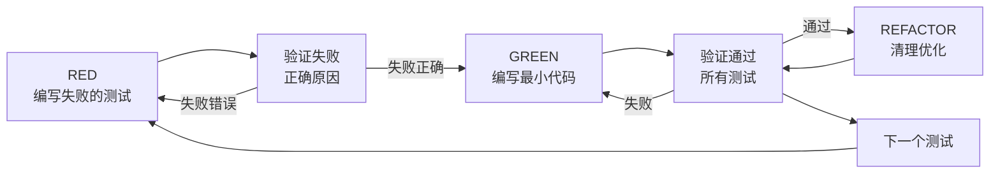
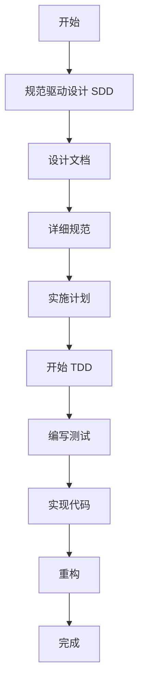
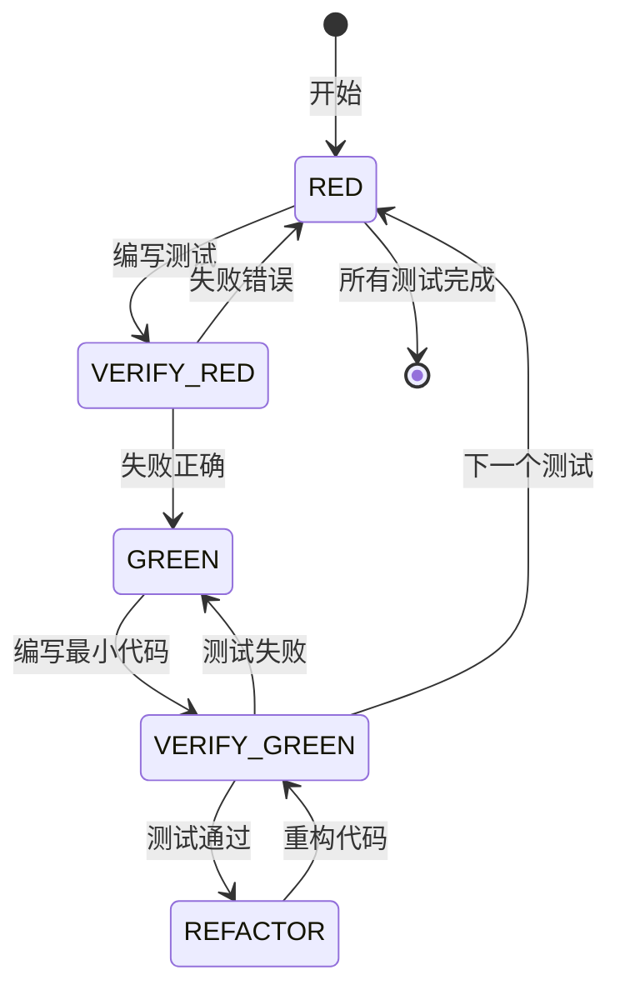
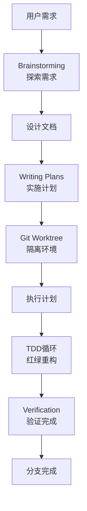
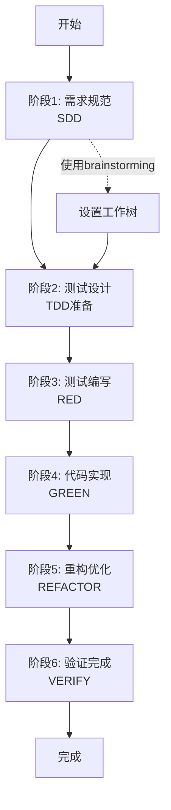
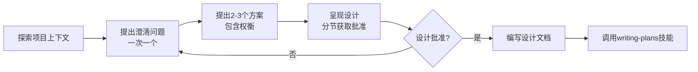

# SDD+TDD流程指导文档 - 基于OpenCode自动开发需求

## 1. 引言

### 1.1 什么是SDD（Specification Driven Design）

SDD（规范驱动设计）是一种以需求规范为核心的开发方法论。它强调在编码之前，先明确、详细地定义需求、设计和实现规范。

**核心理念：**
- 先明确"做什么"，再考虑"怎么做"
- 通过规范文档驱动设计和实现
- 在编码前验证需求的可行性和完整性
- 将模糊的需求转化为可测试的规范

### 1.2 什么是TDD（Test-Driven Development）

TDD（测试驱动开发）是一种软件开发方法，要求在编写生产代码之前先编写测试。

**核心理念：**
- 测试先于代码
- 红绿重构循环（Red-Green-Refactor）
- 测试作为设计工具
- 通过测试验证代码行为

**核心循环：**


### 1.3 为什么结合SDD+TDD

SDD和TDD相辅相成，形成完整的开发方法论：

| 维度 | SDD | TDD | 结合价值 |
|------|-----|-----|---------|
| **时间点** | 编码前需求阶段 | 编码时实施阶段 | 从需求到实现的连续性 |
| **焦点** | "应该做什么" | "代码应该做什么" | 需求与实现的一致性 |
| **产出** | 需求规范、设计文档 | 测试代码、实现代码 | 完整的文档和测试覆盖 |
| **验证** | 需求可行性验证 | 代码行为验证 | 双重质量保障 |

**结合的优势：**

1. **需求清晰度提升**
   - SDD迫使明确需求细节
   - TDD通过测试验证需求理解
   - 避免歧义和误解

2. **设计质量提升**
   - SDD提供架构和设计指导
   - TDD确保API和接口可用性
   - 降低后期返工成本

3. **开发效率提升**
   - 明确的规范减少决策时间
   - 测试先写减少调试时间
   - 快速迭代和反馈

4. **代码质量提升**
   - 双重验证机制
   - 高测试覆盖率
   - 良好的设计和重构基础

### 1.4 OpenCode的角色

OpenCode是具备Superpowers技能体系的AI助手，能够自动化SDD+TDD流程。

**核心能力：**

1. **规范驱动设计（SDD）**
   - 使用brainstorming技能探索需求
   - 创建详细的设计文档
   - 生成实施计划

2. **测试驱动开发（TDD）**
   - 严格执行红绿重构循环
   - 自动编写和运行测试
   - 确保测试先于代码

3. **自动化流程**
   - 工作树管理（using-git-worktrees）
   - 批量执行（executing-plans）
   - 代码审查（requesting-code-review）

4. **质量保障**
   - 验证机制（verification-before-completion）
   - 系统化调试（systematic-debugging）
   - 分支完成（finishing-a-development-branch）

**为什么使用OpenCode：**
- 标准化的工作流程
- 强制执行最佳实践
- 减少人为错误
- 提高开发效率和质量

---

## 2. 核心概念

### 2.1 SDD vs TDD 的关系

SDD和TDD虽然时间不同，但目标一致：确保需求正确实现。



**关系说明：**
- SDD创建"应该做什么"的蓝图
- TDD确保"代码确实做了"所描述的内容
- SDD的规范指导TDD的测试编写
- TDD的测试验证SDD的规范正确性

### 2.2 规范驱动设计原理

**三层规范模型：**

```
┌─────────────────────────────────────┐
│  用户需求层（What）                  │
│  - 功能描述                         │
│  - 用户故事                         │
│  - 验收标准                         │
└─────────────────────────────────────┘
              ↓
┌─────────────────────────────────────┐
│  设计规范层（How）                   │
│  - 架构设计                         │
│  - API规范                          │
│  - 数据模型                         │
└─────────────────────────────────────┘
              ↓
┌─────────────────────────────────────┐
│  实施规范层（Implementation）        │
│  - 任务分解                         │
│  - 实施步骤                         │
│  - 验证方法                         │
└─────────────────────────────────────┘
```

**SDD的关键输出：**

1. **设计文档**（Design Document）
   - 功能概述
   - 架构设计
   - 组件设计
   - 数据流
   - 错误处理

2. **实施计划**（Implementation Plan）
   - 任务分解
   - 依赖关系
   - 实施步骤
   - 验证方法

### 2.3 测试驱动开发流程

**完整TDD循环：**



**每个阶段的详细说明：**

#### RED阶段 - 编写失败的测试

**目标：** 定义期望的行为

**关键原则：**
- 测试应该描述"应该发生什么"，而不是"如何发生"
- 每次只测试一个行为
- 使用清晰、描述性的测试名称
- 尽可能使用真实代码，避免mock

**好的测试示例：**

```javascript
describe('UserService', () => {
  it('应该成功创建用户', async () => {
    const userData = {
      email: 'test@example.com',
      password: 'SecurePass123',
      name: 'Test User'
    };

    const user = await createUser(userData);

    expect(user).toBeDefined();
    expect(user.id).toBeDefined();
    expect(user.email).toBe(userData.email);
    expect(user.password).not.toBe(userData.password); // 密码已哈希
  });

  it('应该拒绝重复的邮箱', async () => {
    const userData = {
      email: 'test@example.com',
      password: 'SecurePass123',
      name: 'Test User'
    };

    await createUser(userData);

    await expect(createUser(userData))
      .rejects.toThrow('Email already exists');
  });
});
```

**验证步骤：**
```bash
npm test tests/services/userService.test.js
```

**预期结果：**
- 测试失败（不是错误）
- 失败原因：功能未实现
- 错误消息清晰

#### VERIFY_RED阶段 - 确认测试失败正确

**为什么重要：**
- 如果测试没有失败，说明测试测试的是现有代码，不是新行为
- 如果测试错误失败（如语法错误），说明测试有问题
- 只有看到测试因"功能不存在"而失败，才能确信测试有效

**失败类型判断：**

| 失败类型 | 特征 | 处理 |
|---------|------|------|
| **正确失败** | "ReferenceError: function not defined" | 继续 |
| **错误失败** | SyntaxError, TypeError | 修复测试 |
| **立即通过** | 测试通过 | 删除或修改测试 |

#### GREEN阶段 - 编写最小代码

**目标：** 使测试通过的最小实现

**关键原则：**
- 只写使测试通过的代码
- 不添加额外功能
- 不进行优化
- 不重构

**实现示例：**

```javascript
// 最小实现 - 只关注通过测试
async function createUser(userData) {
  const user = {
    id: generateId(),
    email: userData.email,
    password: hashPassword(userData.password),
    name: userData.name,
    createdAt: new Date()
  };

  await saveUser(user);
  return user;
}
```

#### VERIFY_GREEN阶段 - 确认测试通过

**验证步骤：**
```bash
npm test tests/services/userService.test.js
```

**预期结果：**
- 所有测试通过
- 没有警告
- 输出干净

#### REFACTOR阶段 - 清理和优化

**目标：** 改进代码质量，保持测试通过

**可以做的：**
- 提取重复代码
- 改进命名
- 简化逻辑
- 优化性能（如果明显）

**不能做的：**
- 添加新功能
- 改变行为
- 删除测试

**重构示例：**

```javascript
// 重构前
async function createUser(userData) {
  const user = {
    id: generateId(),
    email: userData.email,
    password: hashPassword(userData.password),
    name: userData.name,
    createdAt: new Date()
  };
  await saveUser(user);
  return user;
}

// 重构后 - 提取构建用户对象
function buildUser(userData) {
  return {
    id: generateId(),
    email: userData.email,
    password: hashPassword(userData.password),
    name: userData.name,
    createdAt: new Date()
  };
}

async function createUser(userData) {
  const user = buildUser(userData);
  await saveUser(user);
  return user;
}
```

**验证重构：**
```bash
npm test
```

### 2.4 OpenCode如何自动化

**自动化流程图：**



**OpenCode的核心自动化能力：**

1. **需求探索自动化**
   - 自动提出澄清问题
   - 呈现多个方案供选择
   - 分节呈现设计并获取批准

2. **计划生成自动化**
   - 将设计分解为可执行的任务
   - 为每个任务提供详细的步骤
   - 包含测试命令和预期输出

3. **TDD执行自动化**
   - 自动编写测试
   - 自动运行测试并验证失败
   - 自动实现最小代码
   - 自动验证测试通过

4. **质量保障自动化**
   - 自动运行测试套件
   - 自动运行linter
   - 自动进行类型检查
   - 生成验证报告

---

## 3. 完整工作流程

### 3.1 流程概览

SDD+TDD的完整工作流程包含6个主要阶段：



### 3.2 阶段1：需求规范（SDD）

**技能：** `brainstorming`

**目标：** 将模糊的需求转化为清晰、可实施的规范

**工作流程：**



**步骤详解：**

#### 步骤1：探索项目上下文

**目的：** 了解项目现状，确保设计与现有系统协调

**行动：**
- 检查项目结构
- 查看相关文档
- 检查最近的提交
- 了解技术栈
- 识别相关现有功能

**示例输出：**
```
项目上下文：
- 项目类型：Node.js + Express + MongoDB
- 现有用户模型：已有User schema
- 现有认证：简单的会话cookie
- 测试框架：Jest
```

#### 步骤2：提出澄清问题

**原则：**
- 一次只问一个问题
- 尽可能使用多选题
- 聚焦于理解：目的、约束、成功标准

**示例对话：**

**OpenCode：** "用户认证需要支持哪些登录方式？"
1. 仅邮箱密码
2. 邮箱密码 + 社交登录（Google、GitHub）
3. 邮箱密码 + 手机验证码

**用户：** 选择1

**OpenCode：** "令牌过期时间应该设置为多长？"
1. 1小时
2. 24小时
3. 7天
4. 可配置（默认24小时）

**用户：** 选择4

#### 步骤3：提出2-3个方案

**原则：**
- 提供2-3个不同的方案
- 每个方案包含权衡
- 说明推荐选项及理由

**示例：**

**方案1：基础JWT实现（推荐）**
- 实现：使用jsonwebtoken库
- 访问令牌：15分钟
- 刷新令牌：7天
- 存储：Redis存储黑名单
- 优点：简单直接，快速实现
- 缺点：需要Redis基础设施

**方案2：OAuth2标准实现**
- 实现：Passport.js + passport-jwt
- 特性：完整的OAuth2流程
- 优点：行业标准，可扩展
- 缺点：过度设计，学习曲线陡峭

**方案3：无状态JWT**
- 实现：不存储令牌状态
- 特性：仅令牌过期后失效
- 优点：无状态，无需存储
- 缺点：无法主动吊销令牌

**推荐：方案1** - 平衡了简单性和安全性

#### 步骤4：呈现设计

**原则：**
- 分节呈现，每节获取批准
- 根据复杂度调整详细程度
- 覆盖：架构、组件、数据流、错误处理、测试

**示例结构：**

**第1部分：架构设计**

系统采用分层架构：
- **认证控制器**：处理登录/注册/刷新令牌请求
- **认证服务**：实现认证逻辑（密码哈希、令牌生成/验证）
- **中间件**：验证令牌并附加用户信息到请求
- **令牌存储**：Redis用于存储刷新令牌和黑名单

数据流：
1. 用户提交登录 → 控制器 → 服务验证密码 → 生成令牌
2. 后续请求 → 中间件验证令牌 → 附加用户信息 → 继续处理

这看起来正确吗？

#### 步骤5：编写设计文档

**保存位置：** `docs/plans/YYYY-MM-DD-<topic>-design.md`

**文档结构：**

```markdown
# [功能名称] 设计文档

> **创建日期：** YYYY-MM-DD
> **作者：** [OpenCode]
> **状态：** [Draft/Approved]

## 1. 功能概述

[一句话描述功能]

## 2. 架构设计

### 2.1 系统架构

[架构图或描述]

### 2.2 组件设计

[组件列表和职责]

## 3. API设计

### 3.1 端点列表

[API端点列表]

### 3.2 请求/响应格式

[详细的请求响应格式]

## 4. 数据模型

### 4.1 数据库schema

[数据库模型]

## 5. 错误处理

### 5.1 错误类型

[错误类型和HTTP状态码]

### 5.2 错误响应格式

[标准错误响应格式]

## 6. 测试策略

### 6.1 单元测试

[单元测试覆盖]

### 6.2 集成测试

[集成测试覆盖]

## 7. 安全考虑

### 7.1 认证和授权

[安全措施]

### 7.2 数据保护

[数据保护措施]
```

#### 步骤6：过渡到实施

**调用writing-plans技能**创建详细的实施计划

### 3.3 阶段2：测试设计（TDD准备）

**技能：** `writing-plans`

**目标：** 创建详细的实施计划，包含TDD步骤

**计划文档结构：**

```markdown
# [功能名称] 实施计划

> **给OpenCode：** 必需子技能：使用superpowers:executing-plans来实现此计划。

**目标：** [一句话描述此计划构建的内容]

**架构：** [2-3句关于方法的说明]

**技术栈：** [关键技术/库]

---
```

**任务粒度：**

每个步骤是一个动作（2-5分钟）：
- "编写失败的测试" - 步骤
- "运行它以确保失败" - 步骤
- "实现使测试通过的最小代码" - 步骤
- "运行测试并确保通过" - 步骤
- "提交" - 步骤

**任务结构示例：**

````markdown
### 任务 N: [组件名称]

**文件：**
- 创建: `exact/path/to/file.js`
- 修改: `exact/path/to/existing.js:123-145`
- 测试: `tests/exact/path/to/test.js`

**步骤 1: 编写失败的测试**

```javascript
describe('ComponentName', () => {
  it('应该执行特定行为', () => {
    const input = { /* 测试数据 */ };
    const result = functionName(input);
    expect(result).toBe(expected);
  });
});
```

**步骤 2: 运行测试以验证失败**

运行: `npm test tests/path/test.js`
预期: FAIL，显示"functionName is not defined"

**步骤 3: 编写最小实现**

```javascript
function functionName(input) {
  return expected;
}
```

**步骤 4: 运行测试以验证通过**

运行: `npm test tests/path/test.js`
预期: PASS

**步骤 5: 提交**

```bash
git add tests/path/test.js src/path/file.js
git commit -m "feat: 添加特定功能"
```
````

### 3.4 阶段3：测试编写（RED）

**技能：** `test-driven-development`

**目标：** 编写失败测试，定义期望行为

**关键步骤：**

#### 步骤1：识别要测试的行为

从实施计划中提取需要测试的功能点

**示例：**
- 用户注册
- 用户登录
- 令牌刷新
- 用户登出

#### 步骤2：为每个行为编写测试

**测试命名规则：**
- 使用清晰、描述性的名称
- 格式：`应该[期望][条件]`
- 示例：
  - `应该成功创建用户`
  - `应该拒绝重复的邮箱`
  - `应该验证密码强度`

**测试结构：**

```javascript
describe('UserService', () => {
  describe('register', () => {
    it('应该成功创建用户', async () => {
      // Arrange
      const userData = {
        email: 'test@example.com',
        password: 'SecurePass123',
        name: 'Test User'
      };

      // Act
      const result = await register(userData);

      // Assert
      expect(result).toBeDefined();
      expect(result.id).toBeDefined();
      expect(result.email).toBe(userData.email);
    });
  });
});
```

#### 步骤3：运行测试验证失败

```bash
npm test tests/services/userService.test.js
```

**预期结果：**
```
FAIL  tests/services/userService.test.js
  UserService
    register
      ✕ 应该成功创建用户

  ReferenceError: register is not defined
```

**验证清单：**
- [ ] 测试失败（不是错误）
- [ ] 失败原因：功能未实现
- [ ] 错误消息清晰

### 3.5 阶段4：代码实现（GREEN）

**目标：** 编写最小代码使测试通过

#### 步骤1：实现最小代码

**原则：**
- 只写使测试通过的代码
- 不添加额外功能
- 不进行优化

**实现示例：**

```javascript
async function register(userData) {
  // 最小实现 - 只关注通过测试
  const user = {
    id: generateId(),
    email: userData.email,
    password: await hashPassword(userData.password),
    name: userData.name,
    createdAt: new Date()
  };

  await saveUser(user);
  return user;
}
```

#### 步骤2：运行测试验证通过

```bash
npm test tests/services/userService.test.js
```

**预期结果：**
```
PASS  tests/services/userService.test.js
  UserService
    register
      ✓ 应该成功创建用户

Test Suites: 1 passed, 1 total
Tests:       1 passed, 1 total
```

#### 步骤3：运行所有测试确保无回归

```bash
npm test
```

**验证清单：**
- [ ] 新测试通过
- [ ] 所有现有测试仍然通过
- [ ] 没有警告

### 3.6 阶段5：重构优化（REFACTOR）

**目标：** 在保持测试通过的情况下改进代码质量

#### 步骤1：识别重构机会

**常见重构目标：**
- 删除重复代码
- 提取函数/方法
- 改进命名
- 简化复杂逻辑
- 改善代码组织

**示例：检测重复**

```javascript
// 重构前 - 重复的哈希逻辑
async function register(userData) {
  const user = {
    id: generateId(),
    email: userData.email,
    password: await hashPassword(userData.password),
    name: userData.name,
    createdAt: new Date()
  };
  await saveUser(user);
  return user;
}

async function updatePassword(userId, newPassword) {
  const hashedPassword = await hashPassword(newPassword);
  // ...
}

// 重构后 - 提取哈希函数
async function hashUserPassword(password) {
  return await hashPassword(password);
}

async function register(userData) {
  const user = {
    id: generateId(),
    email: userData.email,
    password: await hashUserPassword(userData.password),
    name: userData.name,
    createdAt: new Date()
  };
  await saveUser(user);
  return user;
}
```

#### 步骤2：进行重构

**原则：**
- 保持测试绿色
- 不改变行为
- 小步骤重构
- 每次重构后运行测试

#### 步骤3：验证重构

```bash
npm test
```

**预期结果：**
- 所有测试通过
- 代码更清晰
- 没有功能变化

### 3.7 阶段6：验证完成

**技能：** `verification-before-completion`

**核心原则：** 证据先于主张，始终如此

#### 步骤1：运行完整测试套件

```bash
npm test
```

**验证输出：**
```
Test Suites: 5 passed, 5 total
Tests:       32 passed, 32 total
```

**验证清单：**
- [ ] 所有测试通过
- [ ] 0次失败
- [ ] 输出干净

#### 步骤2：运行linter

```bash
npm run lint
```

**验证输出：**
```
✓ No linting errors found
```

#### 步骤3：运行类型检查（如果适用）

```bash
npm run typecheck
```

**验证输出：**
```
✓ No type errors found
```

#### 步骤4：生成验证报告

**验证报告模板：**

```markdown
## 验证报告

### 测试验证
- 命令: `npm test`
- 结果: 32 passed, 0 failed
- 状态: ✅ 通过

### 代码质量验证
- 命令: `npm run lint`
- 结果: 0 errors
- 状态: ✅ 通过

### 类型检查
- 命令: `npm run typecheck`
- 结果: 0 errors
- 状态: ✅ 通过

### 总结
所有验证通过，工作已完成。
```

---

## 4. 实战案例

### 4.1 案例1：从零开始开发新功能 - 用户认证系统

#### 阶段1：需求规范（SDD）

**OpenCode：** 我正在使用brainstorming技能来探索用户认证系统的需求。

**步骤1：探索项目上下文**

检查项目：
- 项目类型：Node.js + Express + MongoDB
- 现有用户模型：User schema已存在
- 现有认证：简单会话cookie
- 测试框架：Jest

**OpenCode：** "用户认证需要支持哪些登录方式？"
1. 仅邮箱密码
2. 邮箱密码 + 社交登录（Google、GitHub）
3. 邮箱密码 + 手机验证码

**用户：** 选择1

**OpenCode：** "令牌过期时间应该设置为多长？"
1. 1小时
2. 24小时
3. 7天
4. 可配置（默认24小时）

**用户：** 选择4

**OpenCode：** "需要支持刷新令牌吗？"
1. 需要刷新令牌
2. 不需要刷新令牌

**用户：** 选择1

**步骤2：提出方案**

**方案1：基础JWT实现（推荐）**
- 使用jsonwebtoken库
- 访问令牌：15分钟
- 刷新令牌：7天
- Redis存储黑名单
- 优点：简单直接，快速实现

**用户：** 同意方案1

**步骤3：呈现设计**

**第1部分：架构设计**

系统采用分层架构：
- 认证控制器：处理登录/注册请求
- 认证服务：实现认证逻辑
- 中间件：验证令牌
- Redis存储：令牌黑名单

数据流：
1. 用户提交登录 → 控制器 → 服务验证 → 生成令牌
2. 后续请求 → 中间件验证 → 附加用户信息 → 继续

**用户：** 确认

**第2部分：API端点**

`POST /api/auth/register`
- 请求：`{ email, password, name }`
- 响应：`{ accessToken, refreshToken, user }`

`POST /api/auth/login`
- 请求：`{ email, password }`
- 响应：`{ accessToken, refreshToken, user }`

**用户：** 确认

**步骤4：编写设计文档**

设计文档保存到：`docs/plans/2026-03-10-user-auth-design.md`

#### 阶段2：编写实施计划

**OpenCode：** 我正在使用writing-plans技能创建实施计划。

计划保存到：`docs/plans/2026-03-10-user-auth-implementation.md`

**任务1：设置依赖**

**步骤1：安装依赖**

```bash
npm install jsonwebtoken bcrypt redis
npm install -D @types/jsonwebtoken @types/bcrypt
```

**步骤2：运行安装验证**

```bash
npm list jsonwebtoken bcrypt redis
```

**步骤3：提交**

```bash
git add package.json package-lock.json
git commit -m "feat: 添加认证相关依赖"
```

**任务2：创建令牌服务**

**步骤1：编写失败的测试**

```javascript
// tests/services/tokenService.test.js
const { generateToken, verifyToken } = require('../../src/services/tokenService');

describe('TokenService', () => {
  describe('generateToken', () => {
    it('应该生成有效的访问令牌', () => {
      const payload = { userId: '123', email: 'test@example.com' };
      const token = generateToken(payload, 'access');
      expect(token).toBeDefined();
      expect(typeof token).toBe('string');
    });
  });
});
```

**步骤2：运行测试验证失败**

```bash
npm test tests/services/tokenService.test.js
```

预期：FAIL，显示"tokenService not found"

**步骤3：编写最小实现**

```javascript
// src/services/tokenService.js
const jwt = require('jsonwebtoken');

const ACCESS_TOKEN_EXPIRY = '15m';
const REFRESH_TOKEN_EXPIRY = '7d';
const JWT_SECRET = process.env.JWT_SECRET || 'your-secret-key';

function generateToken(payload, type = 'access') {
  const expiry = type === 'access' ? ACCESS_TOKEN_EXPIRY : REFRESH_TOKEN_EXPIRY;
  return jwt.sign(payload, JWT_SECRET, { expiresIn: expiry });
}

function verifyToken(token) {
  return jwt.verify(token, JWT_SECRET);
}

module.exports = {
  generateToken,
  verifyToken
};
```

**步骤4：运行测试验证通过**

```bash
npm test tests/services/tokenService.test.js
```

预期：PASS

**步骤5：提交**

```bash
git add src/services/tokenService.js tests/services/tokenService.test.js
git commit -m "feat: 实现令牌生成和验证服务"
```

[继续其他任务...]

#### 阶段3-5：执行TDD循环

使用`subagent-driven-development`或`executing-plans`执行计划。

每个任务遵循RED-GREEN-REFACTOR循环。

#### 阶段6：验证完成

**OpenCode：** 我正在使用verification-before-completion技能来验证完成。

**步骤1：运行测试**

```bash
npm test
```

输出：
```
Test Suites: 5 passed, 5 total
Tests:       32 passed, 32 total
```

**验证：** 所有测试通过（32次测试，0次失败）

**步骤2：运行linter**

```bash
npm run lint
```

输出：0个错误

**验证：** Linter干净

**主张：** 所有测试通过，linter干净，实施完成

#### 阶段7：完成分支

**OpenCode：** 我正在使用finishing-a-development-branch技能来完成此项工作。

**选项：**
1. 本地合并回main
2. 推送并创建Pull Request
3. 保持分支原样
4. 放弃此工作

**用户：** 选择2

**执行：推送并创建PR**

```bash
git push -u origin feature/user-authentication
gh pr create --title "feat: 实现用户认证系统" --body "..."
```

### 4.2 案例2：Bug修复 - 购物车商品数量错误

#### 使用systematic-debugging

**Bug报告：** 添加5个商品到购物车，显示数量为50

**阶段1：根本原因调查**

**步骤1：重现问题**

```javascript
const { addToCart } = require('./src/services/cartService');

const result = await addToCart('user123', 'prod456', 5);
console.log(result); // 显示50而不是5
```

**步骤2：检查代码**

```javascript
// src/services/cartService.js
function addToCart(userId, productId, quantity) {
  const cart = getCart(userId);
  const existingItem = cart.items.find(item => item.productId === productId);

  if (existingItem) {
    existingItem.quantity = quantity * 10; // 问题在这里！
  } else {
    cart.items.push({ productId, quantity });
  }

  saveCart(cart);
  return cart;
}
```

**根本原因：** 错误地将数量乘以10

#### 阶段2：使用TDD修复

**步骤1：编写失败的测试**

```javascript
// tests/services/cartService.bug.test.js
describe('CartService Bug Fix', () => {
  it('应该正确设置商品数量', async () => {
    const result = await addToCart('test-user', 'test-product', 5);
    expect(result.items[0].quantity).toBe(5); // 应该是5，不是50
  });
});
```

**步骤2：运行测试验证失败**

```bash
npm test tests/services/cartService.bug.test.js
```

预期：FAIL，预期5，得到50

**步骤3：修复bug**

```javascript
function addToCart(userId, productId, quantity) {
  const cart = getCart(userId);
  const existingItem = cart.items.find(item => item.productId === productId);

  if (existingItem) {
    existingItem.quantity += quantity; // 修复：使用+=而不是*10
  } else {
    cart.items.push({ productId, quantity });
  }

  saveCart(cart);
  return cart;
}
```

**步骤4：验证修复**

```bash
npm test tests/services/cartService.bug.test.js
```

预期：PASS

**步骤5：提交**

```bash
git add src/services/cartService.js tests/services/cartService.bug.test.js
git commit -m "fix: 修复购物车商品数量计算错误"
```

### 4.3 案例3：代码重构 - 提取重复的验证逻辑

#### 使用TDD进行重构

**阶段1：识别重复**

在多个控制器中发现重复的验证代码。

**阶段2：RED - 编写新测试**

```javascript
// tests/validators/inputValidator.test.js
const { validateEmail, validatePassword } = require('../../src/validators/inputValidator');

describe('InputValidator', () => {
  it('应该接受有效的邮箱', () => {
    const result = validateEmail('test@example.com');
    expect(result.valid).toBe(true);
  });

  it('应该拒绝无效的邮箱', () => {
    const result = validateEmail('invalid');
    expect(result.valid).toBe(false);
  });
});
```

**阶段3：Verify RED**

```bash
npm test tests/validators/inputValidator.test.js
```

预期：FAIL，验证器不存在

**阶段4：GREEN - 创建验证器**

```javascript
// src/validators/inputValidator.js
function validateEmail(email) {
  if (!email || !email.includes('@')) {
    return { valid: false, error: 'Invalid email' };
  }
  return { valid: true };
}

function validatePassword(password) {
  if (!password || password.length < 8) {
    return { valid: false, error: 'Password too short' };
  }
  return { valid: true };
}

module.exports = {
  validateEmail,
  validatePassword
};
```

**阶段5：Verify GREEN**

```bash
npm test tests/validators/inputValidator.test.js
```

预期：PASS

**阶段6：REFACTOR - 更新控制器**

```javascript
// src/controllers/authController.js
const { validateEmail, validatePassword } = require('../validators/inputValidator');

function register(req, res) {
  const { email, password } = req.body;

  const emailValidation = validateEmail(email);
  if (!emailValidation.valid) {
    return res.status(400).json({ error: emailValidation.error });
  }

  const passwordValidation = validatePassword(password);
  if (!passwordValidation.valid) {
    return res.status(400).json({ error: passwordValidation.error });
  }

  // ... 继续处理
}
```

**阶段7：验证所有测试**

```bash
npm test
```

预期：所有测试通过

---

## 5. 最佳实践

### 5.1 何时使用SDD+TDD

**适合使用SDD+TDD的场景：**

✅ **新功能开发**
- 复杂业务逻辑
- 需要明确需求
- 多人协作开发

✅ **Bug修复**
- 可重现的bug
- 需要防止回归
- 关键路径修复

✅ **代码重构**
- 改善代码质量
- 提高可维护性
- 性能优化

✅ **API开发**
- 需要明确契约
- 多客户端集成
- 版本管理

**不适合使用SDD+TDD的场景：**

❌ **一次性脚本**
- 简单的数据迁移
- 临时工具
- 快速原型验证

❌ **UI布局调整**
- 纯CSS修改
- 简单的样式调整

❌ **紧急热修复**
- 生产环境紧急问题
- 临时补丁

### 5.2 常见错误及避免

**错误1：跳过SDD直接编码**

症状：
- 没有明确需求就开始编码
- 频繁返工
- 功能不符合预期

避免：
- **始终**对创造性工作使用brainstorming
- 编写设计文档
- 获得批准后再编码

**错误2：跳过TDD**

症状：
- 先写代码，后写测试
- 测试立即通过
- 测试覆盖率低

避免：
- **永远**在实现之前编写测试
- 观察测试失败
- 编写最小代码

**错误3：测试不充分**

症状：
- 只测试快乐路径
- 边缘情况未覆盖
- 错误处理未测试

避免：
- 为每个行为编写测试
- 测试边缘情况
- 测试错误处理

**错误4：过度测试**

症状：
- 测试实现细节
- 测试私有方法
- 测试与外部库交互

避免：
- 测试行为，不测试实现
- 测试公共API
- 不测试第三方库

**错误5：没有验证就声称完成**

症状：
- "完成了！"
- "应该工作"
- 没有运行测试

避免：
- **始终**在声称之前运行验证
- 显示验证输出
- 使用verification-before-completion

### 5.3 效率优化技巧

**技巧1：批量相关任务**

使用executing-plans批量处理任务，而不是逐个处理。

**技巧2：重用测试数据**

创建共享的测试夹具和数据生成器。

```javascript
// tests/fixtures/userFixture.js
module.exports = {
  validUser: () => ({
    email: 'test@example.com',
    password: 'StrongPass123',
    name: 'Test User'
  })
};
```

**技巧3：并行处理独立任务**

使用dispatching-parallel-agents处理独立任务。

**技巧4：使用工作树隔离**

使用using-git-worktrees创建隔离的工作环境。

**技巧5：频繁提交**

小步骤，频繁提交，便于回滚和调试。

### 5.4 团队协作建议

**1. 标准化工作流程**

- 所有团队成员遵循SDD+TDD流程
- 使用相同的设计文档模板
- 统一的测试命名约定

**2. 代码审查**

- 每个PR都应包含测试
- 审查测试质量和覆盖率
- 确保TDD原则遵循

**3. 知识分享**

- 分享设计文档
- 记录最佳实践
- 进行代码审查会议

**4. 持续改进**

- 定期回顾工作流程
- 识别改进机会
- 调整工具和流程

---

## 6. 快速参考

### 6.1 决策树

```
开始
  │
  ├─> 创造性工作？（新功能、修改行为）
  │    └─> 是 → brainstorming → writing-plans
  │    └─> 否 → 继续
  │
  ├─> Bug/测试失败？
  │    └─> 是 → systematic-debugging
  │    └─> 否 → 继续
  │
  ├─> 编写任何代码？
  │    └─> 是 → TDD (RED → GREEN → REFACTOR)
  │    └─> 否 → 继续
  │
  ├─> 任务完成？
  │    └─> 是 → verification-before-completion → finishing-a-development-branch
  │    └─> 否 → 继续
```

### 6.2 命令速查

**TDD命令：**
```bash
# 运行所有测试
npm test

# 运行特定测试文件
npm test tests/services/userService.test.js

# 运行特定测试
npm test -t "应该成功创建用户"

# 监视模式
npm test -- --watch
```

**Git命令：**
```bash
# 创建工作树
git worktree add .worktrees/feature -b feature/branch

# 移除工作树
git worktree remove .worktrees/feature

# 提交
git add .
git commit -m "feat: 添加功能"

# 推送
git push -u origin feature/branch
```

**验证命令：**
```bash
# 测试
npm test

# Linter
npm run lint

# 类型检查
npm run typecheck
```

### 6.3 Checklist大全

#### 项目启动Checklist

- [ ] 使用brainstorming探索需求
- [ ] 编写设计文档
- [ ] 获得设计批准
- [ ] 创建实施计划
- [ ] 设置工作树

#### TDD循环Checklist

- [ ] 编写失败的测试
- [ ] 运行测试验证失败（正确原因）
- [ ] 编写最小实现
- [ ] 运行测试验证通过
- [ ] 运行所有测试确保无回归
- [ ] 重构（如果需要）
- [ ] 提交代码

#### 验证完成Checklist

- [ ] 运行测试套件
- [ ] 运行linter
- [ ] 运行类型检查
- [ ] 生成验证报告
- [ ] 显示验证证据

#### 分支完成Checklist

- [ ] 所有任务完成
- [ ] 所有测试通过
- [ ] 验证完成
- [ ] 选择集成方式
- [ ] 执行集成
- [ ] 清理工作树（如果需要）

### 6.4 测试命名约定

**测试描述规范：**
- 格式：`应该[期望][条件][输入]`
- 示例：
  - `应该成功创建用户`
  - `应该拒绝重复的邮箱`
  - `应该验证密码长度`

**测试分组：**
- 使用`describe`按功能分组
- 使用嵌套`describe`组织相关测试

```javascript
describe('UserService', () => {
  describe('register', () => {
    it('应该成功创建用户', () => {});
    it('应该拒绝重复的邮箱', () => {});
  });

  describe('login', () => {
    it('应该成功登录', () => {});
    it('应该拒绝无效密码', () => {});
  });
});
```

---

## 7. 附录

### 7.1 相关资源

**官方文档：**
- Superpowers技能系统：`/home/hujian/.config/opencode/skills/superpowers/`
- OpenCode文档：https://opencode.ai

**外部资源：**
- 测试驱动开发：https://martinfowler.com/bliki/TestDrivenDevelopment.html
- 规范驱动设计：https://www.scaledagileframework.com/specification-by-example/
- Git工作树：https://git-scm.com/docs/git-worktree

**最佳实践：**
- YAGNI：https://martinfowler.com/bliki/Yagni.html
- DRY：https://en.wikipedia.org/wiki/Don%27t_repeat_yourself
- KISS：https://en.wikipedia.org/wiki/KISS_principle

### 7.2 常见问题（FAQ）

**Q1：SDD+TDD会减慢开发速度吗？**

A：短期内可能感觉较慢，但长期来看：
- 减少返工和bug
- 提高代码质量
- 加快迭代速度

**Q2：如果测试太复杂怎么办？**

A：
- 简化设计
- 提取接口
- 使用依赖注入

**Q3：如何处理需要mock的测试？**

A：
- 优先使用真实对象
- 只在必要时mock
- 测试mock的期望

**Q4：何时应该跳过TDD？**

A：
- 原型验证（非生产代码）
- 一次性脚本
- 获得明确许可的紧急修复

**Q5：如何处理遗留代码？**

A：
- 为新功能使用TDD
- 逐步添加测试
- 重构时使用TDD

### 7.3 术语表

| 术语 | 定义 |
|------|------|
| **SDD** | Specification Driven Design，规范驱动设计 |
| **TDD** | Test-Driven Development，测试驱动开发 |
| **RED** | TDD的第一阶段：编写失败的测试 |
| **GREEN** | TDD的第二阶段：编写代码使测试通过 |
| **REFACTOR** | TDD的第三阶段：在保持测试通过的情况下改进代码 |
| **Worktree** | Git工作树，隔离的Git工作区 |
| **Mock** | 模拟对象，用于隔离测试 |
| **Stub** | 桩对象，提供预设的响应 |

### 7.4 变更日志

| 版本 | 日期 | 变更 |
|------|------|------|
| 1.0.0 | 2026-03-10 | 初始版本 |
|      |      | - 创建完整的SDD+TDD流程指导文档 |
|      |      | - 包含7个主要章节 |
|      |      | - 详细的流程说明和实战案例 |
|      |      | - 最佳实践和快速参考指南 |

---

**文档结束**

*最后更新：2026年3月10日*
