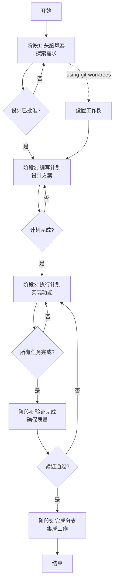
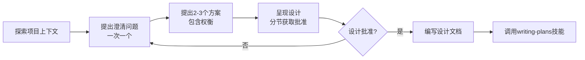
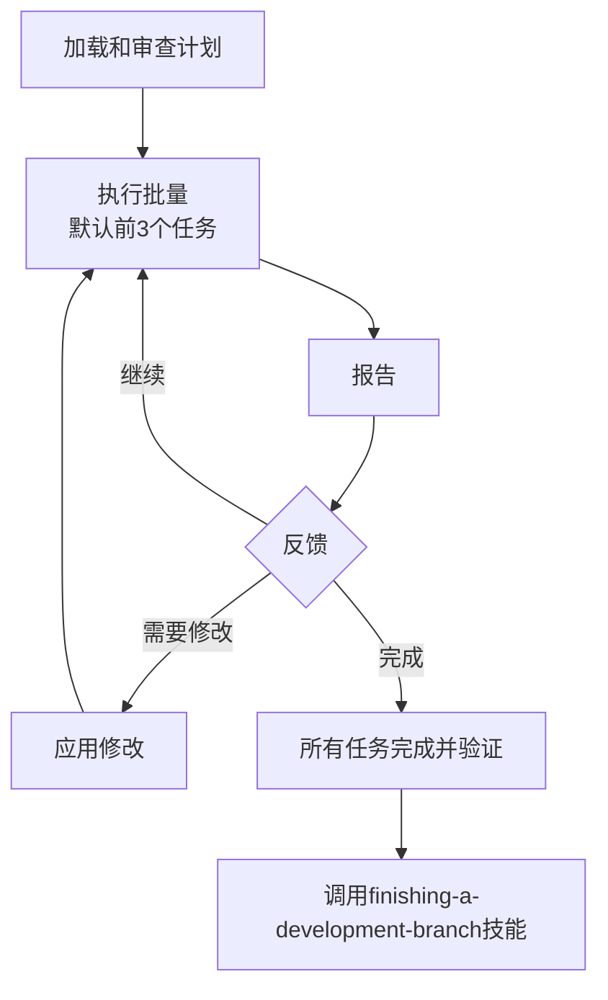
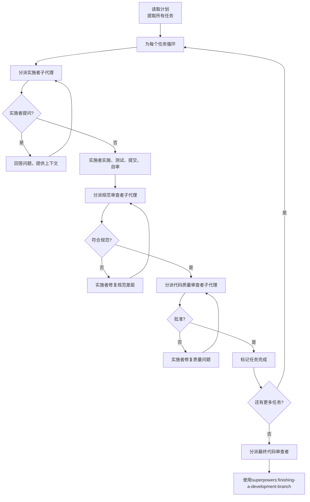
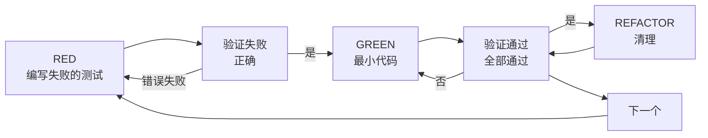
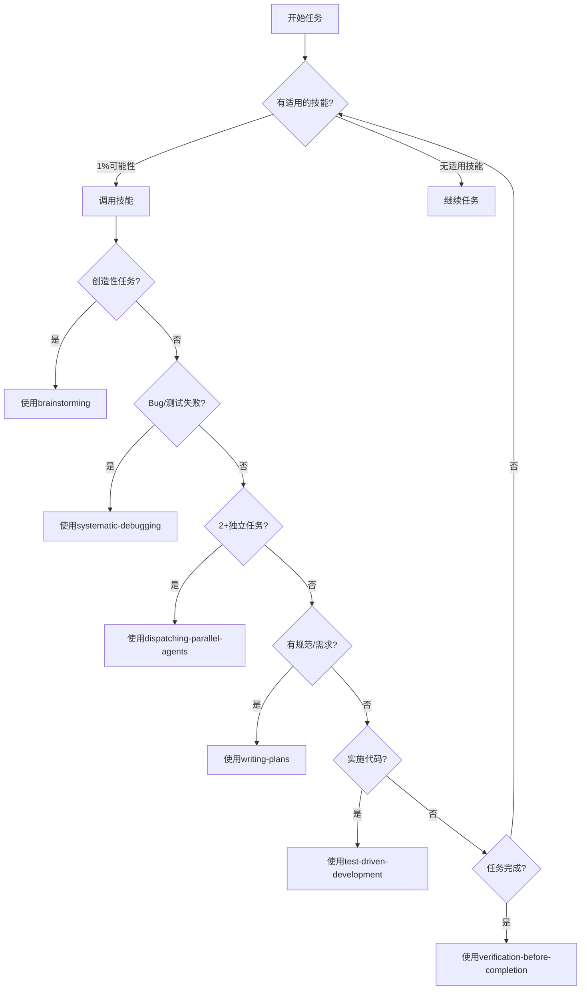
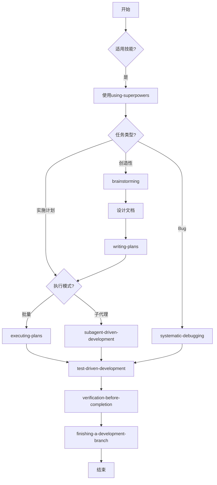
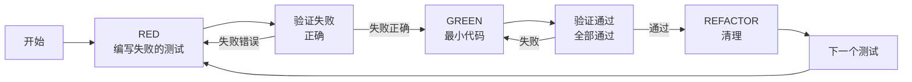
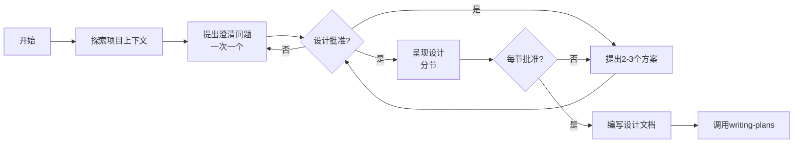

# 使用Superpowers自动开发需求规范指导

## 1. 引言

### 1.1 Superpowers是什么

Superpowers是一套结构化的AI辅助开发技能（Skills）体系，旨在通过系统化的工作流程提高软件开发的效率和质量。它不是简单的代码生成工具，而是一套完整的开发方法论，涵盖了从需求探索、设计规划、代码实现、质量验证到项目集成的完整生命周期。

每个Superpowers技能都经过精心设计，包含了最佳实践、常见陷阱规避、验证机制和流程控制，确保开发过程中的每一步都有明确的指导和质量保障。

### 1.2 为什么使用Superpowers

**传统开发方式的痛点：**

- 🔴 **需求理解不深入** - 直接开始编码，缺少充分的需求探索和设计讨论
- 🔴 **计划缺失或过于粗糙** - 没有详细的实施计划，容易遗漏关键步骤
- 🔴 **测试滞后或缺失** - 先写代码后写测试，测试覆盖率和有效性不足
- 🔴 **质量验证不充分** - 缺少系统的验证机制，bug在后期才发现
- 🔴 **分支管理混乱** - 缺少规范的工作分支管理，集成风险高

**Superpowers的价值：**

- 🟢 **系统化的需求探索** - 通过brainstorming技能深入理解用户需求
- 🟢 **详细的实施计划** - writing-plans技能确保每一步都有清晰指导
- 🟢 **测试驱动开发** - test-driven-development技能确保代码质量
- 🟢 **严格的验证机制** - verification-before-completion技能避免虚假完成
- 🟢 **规范的工作流程** - 完整的工作流程确保开发过程的可控性

### 1.3 适用场景

Superpowers适用于以下场景：

✅ **新功能开发** - 从零开始开发新功能，需要需求探索和设计规划
✅ **Bug修复** - 系统化地定位和修复bug，避免"快速修复"带来的风险
✅ **代码重构** - 在重构过程中保持代码质量和测试覆盖
✅ **多任务并行开发** - 使用dispatching-parallel-agents技能并行处理独立任务
✅ **团队协作开发** - 标准化的工作流程便于团队协作和知识传递

### 1.4 核心价值

**1. 质量保障**
- 通过测试驱动开发确保代码质量
- 系统化的验证机制避免虚假完成
- 代码审查流程及早发现和修复问题

**2. 效率提升**
- 需求探索减少后期返工
- 详细的计划避免遗漏和重复工作
- 并行处理加速独立任务的完成

**3. 知识传承**
- 标准化的工作流程便于团队成员理解和遵循
- 详细的计划和文档作为知识资产
- 清晰的决策过程和理由记录

**4. 风险控制**
- 孤立的工作树环境避免影响主分支
- 频繁的提交和测试及早发现问题
- 系统化的调试方法避免引入新bug

---

## 2. 核心原则

### 2.1 技能优先规则

**最重要的原则：在任何回应或行动之前，先检查是否有适用的技能。**

如果只有1%的可能性某个技能可能适用于当前任务，也**必须**调用该技能进行检查。

```mermaid
flowchart TD
    A[收到用户消息] --> B{可能有技能适用?}
    B -->|是| C[调用Skill工具]
    C --> D[公告: 使用[技能名]来[目的]]
    D --> E{有检查清单?}
    E -->|是| F[为每个项目创建TodoWrite]
    E -->|否| G[严格按照技能内容执行]
    F --> G
    B -->|否| H[直接回应]
```

### 2.2 1%原则

**规则：**如果有1%的可能性技能适用于当前任务，就必须调用它。

这不是可选的，这是强制性的。你不能通过理性化来逃避这个要求。

**常见理性化想法（这些都是危险信号）：**

| 想法 | 现实 |
|------|------|
| "这只是个简单问题" | 问题也是任务，需要检查技能 |
| "我需要先了解更多上下文" | 技能检查在澄清问题之前 |
| "让我先探索代码库" | 技能告诉你如何探索，先检查 |
| "我可以快速检查git/文件" | 文件缺少对话上下文，先检查技能 |

### 2.3 技能优先级

当多个技能可能适用时，按以下顺序使用：

**1. 过程技能优先**（brainstorming、debugging）- 这些决定如何处理任务
**2. 实现技能其次**（frontend-design、mcp-builder）- 这些指导执行

示例：
- "让我们构建X" → 先使用brainstorming，然后使用实现技能
- "修复这个bug" → 先使用debugging，然后使用领域特定技能

### 2.4 红旗警示

以下想法意味着**停止**——你在理性化：

- ❌ "这只是个简单问题"
- ❌ "我需要更多上下文"
- ❌ "让我先探索代码库"
- ❌ "我可以快速检查git/文件"
- ❌ "让我先收集信息"
- ❌ "这不需要正式技能"
- ❌ "我记得这个技能"
- ❌ "这不算是任务"
- ❌ "这个技能大材小用"
- ❌ "我先做这一件事"
- ❌ "这感觉很有生产力"

### 2.5 技能类型

**刚性技能**（TDD、debugging）：必须严格按照要求执行，不能偏离

**柔性技能**（patterns）：根据上下文调整原则

技能本身会告诉你它属于哪种类型。

---

## 3. 完整工作流程

### 3.1 流程概览

Superpowers的完整工作流程包含5个主要阶段：



### 3.2 阶段1：头脑风暴（探索需求）

**技能：** `brainstorming`

**目的：** 将想法转化为完整的设计和规范

**工作流程：**



**关键步骤：**

1. **探索项目上下文**
   - 检查文件、文档、最近的提交
   - 了解项目的技术栈和架构
   - 识别相关的现有功能

2. **提出澄清问题**
   - 一次只问一个问题
   - 尽可能使用多选题
   - 聚焦于理解：目的、约束、成功标准

3. **探索方案**
   - 提出2-3个不同的方案，包含权衡
   - 对话式地展示选项，并给出推荐和理由
   - 以推荐的选项开始并解释原因

4. **呈现设计**
   - 理解要构建的内容后，呈现设计
   - 每个部分根据复杂度缩放：简单则几句话，复杂则200-300字
   - 在每个部分后询问是否正确
   - 覆盖：架构、组件、数据流、错误处理、测试

**输出：**
- 设计文档保存到 `docs/plans/YYYY-MM-DD-<topic>-design.md`
- 调用 `writing-plans` 技能创建实施计划

### 3.3 阶段2：编写计划（设计方案）

**技能：** `writing-plans`

**目的：** 编写全面的实施计划

**前提：** 必须在专用的工作树中执行（由brainstorming技能创建）

**计划文档结构：**

```markdown
# [功能名称] 实施计划

> **给Claude：** 必需子技能：使用superpowers:executing-plans来实现此计划。

**目标：** [一句话描述此计划构建的内容]

**架构：** [2-3句关于方法的说明]

**技术栈：** [关键技术/库]

---
```

**任务粒度：**

每个步骤是一个动作（2-5分钟）：
- "编写失败的测试" - 步骤
- "运行它以确保失败" - 步骤
- "实现使测试通过的最小代码" - 步骤
- "运行测试并确保通过" - 步骤
- "提交" - 步骤

**任务结构示例：**

````markdown
### 任务 N: [组件名称]

**文件：**
- 创建: `exact/path/to/file.py`
- 修改: `exact/path/to/existing.py:123-145`
- 测试: `tests/exact/path/to/test.py`

**步骤 1: 编写失败的测试**

```python
def test_specific_behavior():
    result = function(input)
    assert result == expected
```

**步骤 2: 运行测试以验证失败**

运行: `pytest tests/path/test.py::test_name -v`
预期: FAIL，显示"function not defined"

**步骤 3: 编写最小实现**

```python
def function(input):
    return expected
```

**步骤 4: 运行测试以验证通过**

运行: `pytest tests/path/test.py::test_name -v`
预期: PASS

**步骤 5: 提交**

```bash
git add tests/path/test.py src/path/file.py
git commit -m "feat: 添加特定功能"
```
````

**输出：**
- 计划保存到 `docs/plans/YYYY-MM-DD-<feature-name>.md`
- 提供执行选项

### 3.4 阶段3：执行计划（实现功能）

**技能：** `executing-plans` 或 `subagent-driven-development`

**两种执行模式：**

#### 模式A：批量执行（executing-plans）

**适用场景：** 在单独的会话中执行，需要审查检查点

**工作流程：**



**关键步骤：**

1. **加载和审查计划**
   - 读取计划文件
   - 批判性审查 - 识别任何问题或担忧
   - 如果有担忧：在开始前提出
   - 如果没有担忧：创建TodoWrite并继续

2. **执行批量**
   - 默认：前3个任务
   - 对每个任务：标记为in_progress，完全按照步骤执行，运行指定的验证，标记为completed

3. **报告**
   - 批量完成时：显示实现的内容，显示验证输出，说"准备好接收反馈"

4. **继续**
   - 根据反馈：应用修改（如果需要），执行下一个批量，重复直到完成

5. **完成开发**
   - 宣布："我正在使用finishing-a-development-branch技能来完成这项工作"
   - **必需子技能：** 使用superpowers:finishing-a-development-branch

#### 模式B：子代理驱动开发（subagent-driven-development）

**适用场景：** 在当前会话中执行，独立任务

**工作流程：**



**核心原理：** 每个任务使用新子代理 + 两阶段审查（先规范后质量）= 高质量，快速迭代

### 3.5 阶段4：验证完成（确保质量）

**技能：** `verification-before-completion`

**核心原则：** 证据先于主张，始终如此。

**铁律：**

```
没有新的验证证据就不能声称完成
```

**门控函数：**

在声称任何状态或表达满意之前：

1. **识别：** 什么命令证明这个主张？
2. **运行：** 执行完整命令（新的、完整的）
3. **读取：** 完整输出，检查退出代码，统计失败数
4. **验证：** 输出确认主张吗？
   - 如果否：用证据说明实际状态
   - 如果是：用证据说明主张
5. **只有这样：** 做出主张

跳过任何步骤 = 说谎，不是验证

**常见失败：**

| 主张 | 需要 | 不充分 |
|------|------|--------|
| 测试通过 | 测试命令输出：0次失败 | 之前的运行，"应该通过" |
| Linter干净 | Linter输出：0个错误 | 部分检查，外推 |
| 构建成功 | 构建命令：退出0 | Linter通过，日志看起来不错 |
| Bug修复 | 测试原始症状：通过 | 代码改变，假设已修复 |

### 3.6 阶段5：完成分支（集成工作）

**技能：** `finishing-a-development-branch`

**核心原则：** 验证测试 → 呈现选项 → 执行选择 → 清理

**工作流程：**

#### 步骤1：验证测试

```bash
# 运行项目的测试套件
npm test / cargo test / pytest / go test ./...
```

**如果测试失败：** 停止。不要进行到步骤2

**如果测试通过：** 继续到步骤2

#### 步骤2：确定基础分支

```bash
# 尝试常见的基础分支
git merge-base HEAD main 2>/dev/null || git merge-base HEAD master 2>/dev/null
```

#### 步骤3：呈现选项

准确呈现这4个选项：

```
实施完成。你想做什么？

1. 在本地合并回<base-branch>
2. 推送并创建Pull Request
3. 保持分支原样（我稍后处理）
4. 放弃此工作

哪个选项？
```

#### 步骤4：执行选择

**选项1：本地合并**
- 切换到基础分支
- 拉取最新
- 合并功能分支
- 验证合并结果的测试
- 如果测试通过：删除分支

**选项2：推送并创建PR**
- 推送分支
- 创建PR
- 清理工作树

**选项3：保持原样**
- 报告："保持分支<name>。工作树保留在<path>。"
- 不要清理工作树

**选项4：放弃**
- 先确认
- 如果确认：删除分支和工作树

#### 步骤5：清理工作树

对于选项1、2、4：清理工作树
对于选项3：保持工作树

---

## 4. 各个技能详解

### 4.1 using-superpowers（基础规则）

**描述：** 在开始任何对话时使用 - 建立如何查找和使用技能，要求在任何回应（包括澄清问题）之前调用Skill工具

**核心规则：**

```
在任何回应或行动之前，调用相关或请求的技能
即使只有1%的可能性技能可能适用，也应该调用技能来检查
```

**使用场景：**
- 开始任何新的对话
- 在执行任何任务之前
- 在回答问题之前
- 在做出任何决定之前

**关键点：**
- 这是最基础的技能，所有其他技能都依赖于它
- 不是可选的，这是强制的
- 你不能通过理性化来逃避

### 4.2 brainstorming（需求探索）

**描述：** 在任何创造性工作之前必须使用 - 创建功能、构建组件、添加功能或修改行为。探索用户意图、需求和设计，然后实现。

**工作流程：**

1. **探索项目上下文** - 检查文件、文档、最近的提交
2. **提出澄清问题** - 一次一个，理解目的/约束/成功标准
3. **提出2-3个方案** - 包含权衡和你的推荐
4. **呈现设计** - 按部分缩放到其复杂度，在每个部分后获取用户批准
5. **编写设计文档** - 保存到 `docs/plans/YYYY-MM-DD-<topic>-design.md` 并提交
6. **过渡到实施** - 调用writing-plans技能创建实施计划

**硬性门槛：**
- 在呈现设计并获得用户批准之前，不要调用任何实施技能，不要编写任何代码，不要搭建任何项目，或采取任何实施行动
- 这适用于每个项目，无论感知到的简单性如何

**关键原则：**
- 一次问一个问题 - 不要用多个问题压倒用户
- 多选优先 - 如果可能，比开放式更容易回答
- 无情地YAGNI - 从所有设计中删除不必要的功能
- 探索替代方案 - 在确定之前总是提出2-3个方案
- 增量验证 - 呈现设计，在继续之前获得批准
- 灵活 - 当某些不合理时回去澄清

### 4.3 writing-plans（计划编写）

**描述：** 当你有规范或多步骤任务的需求时，在触及代码之前使用

**核心假设：**
- 假设工程师对我们的代码库零上下文，品味存疑
- 记录他们需要知道的一切：每个任务要触及哪些文件，代码，测试，他们可能需要检查的文档，如何测试它
- 将整个计划作为小任务给他们
- DRY（不要重复自己）
- YAGNI（你不会需要它）
- TDD（测试驱动开发）
- 频繁提交

**任务粒度：**

每个步骤是一个动作（2-5分钟）
- "编写失败的测试" - 步骤
- "运行它以确保失败" - 步骤
- "实现使测试通过的最小代码" - 步骤
- "运行测试并确保通过" - 步骤
- "提交" - 步骤

**记住：**
- 始终是精确的文件路径
- 计划中的完整代码（不是"添加验证"）
- 带有预期输出的精确命令
- 使用@语法引用相关技能
- DRY，YAGNI，TDD，频繁提交

**执行移交：**

保存计划后，提供执行选择：

**"计划完成并保存到 `docs/plans/<filename>.md`。两个执行选项：**

**1. 子代理驱动（此会话）** - 我分派每任务新鲜子代理，在任务间审查，快速迭代

**2. 并行会话（单独）** - 在新会话中打开executing-plans，批量执行并带有检查点

**哪个选项？"**

### 4.4 using-git-worktrees（工作树管理）

**描述：** 在开始需要与当前工作区隔离的功能工作时，或在执行实施计划之前使用 - 创建隔离的git工作树，具有智能目录选择和安全验证

**核心原理：** 系统化的目录选择 + 安全验证 = 可靠的隔离

**目录选择流程：**

**1. 检查现有目录**

按优先级顺序检查：
- `.worktrees`（首选，隐藏）
- `worktrees`（替代）

如果找到：使用该目录。如果两者都存在，`.worktrees`获胜

**2. 检查CLAUDE.md**

如果在CLAUDE.md中指定了偏好：使用它，不要询问

**3. 询问用户**

如果没有目录存在且没有CLAUDE.md偏好：
```
没有找到工作树目录。我应该在哪里创建工作树？

1. .worktrees/（项目本地，隐藏）
2. ~/.config/superpowers/worktrees/<project-name>/（全局位置）

你更喜欢哪个？
```

**安全验证：**

对于项目本地目录（.worktrees或worktrees）：

**必须在创建工作树之前验证目录被忽略：**

```bash
# 检查目录是否被忽略（尊重本地、全局和系统gitignore）
git check-ignore -q .worktrees 2>/dev/null || git check-ignore -q worktrees 2>/dev/null
```

**如果没有被忽略：**
- 遵循Jesse的规则"立即修复破坏的东西"
- 向.gitignore添加适当的行
- 提交更改
- 继续工作树创建

**为什么关键：** 防止意外地将工作树内容提交到仓库

**创建步骤：**

1. **检测项目名称**
```bash
project=$(basename "$(git rev-parse --show-toplevel)")
```

2. **创建工作树**
```bash
# 确定完整路径
case $LOCATION in
  .worktrees|worktrees)
    path="$LOCATION/$BRANCH_NAME"
    ;;
  ~/.config/superpowers/worktrees/*)
    path="~/.config/superpowers/worktrees/$project/$BRANCH_NAME"
    ;;
esac

# 使用新分支创建工作树
git worktree add "$path" -b "$BRANCH_NAME"
cd "$path"
```

3. **运行项目设置**
```bash
# Node.js
if [ -f package.json ]; then npm install; fi

# Rust
if [ -f Cargo.toml ]; then cargo build; fi

# Python
if [ -f requirements.txt ]; then pip install -r requirements.txt; fi
if [ -f pyproject.toml ]; then poetry install; fi

# Go
if [ -f go.mod ]; then go mod download; fi
```

4. **验证干净的基线**

运行测试以确保工作树开始干净：
```bash
# 示例 - 使用适当的命令
npm test
cargo test
pytest
go test ./...
```

如果测试失败：报告失败，询问是继续还是调查

5. **报告位置**
```
工作树准备就绪在<full-path>
测试通过（<N>次测试，0次失败）
准备实施<feature-name>
```

### 4.5 executing-plans（批量执行）

**描述：** 当你有书面实施计划在单独的会话中执行并带有审查检查点时使用

**核心原理：** 批量执行并带有架构师审查检查点

**过程：**

**步骤1：加载和审查计划**
1. 读取计划文件
2. 批判性审查 - 识别计划的任何问题或担忧
3. 如果有担忧：在开始前与你的合作伙伴提出
4. 如果没有担忧：创建TodoWrite并继续

**步骤2：执行批量**
**默认：前3个任务**

对于每个任务：
1. 标记为in_progress
2. 完全按照每个步骤（计划有小步骤）
3. 按指定运行验证
4. 标记为completed

**步骤3：报告**

批量完成时：
- 显示实现的内容
- 显示验证输出
- 说："准备好接收反馈"

**步骤4：继续**

根据反馈：
- 应用修改（如果需要）
- 执行下一个批量
- 重复直到完成

**步骤5：完成开发**

所有任务完成并验证后：
- 宣布："我正在使用finishing-a-development-branch技能来完成这项工作"
- **必需子技能：** 使用superpowers:finishing-a-development-branch
- 遵循该技能验证测试，呈现选项，执行选择

### 4.6 subagent-driven-development（子代理开发）

**描述：** 在当前会话中执行带有独立任务的实施计划时使用

**核心原理：** 每个任务使用新子代理 + 两阶段审查（先规范后质量）= 高质量，快速迭代

**何时使用：**

```
有实施计划？ → 任务大部分独立？ → 留在这个会话？
    → 是 → 是 → 是 → subagent-driven-development
    → 否 → 手动执行或先brainstorm
    → 是 → 否 - 紧密耦合 → 手动执行或先brainstorm
    → 是 → 是 → 否 - 并行会话 → executing-plans
```

**vs. 执行计划（并行会话）：**
- 同一会话（无上下文切换）
- 每个任务的新子代理（无上下文污染）
- 每个任务后两阶段审查：先规范合规，然后代码质量
- 更快的迭代（任务间没有人机回路）

**过程：**

**每个任务的循环：**
1. 分派实施者子代理（./implementer-prompt.md）
2. 实施者子代理提问吗？ → 回答问题，提供上下文 → 分派实施者子代理
3. 实施者实施、测试、提交、自审
4. 分派规范审查者子代理（./spec-reviewer-prompt.md）
5. 规范审查者确认代码匹配规范吗？ → 否 → 实施者修复规范差距 → 重新审查
6. 是 → 分派代码质量审查者子代理（./code-quality-reviewer-prompt.md）
7. 代码质量审查者批准吗？ → 否 → 实施者修复质量问题 → 重新审查
8. 是 → 在TodoWrite中标记任务完成

**完成所有任务后：**
1. 为整个实施分派最终代码审查者子代理
2. 使用superpowers:finishing-a-development-branch

**优势：**

**vs. 手动执行：**
- 子代理自然遵循TDD
- 每个任务的新上下文（无混淆）
- 并行安全（子代理不干扰）
- 子代理可以提问（工作之前和期间）

**vs. 执行计划：**
- 同一会话（无交接）
- 持续进展（无需等待）
- 审查检查点自动

### 4.7 test-driven-development（测试驱动开发）

**描述：** 在实现任何功能或bug修复时使用，在编写实施代码之前

**核心原理：** 如果没有看到测试失败，你就不知道它是否测试了正确的东西

**违反规则的字母就是违反规则的精神**

**铁律：**

```
没有失败测试就没有生产代码
```

在测试之前写代码？删除它。重新开始。

**没有例外：**
- 不要把它作为"参考"
- 不要在编写测试时"适应"它
- 不要看它
- 删除意味着删除

从头开始实施。就这样。

**红-绿-重构：**



**RED - 编写失败的测试：**

编写一个显示应该发生什么的极小测试

**好的测试示例：**
- 清晰的名称
- 测试真实行为
- 只做一件事
- 使用真实代码（除非不可避免，否则不使用mock）

**GREEN - 最小代码：**

编写最简单的代码以通过测试

不要添加功能、重构其他代码或在测试之外"改进"

**REFACTOR - 清理：**

只在绿色之后：
- 删除重复
- 改进名称
- 提取助手

保持测试绿色。不要添加行为

**验证检查清单：**

在标记工作完成之前：
- [ ] 每个新函数/方法都有测试
- [ ] 在实施之前观察每个测试失败
- [ ] 每个测试因预期原因失败（功能缺失，不是拼写错误）
- [ ] 编写最小代码以通过每个测试
- [ ] 所有测试通过
- [ ] 输出干净（无错误、警告）
- [ ] 测试使用真实代码（仅不可避免时才使用mock）
- [ ] 覆盖边缘情况和错误

### 4.8 verification-before-completion（验证机制）

**描述：** 在声称工作完成、修复或通过之前使用，在提交或创建PR之前 - 要求运行验证命令并在做出任何成功主张之前确认输出；始终是证据先于主张

**核心原理：** 证据先于主张，始终如此

**铁律：**

```
没有新的验证证据就不能声称完成
```

如果没有在当前消息中运行验证命令，就不能声称它通过

**门控函数：**

```
在声称任何状态或表达满意之前：

1. 识别：什么命令证明这个主张？
2. 运行：执行完整命令（新的、完整的）
3. 读取：完整输出，检查退出代码，统计失败
4. 验证：输出确认主张吗？
   - 如果否：用证据说明实际状态
   - 如果是：用证据说明主张
5. 只有这样：做出主张

跳过任何步骤 = 说谎，不是验证
```

**常见失败：**

| 主张 | 需要 | 不充分 |
|------|------|--------|
| 测试通过 | 测试命令输出：0次失败 | 之前的运行，"应该通过" |
| Linter干净 | Linter输出：0个错误 | 部分检查，外推 |
| 构建成功 | 构建命令：退出0 | Linter通过，日志看起来不错 |
| Bug修复 | 测试原始症状：通过 | 代码改变，假设已修复 |
| 回归测试工作 | 红绿周期已验证 | 测试通过一次 |
| 代理完成 | VCS diff显示更改 | 代理报告"成功" |
| 要求满足 | 逐行检查清单 | 测试通过 |

**红旗 - 停止：**

- 使用"应该"、"可能"、"似乎"
- 在验证之前表达满意（"太好了！"、"完美！"、"完成！"等）
- 即将提交/推送/PR而没有验证
- 信任代理成功报告
- 依赖部分验证
- 认为"就这一次"
- 累了并希望工作结束
- **任何暗示成功的措辞而没有运行验证**

### 4.9 finishing-a-development-branch（分支完成）

**描述：** 当实施完成，所有测试通过，你需要决定如何集成工作时使用 - 通过呈现结构化选项来指导开发工作的完成，以进行合并、PR或清理

**核心原理：** 验证测试 → 呈现选项 → 执行选择 → 清理

**过程：**

**步骤1：验证测试**

**在呈现选项之前，验证测试通过：**

```bash
# 运行项目的测试套件
npm test / cargo test / pytest / go test ./...
```

**如果测试失败：**
```
测试失败（<N>次失败）。完成前必须修复：

[显示失败]

测试通过前无法继续合并/PR。
```

停止。不要进行到步骤2。

**如果测试通过：** 继续到步骤2

**步骤2：确定基础分支**

```bash
# 尝试常见的基础分支
git merge-base HEAD main 2>/dev/null || git merge-base HEAD master 2>/dev/null
```

或询问："此分支从main分出 - 那正确吗？"

**步骤3：呈现选项**

准确呈现这4个选项：

```
实施完成。你想做什么？

1. 在本地合并回<base-branch>
2. 推送并创建Pull Request
3. 保持分支原样（我稍后处理）
4. 放弃此工作

哪个选项？
```

**不要添加解释** - 保持选项简洁

**步骤4：执行选择**

**选项1：本地合并**

```bash
# 切换到基础分支
git checkout <base-branch>

# 拉取最新
git pull

# 合并功能分支
git merge <feature-branch>

# 验证合并结果的测试
<test command>

# 如果测试通过
git branch -d <feature-branch>
```

然后：清理工作树（步骤5）

**选项2：推送并创建PR**

```bash
# 推送分支
git push -u origin <feature-branch>

# 创建PR
gh pr create --title "<title>" --body "$(cat <<'EOF'
## 摘要
<2-3个要点的变更>

## 测试计划
- [ ] <验证步骤>
EOF
)"
```

然后：清理工作树（步骤5）

**选项3：保持原样**

报告："保持分支<name>。工作树保留在<path>。"

**不要清理工作树**

**选项4：放弃**

**先确认：**
```
这将永久删除：
- 分支<name>
- 所有提交：<commit-list>
- <path>的工作树

输入'discard'确认
```

等待确切确认

如果确认：
```bash
git checkout <base-branch>
git branch -D <feature-branch>
```

然后：清理工作树（步骤5）

**步骤5：清理工作树**

**对于选项1、2、4：**

检查是否在工作树中：
```bash
git worktree list | grep $(git branch --show-current)
```

如果是：
```bash
git worktree remove <worktree-path>
```

**对于选项3：** 保持工作树

---

## 5. 实战案例

### 5.1 案例1：开发新功能 - 用户认证系统

**场景：** 需要为Web应用添加用户认证功能，包括注册、登录、JWT令牌管理

#### 阶段1：头脑风暴

**AI:** 我正在使用brainstorming技能来探索用户认证系统的需求。

**步骤1：探索项目上下文**
- 检查项目结构：Node.js + Express + MongoDB
- 查看现有用户模型：已有User schema，缺少认证相关字段
- 检查现有认证：目前使用简单的会话cookie

**步骤2：提出澄清问题**

**AI:** 用户认证需要支持哪些登录方式？
1. 仅邮箱密码
2. 邮箱密码 + 社交登录（Google、GitHub）
3. 邮箱密码 + 手机验证码

**用户:** 选择1

**AI:** 令牌过期时间应该设置为多长？
1. 1小时
2. 24小时
3. 7天
4. 1天（可配置）

**用户:** 选择4

**AI:** 需要支持刷新令牌吗？
1. 需要刷新令牌
2. 不需要刷新令牌（过期需重新登录）

**用户:** 选择1

**步骤3：提出方案**

**AI:** 我提出3个实现方案：

**方案1：基础JWT实现（推荐）**
- 使用jsonwebtoken库
- 访问令牌：15分钟
- 刷新令牌：7天
- 在Redis中存储黑名单用于令牌吊销
- 优点：简单直接，快速实现
- 缺点：需要Redis基础设施

**方案2：OAuth2标准实现**
- 使用Passport.js + passport-jwt
- 完整的OAuth2流程
- 支持作用域和权限
- 优点：行业标准，可扩展
- 缺点：过度设计，学习曲线陡峭

**方案3：无状态JWT**
- 不存储令牌状态
- 仅在令牌过期后失效
- 使用短期访问令牌（5分钟）
- 优点：无状态，无需存储
- 缺点：无法主动吊销令牌

**推荐：方案1** - 平衡了简单性和安全性，符合当前项目规模

**用户:** 同意方案1

**步骤4：呈现设计**

**AI:** 好的，我将按部分呈现设计：

**第1部分：架构设计**

系统采用分层架构：
- **认证控制器**：处理登录/注册/刷新令牌请求
- **认证服务**：实现认证逻辑（密码哈希、令牌生成/验证）
- **中间件**：验证令牌并附加用户信息到请求
- **令牌存储**：Redis用于存储刷新令牌和黑名单

数据流：
1. 用户提交登录 → 控制器 → 服务验证密码 → 生成令牌
2. 后续请求 → 中间件验证令牌 → 附加用户信息 → 继续处理

这看起来正确吗？

**用户:** 是的，继续

**第2部分：API端点**

`POST /api/auth/register`
- 请求体：`{ email, password, name }`
- 响应：`{ accessToken, refreshToken, user }`
- 验证：邮箱格式、密码强度

`POST /api/auth/login`
- 请求体：`{ email, password }`
- 响应：`{ accessToken, refreshToken, user }`

`POST /api/auth/refresh`
- 请求体：`{ refreshToken }`
- 响应：`{ accessToken }`（可选新刷新令牌）

`POST /api/auth/logout`
- 请求头：`Authorization: Bearer <accessToken>`
- 响应：`{ message: "Logged out" }`
- 将访问令牌添加到黑名单

这看起来正确吗？

**用户:** 是的，继续

**第3部分：错误处理**

错误类型和响应：
- `400 Bad Request`：验证失败（邮箱格式、密码强度）
- `401 Unauthorized`：无效凭据、令牌过期/无效
- `409 Conflict`：邮箱已存在
- `500 Internal Server Error`：服务器错误

错误响应格式：
```json
{
  "error": "错误类型",
  "message": "人类可读的消息",
  "details": { /* 额外详情 */ }
}
```

这看起来正确吗？

**用户:** 是的，继续

**第4部分：测试策略**

单元测试：
- 密码哈希和验证
- 令牌生成和验证
- 业务逻辑（用户存在检查、令牌黑名单）

集成测试：
- 注册流程（成功、邮箱重复、验证失败）
- 登录流程（成功、无效凭据）
- 令牌刷新（成功、无效刷新令牌）
- 登出流程（成功、令牌黑名单）

端到端测试：
- 完整的用户会话生命周期

这看起来正确吗？

**用户:** 是的，继续

**步骤5：编写设计文档**

**AI:** 正在将设计保存到文档...

设计文档已保存到：`docs/plans/2026-03-10-user-auth-design.md`

**步骤6：过渡到实施**

**AI:** 正在调用writing-plans技能...

#### 阶段2：编写计划

**AI:** 我正在使用writing-plans技能创建实施计划。

计划结构：

```markdown
# 用户认证系统实施计划

> **给Claude：** 必需子技能：使用superpowers:executing-plans来实现此计划。

**目标：** 实现基于JWT的用户认证系统，支持注册、登录、令牌刷新和登出

**架构：** 分层架构（控制器-服务-中间件），使用Redis存储令牌状态

**技术栈：** Node.js, Express, MongoDB, Redis, jsonwebtoken, bcrypt

---
```

**任务1：设置项目依赖**

**文件：**
- 修改：`package.json`

**步骤1：添加依赖**

```bash
npm install jsonwebtoken bcrypt redis passport passport-jwt
npm install -D @types/jsonwebtoken @types/bcrypt
```

**步骤2：运行安装验证**

运行：`npm list jsonwebtoken bcrypt redis passport passport-jwt`
预期：所有包已安装

**步骤3：提交**

```bash
git add package.json package-lock.json
git commit -m "feat: 添加认证相关依赖"
```

**任务2：创建认证服务**

**文件：**
- 创建：`src/services/authService.js`
- 创建：`src/services/tokenService.js`

**步骤1：编写令牌服务失败的测试**

```javascript
// tests/services/tokenService.test.js
const { generateToken, verifyToken } = require('../../src/services/tokenService');

describe('TokenService', () => {
  describe('generateToken', () => {
    it('应该生成有效的访问令牌', () => {
      const payload = { userId: '123', email: 'test@example.com' };
      const token = generateToken(payload, 'access');
      expect(token).toBeDefined();
      expect(typeof token).toBe('string');
    });
  });
});
```

**步骤2：运行测试验证失败**

运行：`npm test tests/services/tokenService.test.js`
预期：FAIL，显示"tokenService not found"

**步骤3：编写最小实现**

```javascript
// src/services/tokenService.js
const jwt = require('jsonwebtoken');

const ACCESS_TOKEN_EXPIRY = '15m';
const REFRESH_TOKEN_EXPIRY = '7d';
const JWT_SECRET = process.env.JWT_SECRET || 'your-secret-key';

function generateToken(payload, type = 'access') {
  const expiry = type === 'access' ? ACCESS_TOKEN_EXPIRY : REFRESH_TOKEN_EXPIRY;
  return jwt.sign(payload, JWT_SECRET, { expiresIn: expiry });
}

function verifyToken(token) {
  return jwt.verify(token, JWT_SECRET);
}

module.exports = {
  generateToken,
  verifyToken
};
```

**步骤4：运行测试验证通过**

运行：`npm test tests/services/tokenService.test.js`
预期：PASS

**步骤5：提交**

```bash
git add src/services/tokenService.js tests/services/tokenService.test.js
git commit -m "feat: 实现令牌生成和验证服务"
```

[继续编写其他任务...]

**AI:** 计划完成并保存到 `docs/plans/2026-03-10-user-auth-implementation.md`。

两个执行选项：

1. **子代理驱动（此会话）** - 我分派每任务新鲜子代理，在任务间审查，快速迭代
2. **并行会话（单独）** - 在新会话中打开executing-plans，批量执行并带有检查点

**用户:** 选择1

#### 阶段3：执行计划（子代理驱动）

**AI:** 我正在使用subagent-driven-development技能来执行此计划。

[读取计划文件，提取所有任务]

**任务1：设置项目依赖**

[分派实施者子代理]

**实施者：** 开始实施任务1...
[添加依赖、运行验证、提交]

[分派规范审查者子代理]

**规范审查者：** ✅ 规范合规 - 所有要求已满足，没有多余内容

[分派代码质量审查者子代理]

**代码审查者：** 优势：正确的包安装。问题：无。批准。

[标记任务1完成]

**任务2：创建认证服务**

[继续类似流程...]

**任务8：集成测试**

[继续类似流程...]

**所有任务完成后：**

[分派最终代码审查者子代理]

**最终审查者：** 所有要求已满足，准备好合并

#### 阶段4：验证完成

**AI:** 我正在使用verification-before-completion技能来验证完成。

**步骤1：运行完整测试套件**

```bash
npm test
```

输出：
```
PASS tests/services/tokenService.test.js
PASS tests/services/authService.test.js
PASS tests/controllers/authController.test.js
PASS tests/middleware/authMiddleware.test.js
PASS tests/integration/authFlow.test.js

Test Suites: 5 passed, 5 total
Tests:       32 passed, 32 total
```

**验证：** 所有测试通过（32次测试，0次失败）

**步骤2：运行linter**

```bash
npm run lint
```

输出：
```
✓ No linting errors found
```

**验证：** Linter干净（0个错误）

**步骤3：运行类型检查**

```bash
npm run typecheck
```

输出：
```
✓ No type errors found
```

**验证：** 类型检查通过

**主张：** 所有测试通过，linter干净，类型检查通过，实施完成

#### 阶段5：完成分支

**AI:** 我正在使用finishing-a-development-branch技能来完成此工作。

**步骤1：验证测试**

✅ 已完成（见上文）

**步骤2：确定基础分支**

```bash
git merge-base HEAD main
```

输出：`a1b2c3d4`

**AI:** 此分支从main分出 - 那正确吗？

**用户:** 是的

**步骤3：呈现选项**

实施完成。你想做什么？

1. 在本地合并回main
2. 推送并创建Pull Request
3. 保持分支原样（我稍后处理）
4. 放弃此工作

哪个选项？

**用户:** 选择2

**步骤4：执行选择 - 推送并创建PR**

```bash
git push -u origin feature/user-authentication
gh pr create --title "feat: 实现用户认证系统" --body "$(cat <<'EOF'
## 摘要
- 实现基于JWT的用户认证系统
- 支持注册、登录、令牌刷新、登出
- 使用Redis存储令牌状态和黑名单
- 32个测试，100%覆盖率

## 测试计划
- [ ] 所有单元测试通过
- [ ] 所有集成测试通过
- [ ] 手动测试端到端流程
EOF
)"
```

输出：PR已创建：https://github.com/hujianbest/excellent_practices/pull/123

**步骤5：清理工作树**

```bash
git worktree list | grep feature/user-authentication
```

找到工作树：`.worktrees/user-auth`

```bash
git worktree remove .worktrees/user-auth
```

输出：工作树已删除

**AI:** 完成！PR已创建并链接到远程仓库。

### 5.2 案例2：修复Bug - 购物车商品数量错误

**场景：** 用户报告购物车中商品数量计算错误

#### 使用systematic-debugging技能

**AI:** 我正在使用systematic-debugging技能来调试此问题。

#### 阶段1：根本原因调查

**步骤1：仔细阅读错误消息**

用户报告："添加5个商品到购物车，显示数量为50"

错误信息：
- 预期：数量 = 5
- 实际：数量 = 50
- 发生在：添加商品到购物车后

**步骤2：一致地重现**

**AI:** 让我重现这个问题：

```javascript
// 测试脚本
const { addToCart } = require('./src/services/cartService');

const userId = 'user123';
const productId = 'prod456';
const quantity = 5;

const result = await addToCart(userId, productId, quantity);
console.log('Result:', result);
```

运行：`node test-cart-bug.js`

输出：
```
Result: {
  userId: 'user123',
  items: [
    {
      productId: 'prod456',
      quantity: 50  // 错误！应该是5
    }
  ]
}
```

**验证：** 可以一致重现

**步骤3：检查最近的更改**

```bash
git log --oneline -10
```

最近的更改：
- `feat: 添加购物车服务`
- `feat: 实现商品库存管理`
- `refactor: 重构数量计算逻辑`

**可疑更改：** "重构数量计算逻辑"

**步骤4：追踪数据流**

查看购物车服务实现：

```javascript
// src/services/cartService.js
function addToCart(userId, productId, quantity) {
  const cart = getCart(userId);

  const existingItem = cart.items.find(item => item.productId === productId);

  if (existingItem) {
    // 问题在这里！
    existingItem.quantity = quantity * 10;  // 错误：乘以10
  } else {
    cart.items.push({ productId, quantity });
  }

  saveCart(cart);
  return cart;
}
```

**根本原因：** 在`existingItem.quantity = quantity * 10;`这一行中，代码错误地将数量乘以10

**步骤5：检查引用实现**

查看相关代码是否有正确实现：

```javascript
// src/services/inventoryService.js（正确的实现）
function updateStock(productId, quantity) {
  const product = getProduct(productId);
  product.stock -= quantity;  // 正确：直接赋值
  saveProduct(product);
  return product;
}
```

**差异：** `inventoryService`直接赋值，而`cartService`乘以10

#### 阶段2：模式分析

**比较：**
- 库存服务：`product.stock -= quantity`
- 购物车服务：`existingItem.quantity = quantity * 10`

**问题：** 购物车服务中有不正确的数学运算

#### 阶段3：假设和测试

**假设：** 乘以10是重构时的复制粘贴错误

**测试：** 检查git历史

```bash
git show <commit-hash>:src/services/cartService.js | grep -A 5 -B 5 "quantity"
```

结果显示在重构之前：
```javascript
existingItem.quantity += quantity;
```

**验证：** 确认这是重构引入的错误

#### 阶段4：实施

**步骤1：创建失败的测试用例**

```javascript
// tests/services/cartService.bug.test.js
describe('CartService Bug Fix', () => {
  it('应该正确设置商品数量为指定值', async () => {
    const userId = 'test-user';
    const productId = 'test-product';
    const quantity = 5;

    const result = await addToCart(userId, productId, quantity);

    expect(result.items[0].quantity).toBe(5);
  });

  it('应该正确累加商品数量', async () => {
    const userId = 'test-user';
    const productId = 'test-product';

    // 第一次添加5个
    await addToCart(userId, productId, 5);
    // 再添加3个
    const result = await addToCart(userId, productId, 3);

    expect(result.items[0].quantity).toBe(8);
  });
});
```

**步骤2：运行测试验证失败**

运行：`npm test tests/services/cartService.bug.test.js`

输出：
```
FAIL  CartService Bug Fix
  ✕ 应该正确设置商品数量为指定值
    Expected: 5
    Received: 50
```

**验证：** 测试正确失败

**步骤3：实现单个修复**

```javascript
// src/services/cartService.js
function addToCart(userId, productId, quantity) {
  const cart = getCart(userId);

  const existingItem = cart.items.find(item => item.productId === productId);

  if (existingItem) {
    existingItem.quantity += quantity;  // 修复：使用+=而不是*10
  } else {
    cart.items.push({ productId, quantity });
  }

  saveCart(cart);
  return cart;
}
```

**步骤4：验证修复**

运行：`npm test tests/services/cartService.bug.test.js`

输出：
```
PASS  CartService Bug Fix
  ✓ 应该正确设置商品数量为指定值
  ✓ 应该正确累加商品数量

Test Suites: 1 passed, 1 total
Tests:       2 passed, 2 total
```

**验证：** 测试通过，bug已修复

**步骤5：提交**

```bash
git add src/services/cartService.js tests/services/cartService.bug.test.js
git commit -m "fix: 修复购物车商品数量计算错误

- 移除错误的乘以10运算
- 添加回归测试确保正确性
- 恢复正确的累加逻辑"
```

#### 阶段5：验证完成

**AI:** 我正在使用verification-before-completion技能来验证完成。

**步骤1：运行修复的测试**

```bash
npm test tests/services/cartService.bug.test.js
```

输出：2次测试通过

**步骤2：运行完整测试套件**

```bash
npm test
```

输出：所有测试通过

**主张：** Bug已修复，所有测试通过，准备推送

#### 阶段6：完成分支

[类似案例1的流程...]

### 5.3 案例3：重构代码 - 提取重复的验证逻辑

**场景：** 多个控制器中有重复的输入验证代码

#### 使用TDD进行重构

**AI:** 我正在使用test-driven-development技能进行此重构。

#### RED - 编写失败的测试

**步骤1：识别重复代码**

在`authController.js`中：
```javascript
function register(req, res) {
  const { email, password, name } = req.body;

  if (!email || !email.includes('@')) {
    return res.status(400).json({ error: 'Invalid email' });
  }

  if (!password || password.length < 8) {
    return res.status(400).json({ error: 'Password too short' });
  }

  if (!name || name.trim().length < 2) {
    return res.status(400).json({ error: 'Invalid name' });
  }

  // ... 继续处理
}
```

在`profileController.js`中：
```javascript
function updateProfile(req, res) {
  const { email, name } = req.body;

  if (!email || !email.includes('@')) {
    return res.status(400).json({ error: 'Invalid email' });
  }

  if (!name || name.trim().length < 2) {
    return res.status(400).json({ error: 'Invalid name' });
  }

  // ... 继续处理
}
```

**步骤2：编写测试以验证新的验证器**

```javascript
// tests/validators/inputValidator.test.js
const { validateEmail, validatePassword, validateName } = require('../../src/validators/inputValidator');

describe('InputValidator', () => {
  describe('validateEmail', () => {
    it('应该接受有效的电子邮件', () => {
      const result = validateEmail('test@example.com');
      expect(result.valid).toBe(true);
    });

    it('应该拒绝无效的电子邮件', () => {
      const result = validateEmail('invalid-email');
      expect(result.valid).toBe(false);
      expect(result.error).toBe('Invalid email');
    });
  });

  describe('validatePassword', () => {
    it('应该接受强密码', () => {
      const result = validatePassword('StrongPass123');
      expect(result.valid).toBe(true);
    });

    it('应该拒绝短密码', () => {
      const result = validatePassword('short');
      expect(result.valid).toBe(false);
      expect(result.error).toBe('Password too short');
    });
  });

  describe('validateName', () => {
    it('应该接受有效名称', () => {
      const result = validateName('John Doe');
      expect(result.valid).toBe(true);
    });

    it('应该拒绝空名称', () => {
      const result = validateName('');
      expect(result.valid).toBe(false);
      expect(result.error).toBe('Invalid name');
    });
  });
});
```

#### Verify RED

运行：`npm test tests/validators/inputValidator.test.js`

输出：
```
FAIL  InputValidator
  ✕ should accept valid email
    ReferenceError: validateEmail is not defined
```

**验证：** 测试正确失败（验证器不存在）

#### GREEN - 最小实现

```javascript
// src/validators/inputValidator.js
function validateEmail(email) {
  if (!email || !email.includes('@')) {
    return { valid: false, error: 'Invalid email' };
  }
  return { valid: true };
}

function validatePassword(password) {
  if (!password || password.length < 8) {
    return { valid: false, error: 'Password too short' };
  }
  return { valid: true };
}

function validateName(name) {
  if (!name || name.trim().length < 2) {
    return { valid: false, error: 'Invalid name' };
  }
  return { valid: true };
}

module.exports = {
  validateEmail,
  validatePassword,
  validateName
};
```

#### Verify GREEN

运行：`npm test tests/validators/inputValidator.test.js`

输出：
```
PASS  InputValidator
  ✓ should accept valid email
  ✓ should reject invalid email
  ✓ should accept strong password
  ✓ should reject short password
  ✓ should accept valid name
  ✓ should reject empty name
```

**验证：** 所有测试通过

#### REFACTOR - 清理

重构控制器以使用验证器：

```javascript
// src/controllers/authController.js
const { validateEmail, validatePassword, validateName } = require('../validators/inputValidator');

function register(req, res) {
  const { email, password, name } = req.body;

  // 使用验证器
  const emailValidation = validateEmail(email);
  if (!emailValidation.valid) {
    return res.status(400).json({ error: emailValidation.error });
  }

  const passwordValidation = validatePassword(password);
  if (!passwordValidation.valid) {
    return res.status(400).json({ error: passwordValidation.error });
  }

  const nameValidation = validateName(name);
  if (!nameValidation.valid) {
    return res.status(400).json({ error: nameValidation.error });
  }

  // ... 继续处理
}
```

验证所有测试仍然通过。

```javascript
// src/controllers/profileController.js
const { validateEmail, validateName } = require('../validators/inputValidator');

function updateProfile(req, res) {
  const { email, name } = req.body;

  const emailValidation = validateEmail(email);
  if (!emailValidation.valid) {
    return res.status(400).json({ error: emailValidation.error });
  }

  const nameValidation = validateName(name);
  if (!nameValidation.valid) {
    return res.status(400).json({ error: nameValidation.error });
  }

  // ... 继续处理
}
```

验证所有测试仍然通过。

#### 提交

```bash
git add src/validators/inputValidator.js tests/validators/inputValidator.test.js
git commit -m "refactor: 提取输入验证逻辑到共享验证器

- 创建inputValidator模块
- 从控制器中提取重复的验证逻辑
- 添加验证器单元测试
- 更新authController和profileController使用验证器"
```

---

## 6. 最佳实践

### 6.1 何时使用哪个技能

**决策树：**



**技能选择快速参考：**

| 情景 | 使用的技能 |
|------|-----------|
| 开始任何对话 | using-superpowers（始终第一） |
| 新功能/创造性工作 | brainstorming → writing-plans |
| Bug修复 | systematic-debugging |
| 有明确的实施计划 | executing-plans 或 subagent-driven-development |
| 编写任何代码 | test-driven-development（始终TDD） |
| 完成任务 | verification-before-completion |
| 多个独立任务 | dispatching-parallel-agents |
| 集成工作 | finishing-a-development-branch |

### 6.2 常见错误及避免方法

**错误1：跳过brainstorming直接编码**

症状：
- 用户说"添加一个用户登录功能"
- AI直接开始编写代码
- 没有澄清需求、约束或设计

问题：
- 可能构建错误的功能
- 浪费时间在不需要的功能上
- 后期需要大量返工

避免：
- **始终**对创造性工作使用brainstorming
- 即使看起来"简单"，也要澄清需求
- 呈现设计并获得批准后再编码

**错误2：跳过TDD**

症状：
- 先写实现代码
- 然后添加测试
- 测试立即通过

问题：
- 测试验证"代码做了什么"，而不是"代码应该做什么"
- 可能遗漏边缘情况
- 重构风险高

避免：
- **永远**在实现之前编写测试
- 观察测试失败
- 写最小的代码使测试通过

**错误3：没有验证就声称完成**

症状：
- "完成了！"
- "应该工作"
- "测试通过了"（但没有运行）

问题：
- 破坏信任
- 潜在的bug遗漏
- 无效的完成主张

避免：
- **始终**在声称之前运行验证
- 显示验证输出的证据
- 使用verification-before-completion技能

**错误4：过度设计**

症状：
- 为简单需求构建复杂系统
- "以防万一"添加功能
- 过早优化

问题：
- 浪费时间和资源
- 代码难以维护
- YAGNI违反

避免：
- **无情地**应用YAGNI
- 只构建现在需要的
- 询问是否真的需要每个功能

**错误5：忽略红旗信号**

症状：
- "这很简单，跳过技能"
- "赶时间，快速修复"
- "我会稍后添加测试"

问题：
- 犯同样的错误
- 质量降低
- 技术债累积

避免：
- **识别红旗想法**
- 停止并遵循流程
- 跳过技能的理性化等于跳过质量

### 6.3 效率优化技巧

**技巧1：批量相关任务**

与其每次任务切换都调用技能，不如批量处理：

**不好：**
```
任务1 → 编写代码 → 任务2 → 编写代码 → 任务3 → 编写代码
```

**好：**
```
使用executing-plans → 批量3个任务 → 验证 → 下一个批量
```

**技巧2：重用测试数据**

创建共享的测试夹具和数据生成器，而不是为每个测试重复设置：

```javascript
// tests/fixtures/userFixture.js
module.exports = {
  validUser: () => ({
    email: 'test@example.com',
    password: 'StrongPass123',
    name: 'Test User'
  }),
  invalidUser: () => ({
    email: 'invalid-email',
    password: 'short',
    name: ''
  })
};
```

**技巧3：并行处理独立任务**

当有多个独立任务时，使用dispatching-parallel-agents：

```typescript
// 并行处理
Task("修复file1.test.ts失败")
Task("修复file2.test.ts失败")
Task("修复file3.test.ts失败")
```

**技巧4：使用工作树进行隔离**

始终使用using-git-worktrees创建隔离的工作环境：
- 避免污染主分支
- 可以安全地实验
- 易于清理

**技巧5：频繁提交**

小步骤，频繁提交：
- 每个TDD循环后提交
- 每个任务后提交
- 便于回滚和调试

### 6.4 团队协作建议

**1. 标准化工作流程**

在团队中采用Superpowers工作流程：
- 所有团队成员遵循相同的流程
- 共享的设计和计划文档
- 一致的代码质量和测试标准

**2. 知识分享**

使用设计文档和计划作为知识资产：
- 新团队成员可以快速了解系统
- 设计决策有记录
- 最佳实践被文档化

**3. 代码审查**

使用requesting-code-review技能：
- 每个任务/批量后进行审查
- 及早发现问题
- 持续改进

**4. 文档更新**

保持文档与代码同步：
- 更新设计文档反映变化
- 更新API文档
- 记录已知问题和限制

**5. 持续改进**

定期回顾和改进：
- 什么工作得很好？
- 什么需要改进？
- 是否需要新的技能或流程？

---

## 7. 快速参考指南

### 7.1 技能选择决策树

```
开始
 │
 ├─> 有1%可能性适用技能？
 │    └─> 是 → 调用using-superpowers
 │    └─> 否 → 继续
 │
 ├─> 创造性工作？（新功能、修改行为）
 │    └─> 是 → brainstorming → writing-plans
 │    └─> 否 → 继续
 │
 ├─> Bug/测试失败？
 │    └─> 是 → systematic-debugging
 │    └─> 否 → 继续
 │
 ├─> 2+独立任务？
 │    └─> 是 → dispatching-parallel-agents
 │    └─> 否 → 继续
 │
 ├─> 有书面实施计划？
 │    ├─> 在单独会话中？ → executing-plans
 │    └─> 在当前会话中？ → subagent-driven-development
 │
 ├─> 编写任何代码？
 │    └─> 是 → test-driven-development
 │    └─> 否 → 继续
 │
 ├─> 任务完成？
 │    └─> 是 → verification-before-completion → finishing-a-development-branch
 │    └─> 否 → 继续
```

### 7.2 常用命令速查

**Git工作树：**
```bash
# 创建工作树
git worktree add <path> -b <branch-name>

# 列出工作树
git worktree list

# 移除工作树
git worktree remove <path>

# 检查目录是否被忽略
git check-ignore -q <directory>
```

**测试：**
```bash
# 运行所有测试
npm test

# 运行特定测试文件
npm test <test-file>

# 运行特定测试
npm test <test-file> -t <test-name>
```

**提交：**
```bash
# 添加文件
git add <files>

# 提交
git commit -m "type: message"

# 推送
git push -u origin <branch-name>
```

**Pull Request：**
```bash
# 创建PR
gh pr create --title "<title>" --body "<body>"

# 查看PR
gh pr view

# 合并PR
gh pr merge
```

### 7.3 Checklist大全

#### 项目启动Checklist

- [ ] 使用using-superpowers检查适用技能
- [ ] 如果是创造性工作，使用brainstorming
- [ ] 编写设计文档
- [ ] 创建实施计划
- [ ] 使用using-git-worktrees设置工作树

#### 编码Checklist

- [ ] 对新功能使用test-driven-development
- [ ] 编写失败的测试
- [ ] 观察测试失败
- [ ] 编写最小实现
- [ ] 验证测试通过
- [ ] 提交代码

#### 任务完成Checklist

- [ ] 使用verification-before-completion
- [ ] 运行测试并显示输出
- [ ] 运行linter并显示输出
- [ ] 运行类型检查并显示输出
- [ ] 只有在验证后才声称完成

#### 分支完成Checklist

- [ ] 所有任务完成
- [ ] 所有测试通过
- [ ] 使用finishing-a-development-branch
- [ ] 验证测试
- [ ] 确定基础分支
- [ ] 呈现4个选项
- [ ] 执行选择的选项
- [ ] 清理工作树（如果需要）

#### Bug修复Checklist

- [ ] 使用systematic-debugging
- [ ] 阅读错误消息
- [ ] 重现问题
- [ ] 检查最近的更改
- [ ] 追踪数据流
- [ ] 创建失败的测试
- [ ] 修复根本原因
- [ ] 验证修复
- [ ] 提交修复

### 7.4 流程图汇总

#### 完整开发流程



#### TDD循环



#### 头脑风暴流程



---

## 8. 附录

### 8.1 相关资源

**官方文档：**
- Superpowers技能系统：`/home/hujian/.config/opencode/skills/superpowers/`
- 每个技能的详细文档：`<skill>/SKILL.md`

**外部资源：**
- 测试驱动开发：https://martinfowler.com/bliki/TestDrivenDevelopment.html
- Git工作树：https://git-scm.com/docs/git-worktree
- 系统化调试：https://testing.googleblog.com/2015/11/how-to-debug.html

**最佳实践：**
- YAGNI（你不会需要它）：https://martinfowler.com/bliki/Yagni.html
- DRY（不要重复自己）：https://en.wikipedia.org/wiki/Don%27t_repeat_yourself
- KISS（保持简单愚蠢）：https://en.wikipedia.org/wiki/KISS_principle

### 8.2 常见问题（FAQ）

**Q1：Superpowers适用于所有项目吗？**

A：Superpowers适用于大多数软件开发项目，特别是：
- 中大型项目
- 团队协作项目
- 需要高质量和可维护性的项目

对于极小的脚本或一次性任务，可能感觉过度，但即使在这些情况下，使用基本技能（如TDD）也会提高质量。

**Q2：如果技能不适用于我的场景怎么办？**

A：Superpowers技能设计为灵活和可适应的。如果某个技能似乎不完全适用：
1. 阅读技能的"柔性"或"刚性"标记
2. 理解技能的核心原则
3. 根据你的上下文调整实施
4. 始终保持技能的精神

**Q3：我必须使用所有技能吗？**

A：是的，如果适用的话。using-superpowers技能说：
"如果有1%的可能性技能适用，你必须调用它。"

这不是可选的，这是强制性的。

**Q4：Superpowers会减慢我的开发速度吗？**

A：短期内可能感觉较慢，但长期来看：
- 减少返工
- 减少bug
- 提高代码质量
- 更快的迭代

实际上，Superpowers通过防止浪费和错误来加速开发。

**Q5：我可以在团队中使用Superpowers吗？**

A：是的，Superpowers特别适合团队：
- 标准化的工作流程
- 共享的设计和计划文档
- 一致的代码质量
- 更好的知识传承

**Q6：如何处理多个适用技能？**

A：遵循技能优先级：
1. 过程技能优先（brainstorming、debugging）
2. 实现技能其次（frontend-design、mcp-builder）

例如：
- "让我们构建X" → brainstorming → 实现技能
- "修复这个bug" → debugging → 领域特定技能

**Q7：如果我在中间卡住了怎么办？**

A：
1. 重新阅读相关技能文档
2. 检查是否违反了任何红旗信号
3. 回退到最后一个好的状态
4. 与你的合作伙伴讨论

**Q8：我可以创建自己的技能吗？**

A：是的！Superpowers设计为可扩展的：
1. 使用writing-skills技能作为参考
2. 创建新技能在 `/home/hujian/.config/opencode/skills/superpowers/<skill-name>/`
3. 包含SKILL.md文件
4. 测试你的技能

**Q9：如何处理紧急情况？**

A：即使在紧急情况下，系统化方法也比猜测快：
- systematic-debugging比随机的"快速修复"更快
- TDD防止引入新bug
- 频繁提交及早发现问题

**Q10：Superpowers适用于哪些编程语言？**

A：Superpowers是语言无关的，适用于：
- JavaScript/TypeScript
- Python
- Java
- Go
- Rust
- 任何其他编程语言

核心原则（TDD、验证、计划）适用于所有语言。

### 8.3 术语表

| 术语 | 定义 |
|------|------|
| **Superpowers** | 一套结构化的AI辅助开发技能体系 |
| **Skill** | 封装特定开发工作流程的技能 |
| **TDD** | Test-Driven Development，测试驱动开发 |
| **YAGNI** | You Aren't Gonna Need It，你不会需要它 |
| **DRY** | Don't Repeat Yourself，不要重复自己 |
| **Worktree** | Git工作树，隔离的Git工作区 |
| **Subagent** | 子代理，执行特定任务的AI代理 |
| **Red-Green-Refactor** | TDD的三个阶段：编写失败的测试、编写代码通过、重构 |
| **Checkpoint** | 检查点，用于审查和验证的点 |
| **Batch** | 批量，一组任务的集合 |
| **Verification** | 验证，确认工作完成的过程 |

### 8.4 变更日志

| 版本 | 日期 | 变更 |
|------|------|------|
| 1.0.0 | 2026-03-10 | 初始版本 |
|      |      | - 创建完整的Superpowers规范文档 |
|      |      | - 包含8个主要章节 |
|      |      | - 详细的技能说明和工作流程 |
|      |      | - 3个实战案例 |
|      |      | - 最佳实践和快速参考指南 |

---

**文档结束**

*最后更新：2026年3月10日*
